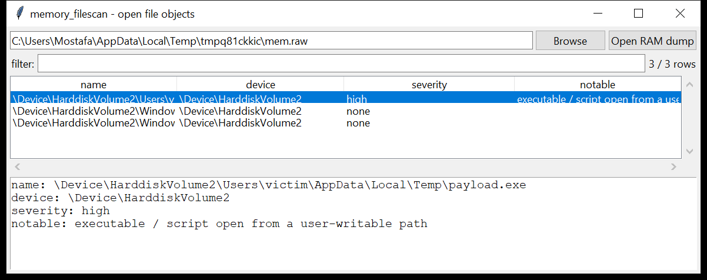

# memory_filescan

**Every file that was open at capture time, recovered from RAM.**

`memory_filescan` scans a Windows memory dump for the `File` pool tag
every `_FILE_OBJECT` allocation carries, reads the object body physically
(pool memory is contiguous the same way it is on disk), and pulls out a
plausible `FileName` `UNICODE_STRING` — a sane length pair and a buffer
pointer in kernel space.



## No per-process attribution needed

A file object's name buffer lives in **paged pool** — kernel address
space, mapped identically into every process. So once the buffer pointer
is found, it is resolved through **any** valid page-table root (the same
kernel-DTB discovery `memory_malfind` / `memory_dlllist` use), with no
process-enumeration step required first. That also means this tool has no
"owning process" column — a `_FILE_OBJECT` does not carry one; the
process(es) that had it open would need cross-referencing against
`_HANDLE_TABLE` entries (`memory_handles`).

## Usage

```
memory_filescan MEMORY.DMP
memory_filescan mem.lime --notable-only --csv files.csv
memory_filescan mem.raw --grep '\.docx$'
```

| flag | effect |
|------|--------|
| `--grep REGEX` | match the recovered path |
| `--notable-only` / `--min-severity low\|medium\|high` | filter by the flags raised |
| `--csv PATH` / `--json PATH` | `name, device, severity, notable, phys_offset` |

## Why it matters

A file object survives in memory independent of whether its data is
still on disk — a deleted document, a since-quarantined dropper, a log
file an attacker unlinked, can all still show up here with their full
original path. It is also a cheap way to see what a live process had
open at the moment of capture, without needing a full handle-table walk.

## Flags

| flag | triggers on |
|------|-------------|
| `executable / script open from a user-writable path` | `.exe .dll .sys .ps1 .bat .vbs .js` under `AppData`, `Temp`, `ProgramData`, `Public` |
| `alternate data stream` | a `name:stream` component |
| `remote (SMB) file object` | path through `\Device\Mup\` / `\Device\LanmanRedirector\` |

## Limitations (v0.1)

- **Names only, no metadata.** Size, timestamps and section-based content
  recovery are `memory_dumpfiles`' job (not yet built); this tool answers
  "what paths were open," not "what were their contents."
- The pool-header size varies slightly across Windows builds, so the
  object body is tried at four candidate offsets (12, 8, 16, 4 bytes)
  past the tag and validated by whether a plausible `UNICODE_STRING`
  turns up — occasionally two builds' offsets are both structurally
  plausible and the wrong one wins; the recovered path is always a real
  string from memory, just possibly attributed to the wrong tag hit.
- Device paths are raw NT paths (`\Device\HarddiskVolumeN\...`), not
  resolved to a drive letter (that mapping needs the `\GLOBAL??`
  symbolic-link objects, not yet parsed here).
- Deduplicates by name; the same open file backed by several `_FILE_OBJECT`
  instances (common for shared DLLs) reports once.

## Tests

`tests/_mem.py` builds a minimal kernel address space (a self-referential
PML4 plus a linear identity map, reachable via the same `find_kernel_dtb`
every pool-scanning memory tool uses) and places synthetic `_FILE_OBJECT`
records at each of the supported pool-header offsets, with the `FileName`
buffer in kernel-mapped memory. The tests cover discovery at every body
offset, the device-path extraction, the writable-path flag, and the CLI
CSV(BOM) / JSON output.

```
cd memory/memory_filescan && python -m pytest -q
```
