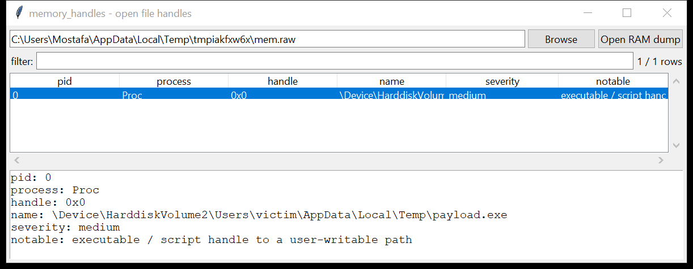

# memory_handles

**Which process had which file open, straight from a memory dump.**

`memory_handles` walks each process's handle table in a Windows RAM dump
and reports the open file handles it recovers, with no profile or symbol
data: `ObjectTable` is located by validating candidate `_EPROCESS`
offsets against the resulting `_HANDLE_TABLE` shape, the (1-3 level)
table is walked, and each `_HANDLE_TABLE_ENTRY` is decoded to an object
address — trying the handful of bit-layouts the encoding has used across
Windows releases — then checked against the `_FILE_OBJECT` shape (the
same `FileName` content-check `memory_filescan` uses).



## Usage

```
memory_handles MEMORY.DMP
memory_handles mem.lime --process lsass.exe --csv h.csv
memory_handles mem.raw --notable-only
```

| flag | effect |
|------|--------|
| `--process SUBSTR` / `--pid N` | filter to one process |
| `--grep REGEX` | match the handle's path |
| `--notable-only` / `--min-severity low\|medium\|high` | filter by the flags raised |
| `--csv PATH` / `--json PATH` | `pid, process, handle, type, name, severity, notable` |

## Why it matters

`memory_filescan` finds every open file object system-wide but cannot say
*who* had it open — a `_FILE_OBJECT` carries no owning-process field.
`memory_handles` answers exactly that question by walking the handle
table each process actually holds its references in, which is what tells
you a specific process had a specific file open at capture time — useful
for tying a locked/in-use file, a log an attacker's process was writing
to, or a document open in an office app back to the process responsible.

## Flags

| flag | triggers on |
|------|-------------|
| `executable / script handle to a user-writable path` | an open `.exe/.dll/.ps1/...` under `AppData`, `Temp`, `ProgramData`, `Public` |
| `handle to a sensitive credential / hive file` | `SAM`, `SYSTEM`, `SECURITY`, `NTUSER.DAT`, `ntds.dit` |
| `non-lsass process (...) holding a handle to an LSASS dump` | any process other than `lsass.exe` with a `lsass.dmp` handle open |

## Limitations (v0.1)

- **File handles only.** Typing a handle as Key / Process / Thread /
  Section / Event needs either a documented dispatcher-object type code
  or the `_CM_KEY_BODY` chain, and stacking those on top of the two
  already-uncertain steps below risked a much higher wrong-answer rate;
  they are the natural next addition (see `memory_registry`'s similarly
  scoped-down hivelist for the same reasoning).
- **`ObjectTable` discovery is structural, not offset-based**: since the
  field's position in `_EPROCESS` has moved across Windows releases, every
  8-byte-aligned slot in a broad window is tried and validated by whether
  it yields a plausible `_HANDLE_TABLE` (a 0-2 level count, a page-aligned
  base) - this is slower than a known offset but tolerates build drift.
- **The handle-entry bit-layout has changed across releases too** (the
  bit position of `ObjectPointerBits` within `_HANDLE_TABLE_ENTRY`); three
  candidate shifts are tried per entry and the first that resolves to a
  valid `_FILE_OBJECT` wins. A build using a shift this tool does not try
  will simply not surface that handle.
- Handle *values* for 2-level tables are a running counter, not the
  literal Windows handle number (which needs the level-1/level-0 index
  arithmetic Windows itself uses); treat them as an id, not a real HANDLE.
- Not tested on a real Windows RAM dump (no live capture available here);
  validated against a hand-built synthetic address space exercising the
  `ObjectTable` → `_HANDLE_TABLE` → entry → `_FILE_OBJECT` chain,
  including two of the three supported bit-layouts.

## Tests

`tests/_mem.py` extends the same minimal kernel address space
`memory_filescan` uses (a self-referential PML4 with a linear identity
map) with a one-level `_HANDLE_TABLE`, a single entry encoded at a chosen
bit-shift, and a `_FILE_OBJECT` body with its `FileName` in kernel-mapped
memory. The tests cover end-to-end recovery at the primary shift and at
the two fallback shifts, and the CLI CSV(BOM) / JSON output with the
writable-path flag.

```
cd memory/memory_handles && python -m pytest -q
```
