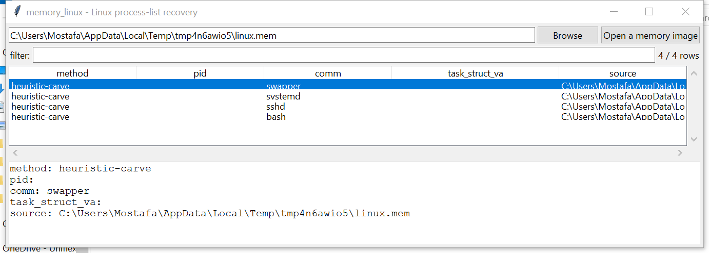

# memory_linux

**A genuine process-list recovery when you can supply a kernel
profile — a much weaker fallback when you can't.**

## ⚠️ Confidence & Validation — read before relying on this

`task_struct` has **no stable cross-version signature** the way
Windows kernel objects have a pool tag — this suite's other memory_*
tools can scan for `_EPROCESS`/`_FILE_OBJECT`/`_VACB` etc. regardless
of exact field offsets; Linux's equivalent has neither a comparable tag
nor a fixed layout across kernel versions and build configurations.

So `memory_linux` follows the same pattern `memory_hashdump`/
`memory_lsasecrets` use for a SYSTEM/SAM hive pair: **the examiner
supplies the missing piece.**

- **With `--profile`** (a small JSON naming this specific kernel
  build's direct-physical-map base, `init_task`'s virtual address, and
  `task_struct`'s `tasks`/`comm`/`pid` field offsets — obtainable from
  the target system's own debug symbols, `/proc/kallsyms`, or a
  matching `vmlinux`), this performs a **genuine, verifiable**
  doubly-linked-list walk of the `tasks` list, translating kernel
  virtual addresses via simple direct-map arithmetic (`pa = va -
  direct_map_base`, valid for slab-allocated kernel objects in the
  direct-mapped region). A wrong profile is rejected outright if the
  arithmetic goes out of bounds, not silently walked into garbage.
- **Without `--profile`**, falls back to a much weaker heuristic:
  carving 16-byte NUL-terminated printable strings that *could*
  plausibly be a `comm` value, with **no way to confirm any hit is
  actually inside a task_struct at all**. Every row is labeled with
  its `method` so the two are never confused.

## Usage

```
memory_linux linux.mem --profile kernel.json
memory_linux linux.mem                          # weak fallback
memory_linux --gui
```

### Profile JSON

```json
{
  "direct_map_base": "0xffff888000000000",
  "init_task_va": "0xffffffff82a12980",
  "tasks_offset": 848,
  "comm_offset": 1616,
  "pid_offset": 1524
}
```



| flag | effect |
|------|--------|
| `--profile PATH` | drives the genuine tasks-list walk |
| `--csv` / `--json` | UTF-8-with-BOM, formula-injection-safe output |

## Why it matters

A correct kernel profile turns this into a real, trustworthy process
enumeration — exactly as reliable as this suite's Windows pool-tag
scans, just needing one more piece of case-specific input up front
rather than working blind. Without one, the fallback still surfaces
plausible process-name text worth a manual look.

## Limitations (v0.1)

- **Process list only** — no modules, network, or command-history
  recovery; each is its own comparable undertaking.
- **The GUI has no profile-loading control in v0.1** — `--gui` always
  uses the weaker heuristic-carve fallback; the profile-driven walk is
  CLI-only for now (visible in the screenshot's `method` column).
- The heuristic fallback has no structural anchor at all — expect both
  false positives (any short printable+NUL text) and false negatives.
- No modern KASLR-aware auto-discovery of `direct_map_base`/
  `init_task_va` — both must be supplied.

## Tests

`tests/_synth.py` builds a real synthetic direct-mapped image with a
genuine circular `tasks` list. Tests cover profile loading (including
a missing required field raising), the list walk recovering the
correct chain (excluding `init_task` itself, matching real kernel
convention), a single-entry list correctly walking to nothing, a
deliberately wrong `direct_map_base` being rejected rather than
silently reading garbage, the heuristic carve finding NUL-terminated
strings, both collect paths end-to-end, and the CLI.

```
cd memory/memory_linux && python -m pytest -q
```
