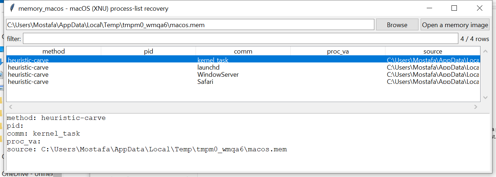

# memory_macos

**A genuine BSD-LIST walk of XNU's `allproc` when you can supply a
kernel profile — the same weak fallback as `memory_linux` when you
can't. This suite's lowest-confidence memory/ tool.**

## ⚠️ Confidence & Validation — read before relying on this

XNU's BSD-layer `proc` structure has no stable cross-version signature
the way Windows kernel objects in this suite have a pool tag, and
macOS kernel memory forensics has meaningfully **less public community
tooling and documentation than even Linux's equivalent problem** — this
project's confidence here is the lowest of this suite's `memory/`
tools.

Follows the same pattern `memory_linux` uses for the analogous Linux
problem, adapted to XNU's actual structural convention:

- **With `--profile`** (a small JSON naming the kernel's direct
  -physical-map base, the `allproc` list's first `proc` pointer value,
  and `proc`'s `p_list.le_next`/`p_comm`/`p_pid` field offsets —
  obtainable from the target system's own kernel debug symbols), this
  performs a genuine, verifiable walk of the **BSD `LIST`** `allproc`
  anchors. **This is a real structural difference from `memory_linux`,
  not a renamed copy** — BSD `LIST`s are **NULL-terminated**, unlike
  Linux's circular `tasks` list, so the walk includes the very first
  entry (`kernel_task`, PID 0) rather than excluding it the way
  `memory_linux` excludes `init_task`. A wrong profile is rejected
  outright if the arithmetic goes out of bounds.
- **Without `--profile`**, falls back to the identical weak heuristic
  `memory_linux` uses: carving 16-byte NUL-terminated printable
  strings that could plausibly be a `p_comm` value, with no way to
  confirm any hit is actually inside a `proc` structure.

## Usage

```
memory_macos macos.mem --profile kernel.json
memory_macos macos.mem                          # weak fallback
memory_macos --gui
```

### Profile JSON

```json
{
  "direct_map_base": "0xffffff8000000000",
  "allproc_first_va": "0xffffff80012a3000",
  "p_list_next_offset": 8,
  "p_comm_offset": 64,
  "p_pid_offset": 96
}
```



| flag | effect |
|------|--------|
| `--profile PATH` | drives the genuine `allproc` BSD-LIST walk |
| `--csv` / `--json` | UTF-8-with-BOM, formula-injection-safe output |

## Why it matters

A correct kernel profile turns this into a real, trustworthy process
enumeration for a platform this suite otherwise has no memory-forensics
coverage for at all. Without one, the fallback still surfaces plausible
process-name text worth a manual look.

## Limitations (v0.1)

- **Process list only** — no modules, network, or command-history
  recovery.
- **The GUI has no profile-loading control in v0.1** — `--gui` always
  uses the weaker heuristic-carve fallback; the profile-driven walk is
  CLI-only (visible in the screenshot's `method` column).
- Even the profile-driven path is explicitly labeled `confidence:
  medium`, not `high` — this project's confidence in the underlying
  direct-map mechanics for XNU specifically is lower than for Linux.
- No KASLR-aware auto-discovery of `direct_map_base`/
  `allproc_first_va` — both must be supplied.

## Tests

`tests/_synth.py` builds a real synthetic direct-mapped image with a
genuine NULL-terminated `allproc` chain. Tests cover profile loading, a
full-chain walk correctly **including** the first entry (unlike
`memory_linux`'s exclusion — the actual structural difference between
BSD `LIST` and Linux's circular list, verified here), a single-entry
list terminating correctly, a deliberately wrong `direct_map_base`
being rejected, the heuristic carve, both collect paths end-to-end, and
the CLI.

```
cd memory/memory_macos && python -m pytest -q
```
