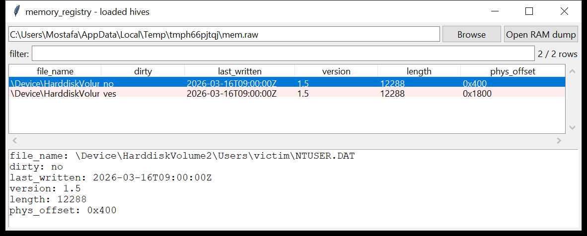

# memory_registry

**Which hives were loaded, and were any dirty — read straight from RAM.**

`memory_registry` scans a Windows memory dump for the `regf` hive
base-block signature — the 4 KiB header every loaded hive keeps
memory-resident — and decodes it directly, with no profile or symbol
data: the embedded **file path**, the **sequence numbers** (a mismatch
means unflushed, dirty changes), the **last-written FILETIME**, and the
format version.



## Usage

```
memory_registry MEMORY.DMP
memory_registry mem.lime --dirty-only --csv hives.csv
memory_registry mem.raw --name NTUSER --json hives.json
```

| flag | effect |
|------|--------|
| `--dirty-only` | only hives whose sequence numbers disagree |
| `--name SUBSTR` | match the hive file path |
| `--csv PATH` / `--json PATH` | `file_name, dirty, seq1, seq2, last_written, version, length, phys_offset` |

## Why it matters

A hive that was loaded at capture time is memory-resident even if its
backing file was deleted from disk before or during the incident — a
common anti-forensic move against `SYSTEM` / `SECURITY` / a user's
`NTUSER.DAT`. The dirty flag also tells you a hive had **pending writes
that never reached disk**, which is exactly the state a live-response
memory capture is positioned to catch and a disk image is not.

## Limitations (v0.1)

- **Hive list only** — this recovers the header, not the hive body. Full
  reconstruction of a hive file from memory means walking the in-memory
  cell map (`_CMHIVE` → `_HHIVE.Storage[Stable].Map`, a table of
  individually-allocated 4 KiB blocks that are **not** contiguous the way
  an on-disk hive's bins are), which needs build-specific structure
  offsets this tool does not yet carry. That reconstruction is the
  natural next step; for now, treat a hit here as "this hive was loaded"
  and pull its content from disk / a shadow copy with `windows_registry`.
- The same header can be mapped at more than one physical location
  (cache copies, dumped duplicates); results are de-duplicated by
  `(name, sequence numbers, last-written)`.
- The header checksum is not verified — a torn or partially-overwritten
  header can still produce a row with a corrupted filename.
- Profile-independent by design, so no attribution to a specific process
  or session is attempted (unlike `_CMHIVE`-walk based tools).

## Tests

`tests/_hive_synth.py` embeds two synthetic `regf` headers in a flat
memory image — a clean `NTUSER.DAT` and a dirty `SYSTEM` hive (mismatched
sequence numbers) — with padding between them so the scan has to find
each independently. The tests cover header decoding (name, dirty flag,
last-written time) and the CLI CSV(BOM) / JSON output with `--dirty-only`
/ `--name` filters.

```
cd memory/memory_registry && python -m pytest -q
```
