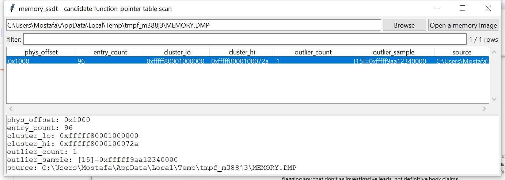

# memory_ssdt

**A candidate function-pointer-table scan, not a symbol-resolved SSDT
dump — and an honest expectation of finding nothing on modern Windows.**

## ⚠️ Confidence & Validation — read before relying on this

The classic "inspect the SSDT for hooks" technique targets
`KeServiceDescriptorTable`, which is **unexported** on x64 Windows with
no stable public offset this project can resolve. Worse: on any modern
build with **PatchGuard** active, the real syscall dispatch table
cannot legitimately be hooked at runtime the way this technique
originally assumed — PatchGuard actively protects it. **On a typical
Windows 10/11 x64 image, expect `memory_ssdt` to find little or
nothing — that is the correct, honest outcome, not a bug.**

What this still does, with genuine (not obsolete) value: rather than
locate `KeServiceDescriptorTable` directly, it scans physical memory
for runs of at least 64 consecutive canonical kernel pointers that
**cluster tightly** — at least 90% of them fall within a 32 MiB window,
consistent with all pointing into one kernel-mode image, a real
structural property a syscall table (or any legitimate kernel dispatch
table) has. Any entries that **don't** fit that cluster — including
ones that don't even translate to mapped memory — are flagged as
possible hooks. **This never claims to have found *the* SSDT
specifically** — there is no way to be certain a given candidate array
is the syscall table rather than some other similarly-shaped kernel
table, and this has not been verified against a real Windows image.
Treat any flagged entry as an investigative lead requiring
corroboration, not a confirmed hook.

## Usage

```
memory_ssdt MEMORY.DMP
memory_ssdt MEMORY.DMP --min-entries 128 --csv candidates.csv
memory_ssdt --gui
```



| flag | effect |
|------|--------|
| `--min-entries N` | only report candidates with at least N entries (default 64, reduces noise) |
| `--csv` / `--json` | UTF-8-with-BOM, formula-injection-safe output |

## Why it matters

Even without symbol resolution, a genuinely hooked dispatch table looks
structurally different from an unhooked one: one entry pointing far
outside a tight cluster of otherwise-consistent kernel pointers is a
real, checkable anomaly — and this technique would still apply to
older/32-bit images, or any other similarly-shaped kernel table worth
a second look, not only the literal SSDT.

## Limitations (v0.1)

- No claim of having located `KeServiceDescriptorTable` specifically —
  see above.
- Expect little to no output on PatchGuard-protected modern Windows
  images — the correct result, not a failure.
- The clustering scan can be noisy on a large real image: kernel memory
  contains many legitimately pointer-heavy structures (page tables,
  handle tables, object headers) that can spuriously match the same
  shape. `--min-entries` is the main noise-reduction knob.
- No PE/export-table parsing, no attempt to identify *which* kernel
  module a cluster belongs to — bounds are inferred purely from where
  the pointers themselves cluster.

## Tests

Covers the canonical-pointer check, tight-cluster detection (a run of
64 clustered pointers correctly bounded within a small window),
scattered/random pointers correctly rejected as not clustering, run
-detection in a byte buffer (including short runs below the minimum
being ignored), a deliberately planted outlier pointer being flagged
by index, clean clustered data producing zero outliers, random-noise
input producing zero candidates, and the CLI.

```
cd memory/memory_ssdt && python -m pytest -q
```
