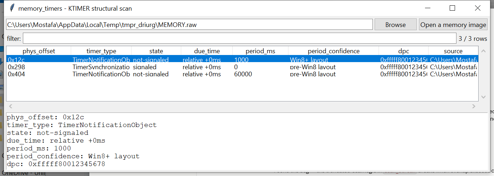

# memory_timers

**Find Windows kernel timers without a symbol server.**

Most "enumerate a kernel object type" memory-forensics tools need
`KiTimerTableListHead` or some other unexported kernel global — an
address only a symbol server (PDB) can give you, which this project
has no network access to and won't hardcode per-Windows-build (that
kind of guess can't be self-verified and drifts every release).
`memory_timers` instead structurally validates the **documented**
`DISPATCHER_HEADER`/`KTIMER` layout (public via the WDK and the Windows
Research Kernel) wherever it appears in physical memory — the same
"profile-independent structural scan" approach this suite's other
Windows memory tools use for pool-tagged objects, just anchored on a
type-enum byte instead of a 4-byte ASCII tag.

## Usage

```
memory_timers MEMORY.DMP
memory_timers MEMORY.DMP --periodic-only --csv timers.csv
memory_timers --gui
```

x64 images only.



| flag | effect |
|------|--------|
| `--periodic-only` | only timers with a non-zero period (excludes one-shot timers) |
| `--csv` / `--json` | UTF-8-with-BOM, formula-injection-safe output |

## How it validates a candidate

Every KTIMER starts with a `DISPATCHER_HEADER` — a small, stable
structure shared by every kernel synchronization object. A candidate is
accepted only if:

- its `Type` byte is `8` (`TimerNotificationObject`) or `9`
  (`TimerSynchronizationObject`) — documented, stable `KOBJECTS` enum
  values;
- its `Size` byte falls in a plausible range for `sizeof(KTIMER)/4`;
- its `WaitListHead`, `TimerListEntry`, and `Dpc` pointer fields each
  look like a canonical x64 kernel-space address (or `NULL`) — not
  trusted blindly.

This rejects the overwhelming majority of memory that merely happens to
contain a `0x08` or `0x09` byte, without needing to know *where* in the
image a timer sits ahead of time.

## Why it matters

A periodic kernel timer with an attached DPC is a legitimate,
long-standing persistence/callback mechanism — and one a rootkit or
kernel-mode implant can use the same way a normal driver does. Finding
timers structurally means this works even against something that
deliberately unlinked itself from any list a symbol-based tool would
have walked.

## Limitations (v0.1)

- **x64 only.** The 32-bit `DISPATCHER_HEADER`/`KTIMER` layout uses
  different field sizes and is not supported.
- **A structural scan, not a tagged-pool scan.** There is no ground
  -truth anchor like a pool tag here — a byte sequence that merely
  *resembles* a `KTIMER` by chance will pass validation. Confidence is
  reported as `heuristic` in CSV/JSON output for this reason, even
  though every field checked is genuinely documented.
- **The `Period` field's exact offset is Windows-version-dependent**
  (an optional `Processor` field was inserted before it on Windows 8+).
  Both candidate offsets are tried and the more plausible one is
  reported with a `period_confidence` label; when the period is `0`
  under both readings the label itself is arbitrary (the value is
  identical either way).
- **No DPC-target resolution.** The `Dpc` pointer is reported as a raw
  kernel address; resolving it to a loaded driver/module (to tell a
  legitimate timer from an unbacked one) is not implemented in v0.1 —
  cross-reference it against `memory_dlllist`'s findings by hand.
- No `KiTimerTableListHead` cross-check (that would need the very
  symbol this tool exists to avoid depending on), so there's no way to
  independently confirm every *real* timer was found versus one that
  hid itself from that list.

## Tests

`tests/_synth.py` builds a real KTIMER-shaped byte blob (both the
pre-Windows-8 and Windows-8+ field layouts) for forward-consistency
testing. Tests cover accepting both valid timer-type bytes, rejecting a
wrong type/size/non-canonical-pointer candidate, accepting a `NULL`
DPC, picking the correct period under both layout variants, decoding a
relative due-time, a match spanning a chunk boundary in the streaming
scanner, an end-to-end image scan, and the CLI (`--periodic-only`,
`--csv`/`--json`).

```
cd memory/memory_timers && python -m pytest -q
```
