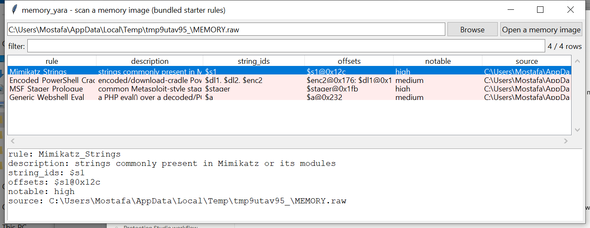

# memory_yara

**YARA-shaped detection over a memory image — no `yara-python`, no
network access to a signature service.**

`memory_yara` implements a practical subset of the YARA rule language
from scratch — a tokenizer/parser for `rule { meta: strings: condition:
}` blocks, text/hex/regex string patterns with the common modifiers,
and a boolean/counting condition evaluator — and runs it against a
memory image's raw physical bytes. Point it at a rules file (your own,
or the bundled starter set) and a dump; it reports which rule matched,
which of its strings hit, and where.

## Usage

```
memory_yara MEMORY.DMP --rules mimikatz.yar
memory_yara MEMORY.DMP --starter-rules --csv hits.csv
memory_yara --gui
```

Works against any format `memory_image` understands (raw, LiME, ELF
core, Windows crash dump).



| flag | effect |
|------|--------|
| `--rules PATH` | your own `.yar`-shaped rules file |
| `--starter-rules` | use the bundled starter ruleset instead |
| `--csv` / `--json` | UTF-8-with-BOM, formula-injection-safe output |

## Rule language subset

```
rule Encoded_PowerShell_Cradle
{
    meta:
        description = "encoded/download-cradle PowerShell command line"
        severity = "medium"
    strings:
        $enc1 = "-enc " nocase
        $enc2 = "-EncodedCommand" nocase
        $dl1 = "DownloadString" nocase
        $dl2 = "IEX(New-Object" nocase
    condition:
        1 of ($enc1, $enc2) or ($dl1 and $dl2)
}
```

- **Strings**: `"text"` (with `nocase` / `wide` / `ascii` / `fullword`
  modifiers), `{ 4D 5A ?? 00 [2-4] 90 }` (hex bytes, `??` full-byte
  wildcards, `[n]` / `[n-m]` / `[n-]` jump ranges), `/regex/` (Python
  `re` syntax, optional `nocase`).
- **Conditions**: `and` / `or` / `not`, parentheses, `$id` (matched or
  not), `any of them` / `all of them` / `N of them` / `N of ($a, $b)`,
  `#id` (match count) compared with `< <= > >= == !=`, `filesize`
  (accepts `KB`/`MB` suffixes).

A small starter ruleset (`memory_yara/rules/starter.yar`) ships with
generic, well-known indicators: the EICAR test string, common Mimikatz
strings, an encoded/download-cradle PowerShell pattern, a common
Metasploit-style stager prologue, and a generic PHP-webshell `eval()`
shape.

## Why it matters

A memory dump often needs to be checked against a specific IOC set —
strings from a threat-intel report, a hex pattern for a known packer —
without installing `yara-python` or reaching out to a signature
service, which itself may not be appropriate mid-engagement on an
isolated analysis workstation. This gives that capability self-contained.

## Limitations (v0.1)

- **Physical memory scanning only.** A hit is reported by physical
  offset; resolving it to the owning process or kernel module (the
  planned "per-process VA-space scanning" from the original spec) is
  deferred to a later version — cross-reference an offset against
  `memory_pslist` / `memory_dlllist`'s own findings by hand for now.
- **Not full YARA compatibility.** Not supported: nibble wildcards
  (`?A` / `A?`), hex-pattern alternation (`(AA|BB)`), string offsets
  (`@id`), wildcarded string-set references (`$a*`), module/PE-specific
  conditions (`pe.`, `math.`), `for` loops, `include`.
- A match (or a hex jump) that straddles a chunk boundary is only found
  if it fits within an 8 KiB overlap window between chunks — patterns
  wider than that across a boundary can be missed.
- This is a from-scratch reimplementation of a rule-language subset,
  not YARA itself — a `.yar` file using unsupported syntax will report
  a per-rule warning and be skipped (other rules in the same file still
  run) rather than silently misbehaving.

## Tests

27 tests cover the rule parser (meta/strings/all three string kinds and
their modifiers), the condition parser and evaluator (and/or/not,
`N of (...)`, count comparisons, `filesize`), hex-pattern compilation
(exact bytes, `??` wildcards, jump ranges, and rejecting unsupported hex
syntax), a match that straddles a chunk boundary in the streaming
scanner, a malformed rule not blocking the rest of the same file, an
end-to-end scan against a synthetic memory image, the bundled starter
ruleset actually catching a planted EICAR string, and the CLI.

```
cd memory/memory_yara && python -m pytest -q
```
