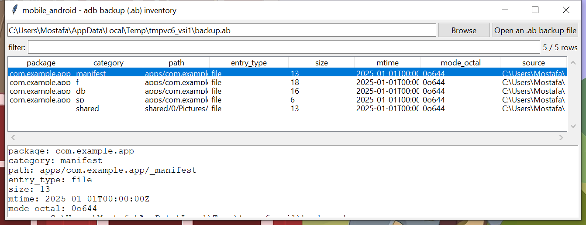

# mobile_android

**Read an `adb backup` archive without needing `adb` on the analysis
machine.**

An `.ab` file is a small ASCII header (magic, format version,
compression flag, encryption algorithm) followed by a payload that's
optionally zlib-compressed and, underneath that, always a plain POSIX
tar stream of the backed-up app data. `mobile_android` parses the
header, decompresses if needed, and reads the tar payload with the
standard library's own `tarfile` module — no hand-rolled tar reader,
no `adb` binary required.

## Usage

```
mobile_android backup.ab
mobile_android backup.ab --package com.example.app --csv files.csv
mobile_android backup.ab --extract-dir ./extracted
mobile_android --gui
```



| flag | effect |
|------|--------|
| `--package TEXT` | substring filter on package name |
| `--category {f,db,sp,r,a,manifest,shared,other}` | filter by entry category |
| `--extract-dir DIR` | extract matching files, preserving the real `apps/<package>/...` tree |
| `--csv` / `--json` | UTF-8-with-BOM, formula-injection-safe output |

Each entry's `category` reflects where it sits in the backup's own
layout: `f` (app files directory), `db` (SQLite databases), `sp`
(shared preferences XML), `r` / `a` (root-relative / APK-and-OBB data,
rarer), `manifest` (the app's own `_manifest` entry), and `shared`
(external/shared storage, if included in the backup).

## Why it matters

`adb backup` is a fast, no-root way to pull an app's private data off a
device that's still accessible (USB debugging enabled, screen
unlocked) — often faster to acquire than a full physical extraction.
Reading the `.ab` directly means the analysis doesn't depend on having
`adb` installed or a device connected at review time.

## Limitations (v0.1)

- **Unencrypted backups only** (`encryption: none` in the header — the
  common case for a backup taken with no password entered on the
  device's backup-confirmation prompt). An encrypted backup's key
  -wrapping blob (PBKDF2-derived AES-256-CBC unwrap plus an HMAC-SHA1
  checksum) is detected and reported, not decrypted, in v0.1.
- No app-specific database/preferences decoding (a recovered
  `db`-category SQLite file is a normal SQLite database — open it with
  whatever tool fits its schema).
- Large backups are decompressed fully into memory before the tar
  payload is read; a very large `.ab` file will need correspondingly
  more RAM.

## Tests

`tests/_synth.py` builds a real `.ab` file (correct header, a genuine
tar stream built with the standard library, optional zlib compression)
covering app files, a database, shared preferences, a manifest entry,
and shared-storage content. Tests cover header parsing, compressed and
uncompressed payloads, package/category classification, encrypted
-backup detection (and its distinct non-zero CLI exit code), a bad
-magic file, `--extract-dir` tree reconstruction, and the CLI
(`--package`, `--csv`/`--json`).

```
cd mobile/mobile_android && python -m pytest -q
```
