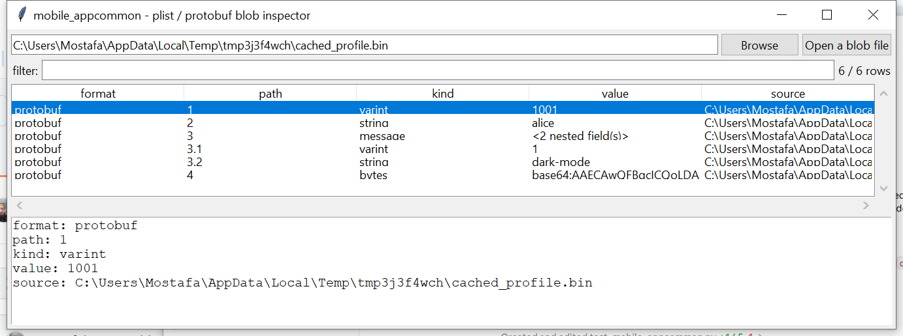

# mobile_appcommon

**Point it at an unknown blob — a BLOB column, a LevelDB value, a
cache file — and find out what's actually in it.**

Originally specified as a shared, not-directly-run back end for
`mobile_iosbackup` / `mobile_android` / `app_chat`, this is instead its
own small CLI tool: a generic inspector for the two binary blob shapes
that turn up constantly across a mobile extraction. **Binary property
lists** (with the same `NSKeyedArchiver` unwrapping `macos_plist` /
`mobile_iosbackup` use) are decoded exactly. **Schemaless Protocol
Buffers** — the wire format underneath a huge share of both iOS and
Android apps' local caches — are decoded structurally with no `.proto`
file needed at all: field numbers and wire types are self-describing
in the format itself.

## Usage

```
mobile_appcommon unknown.blob
mobile_appcommon --hex 0a0568656c6c6f
mobile_appcommon cached.plist --csv fields.csv
mobile_appcommon --gui
```

`--hex` decodes an inline hex string directly — handy for a blob copied
out of another tool's output without saving it to a file first.



| flag | effect |
|------|--------|
| `--csv` / `--json` | UTF-8-with-BOM, formula-injection-safe output |

## How it decodes

1. **Sniff**: `bplist00` magic → plist; `SQLite format 3\0` → reported
   as a database, not decoded here; leading `{`/`[`/`<` → treated as
   plain text; otherwise, attempt protobuf.
2. **Plist**: decoded via the standard library plus this project's
   `NSKeyedArchiver` unwrapper, flattened to dot/bracket paths.
3. **Protobuf**: walked field by field — varint (wire type 0),
   fixed64/fixed32 (types 1/5), and length-delimited (type 2) are all
   **exactly** decoded per the public wire-format spec. For each
   length-delimited field, content is **guessed**: valid, mostly
   -printable UTF-8 → string; otherwise, try recursively parsing it as
   a nested message and keep that reading only if the field numbers
   found look plausible; otherwise, report raw bytes. Rows are
   flattened with a dotted field-number `path` (`3.1`, `3.2`, ...) so a
   nested field's origin is always visible.

## Why it matters

A lot of what's cached locally by mobile apps — including plenty that
never has a `.proto` schema published anywhere — is still just
Protocol Buffers under the hood, and the wire format alone is enough
to recover real structure and content from it without that schema.
This turns "there's a weird binary blob in this database column" into
an actual, reviewable field list in one step.

## Limitations (v0.1)

- **The wire-level decode (field numbers, wire types, exact varint/
  fixed values) is exact and high confidence — the published Protocol
  Buffers specification, not a guess.** The *semantic* classification
  of each length-delimited field (string vs. bytes vs. nested message)
  is a heuristic, explicitly lower confidence, and can misclassify —
  e.g. a bytes field that happens to also parse as a plausible nested
  message will be reported as one.
- No field *names* are ever recovered (impossible without the actual
  `.proto` schema) — only numbers.
- No `repeated`/`packed` field semantics — repeated scalar values
  encoded in the newer packed wire format are reported as one opaque
  bytes/string field rather than split into individual values.
- SQLite input is detected and named, not opened here — this tool's
  job is the blob shapes a database's own *columns* might hold, not
  the database container itself.
- No Android Binary XML (AXML) support in v0.1, despite AXML being
  another self-contained format found throughout Android app data
  (`AndroidManifest.xml`, compiled resources) — deferred to a future
  version.

## Tests

`tests/_synth.py` includes a minimal *forward* protobuf encoder (tag/
varint/length-delimited construction) used only to build test fixtures
— the tool itself never writes protobuf. Tests cover format sniffing
(plist/SQLite/text/protobuf fallback), varint and string field
decoding, nested-message recognition (including a field whose
recovered value is itself further flattened with a dotted path), bytes
-vs-text classification, rejecting genuinely invalid input, plist
decoding and flattening, the SQLite detection-not-decode path, and the
CLI (`--hex`, file input, `--csv`/`--json`).

```
cd mobile/mobile_appcommon && python -m pytest -q
```
