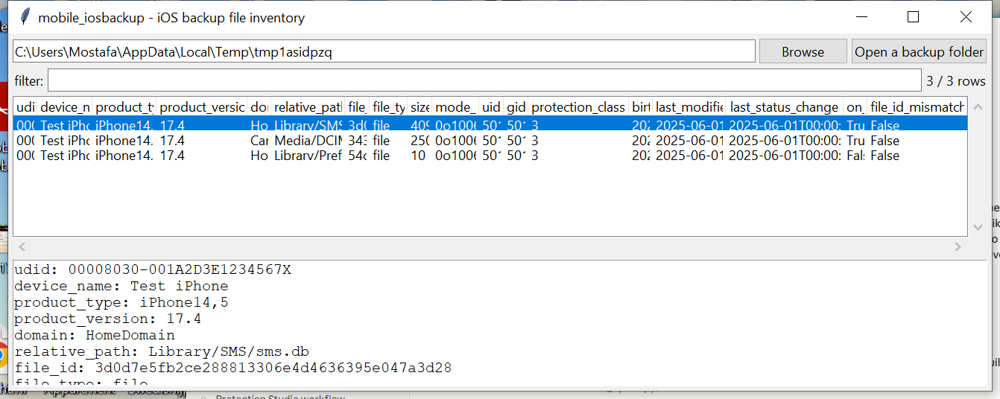

# mobile_iosbackup

**Turn a folder of SHA-1-named blobs back into a real file tree.**

A modern (iOS 10+) local iTunes/Finder backup stores every file's
content flat, named by `sha1(domain + "-" + relativePath)`, under
`<fileID[:2]>/<fileID>` — with `Manifest.db` (a plain SQLite database)
holding the actual domain, path, and metadata for each one.
`mobile_iosbackup` reads that index, joins it against what's physically
present on disk, and can reconstruct the real `domain/relativePath`
folder structure from the hash-named blobs.

## Usage

```
mobile_iosbackup 00008030-001A2D3E1234567X
mobile_iosbackup "MobileSync/Backup" --domain CameraRollDomain --csv photos.csv
mobile_iosbackup 00008030-001A2D3E1234567X --extract-dir ./extracted
mobile_iosbackup --gui
```

The target may be a single backup folder (containing `Manifest.db`), or
a parent `Backup` folder (the standard iTunes/Finder location on macOS —
`~/Library/Application Support/MobileSync/Backup/` — or Windows —
`%APPDATA%\Apple Computer\MobileSync\Backup\`) to search recursively for
every backup under it.



| flag | effect |
|------|--------|
| `--domain TEXT` / `--path TEXT` | substring filters |
| `--type {file,directory,symlink}` | filter by POSIX file type |
| `--missing-only` | only rows whose content isn't present on disk |
| `--extract-dir DIR` | reconstruct `domain/relativePath` under this directory for every matching on-disk file |
| `--csv` / `--json` | UTF-8-with-BOM, formula-injection-safe output |

Each row also carries `file_id_mismatch`: the tool recomputes
`sha1(domain + "-" + relativePath)` and flags a row where it disagrees
with the `fileID` Manifest.db actually stores — evidence of a tampered
or hand-edited manifest.

## Why it matters

Manifest.db's flat, hash-named storage is opaque without this join —
you can't tell `3d0d7e5f...` is `Library/SMS/sms.db` by looking at the
backup folder. `--extract-dir` turns that into a normal browsable tree
that any other tool (or a human) can work with directly, and
`--missing-only` surfaces entries Manifest.db expected but the backup
never actually wrote (partial/interrupted backups, or files excluded by
size/type).

## Limitations (v0.1)

- **Encrypted backups are detected, not decrypted.** `Manifest.plist`'s
  `IsEncrypted` flag is checked and reported; an encrypted backup's
  `Manifest.db` and file contents are themselves protected by a
  password-derived keybag using the same class of undocumented,
  only-reverse-engineered wrapping scheme as APFS volume encryption —
  genuinely uncertain enough that this project reports it rather than
  guessing at an unlock. Supply an **unencrypted** backup (or one
  already decrypted by other means) for v0.1.
- **Per-file metadata (size, mode, timestamps, protection class) comes
  from an undocumented binary-plist blob.** The field names used here
  (`Size`, `Mode`, `UserID`, `GroupID`, `ProtectionClass`, `Birth`,
  `LastModified`, `LastStatusChange`) are consistent across public
  community write-ups going back years, but Apple has never published
  this format, and it has **not been byte-verified against a real
  device backup in this environment** — a row with blank metadata
  fields but a correct `domain`/`relative_path`/`file_id` (which come
  straight from Manifest.db's own SQL columns, not the blob) means the
  blob didn't parse as expected, not that the file itself is missing.
- No `Manifest.mbdb`-era (pre-iOS 10, pre-`Manifest.db`) legacy backup
  format support.
- No application-level decoding (no SMS/contacts/photos parsing) — pair
  `--extract-dir`'s output with the relevant domain-specific tool.

## Tests

`tests/_synth.py` builds a real backup folder: a genuine SQLite
`Manifest.db`, `Manifest.plist`/`Info.plist`, and per-file metadata
blobs — both a plain plist (exercising the metadata-field extraction
directly) and a hand-built genuine `NSKeyedArchiver`-wrapped plist
(exercising the archive-unwrap integration end to end), plus physical
hashed-name content for some entries and not others. Tests cover backup
discovery, file-ID computation, metadata decoding (both blob shapes,
including directory-vs-file typing), missing-on-disk detection,
encrypted-backup warning-and-skip, and the CLI (`--extract-dir`
tree reconstruction, `--domain`/`--missing-only` filters, `--csv`/
`--json`).

```
cd mobile/mobile_iosbackup && python -m pytest -q
```
