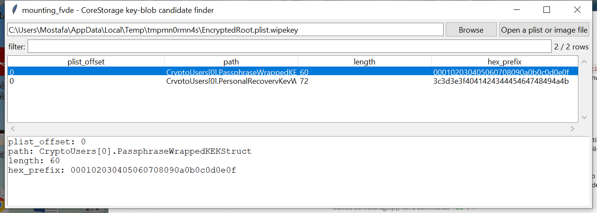

# mounting_fvde

**Unlock a legacy CoreStorage FileVault2 volume — with the exact,
standard crypto separated cleanly from the genuinely uncertain,
reverse-engineered-only part.**

## ⚠️ Confidence & Validation — read before relying on this

This tool splits into two halves with very different confidence:

- **Exact, standard, no guessing**: PBKDF2-HMAC-SHA256 key derivation
  (Python's own `hashlib`), RFC 3394 AES Key Unwrap (`keywrap.py`,
  verified against the official RFC 3394 §4.1 known-answer test
  vector — not just internal round-trip consistency), and AES-XTS-128
  sector decryption (`aes.py`, the same from-scratch AES core
  `mounting_luks` and `mounting_veracrypt` already use).
- **Genuinely uncertain**: the exact byte-level layout of Apple's
  CoreStorage `EncryptedRoot.plist.wipekey` — which field inside it is
  the PBKDF2 salt, which is the iteration count, which bytes are the
  RFC-3394-wrapped key. This is known only through community reverse
  -engineering (the libfvde project), and this implementation has
  **not** been independently verified against a real macOS-generated
  volume. Treat any output as an investigative lead, not verified
  ground truth, until corroborated.

Because of that split, `unlock`/`decrypt` take salt, iteration count,
and wrapped-key bytes as **explicit parameters you supply** rather than
auto-parsed from an assumed layout — the same "verify, don't silently
trust" posture `mounting_luks` uses for its master-key digest, applied
here because the *surrounding* format is uncertain in a way LUKS's
published spec is not. A decrypted result is only ever reported as a
real unlock when the plaintext contains the expected HFS+/HFSX volume
-header magic at its standard offset — never presented as valid
without that check passing.

**APFS-container FileVault is out of scope for v0.1** — a materially
different keybag format this project has even less confidence
reconstructing correctly than CoreStorage's.

## Usage

```
mounting_fvde info EncryptedRoot.plist.wipekey
mounting_fvde unlock --password 'hunter2' --salt-hex <hex> \
    --iterations 41000 --wrapped-hex <hex>
mounting_fvde decrypt volume.img --password 'hunter2' --salt-hex <hex> \
    --iterations 41000 --wrapped-hex <hex> -o decrypted.bin
mounting_fvde --gui
```

### `info` — find candidate key material

Scans a plist file or a raw image for embedded property lists (a
self-repairing bplist-trailer scan, since a real embedded plist is
usually followed by more binary metadata, not a clean end-of-file) and
lists every byte blob of a plausible size (32–256 bytes) found inside —
a `PassphraseWrappedKEKStruct`-shaped candidate for the examiner to
inspect, not an auto-decoded answer.



### `unlock` — derive the volume encryption key

Given salt/iterations/wrapped-key bytes (from `info`'s candidates, or
sourced another way) and a password, derives the KEK and RFC-3394
-unwraps it. A wrong password/salt/iteration count/wrapped-key value
is **rejected** via the unwrap's own integrity check, not silently
wrong.

### `decrypt` — unlock, then decrypt and verify

Same as `unlock`, then AES-XTS-128-decrypts a byte range (the VEK
splits into the two 128-bit XTS keys via the standard first-half/
second-half convention) and refuses to report success unless the
result contains a valid HFS+/HFSX magic at the standard offset.

| flag | effect |
|------|--------|
| `info --csv` / `--json` | candidate blob inventory |
| `unlock`/`decrypt --wrapped-hex` | the RFC-3394-wrapped key bytes |

## Why it matters

Even with the format uncertainty acknowledged above, the standard-crypto
half of this tool is real and verified: given correct key material (by
whatever means an examiner obtains it), volume decryption here is
exactly as trustworthy as `mounting_luks`'s or `mounting_veracrypt`'s.

## Limitations (v0.1)

- APFS-container FileVault not supported — CoreStorage only.
- No automatic salt/iterations/wrapped-key extraction — deliberately
  examiner-supplied, for the reasons above.
- `info`'s candidate list may include false positives (any
  plausible-length byte blob) and could miss the real key material if
  it falls outside the 32–256 byte window this tool scans for.
- No brute forcing of any kind — a password or recovery key must
  already be known.

## Tests

`RFC 3394 unwrap/wrap are checked against the official RFC 3394 §4.1
known-answer test vector` — a genuine correctness check, not just
internal self-consistency. Also covers wrong-KEK rejection, the bplist
-trailer scan (including the fix for a real bug where trailing bytes
after an embedded plist broke parsing), candidate-blob discovery,
`derive_vek` end-to-end (wrap a known key, recover it via password
+salt+iterations), wrong-password rejection, the VEK→XTS-key split,
HFS+-magic verification (including a wrong-key rejection case), and
the CLI (`info`, `unlock`, `decrypt` error paths).

```
cd mounting/mounting_fvde && python -m pytest -q
```
