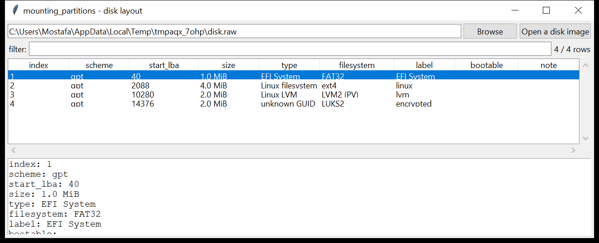

# mounting_partitions

**One clean partition-layout table for a disk image — no mounting.**
`mounting_partitions` opens a raw / split / EWF / VHD / VMDK image (or an
`nbd://` URL), parses the **MBR** (including extended / logical partitions)
and the **GPT**, and — by peeking at the first sectors of each slice —
reports the **filesystem or container actually present**:

`NTFS` · `exFAT` · `FAT12/16/32` · `ext2/3/4` · `XFS` · `Btrfs` ·
`ReiserFS` · `F2FS` · `APFS container` · `HFS+` · `LVM2 (PV)` · `LUKS1/2` ·
`BitLocker` · `Linux swap` · `Linux MD RAID` · `ISO9660`.

Gaps and overlaps between partitions, and unallocated space at the start /
end of the disk, are listed. It shares the container-format layer with
`mounting_image` but never mounts, serves or writes anything.



## Usage

```
mounting_partitions disk.raw
mounting_partitions evidence.E01 --json layout.json
mounting_partitions image.vmdk --csv partitions.csv
mounting_partitions nbd://127.0.0.1:10809/disk
mounting_partitions disk.raw --gui
```

| flag | effect |
|------|--------|
| `--format {raw,ewf,vhd,vhdx,vmdk,nbd}` | force the container format instead of sniffing |
| `--sector N` | logical sector size (default 512) |
| `--csv PATH` / `--json PATH` | write the table instead of the text report |

Sample text output:

```
image:   disk.raw  [raw, 16.0 MiB]
scheme:  mbr

 #  scheme      start LBA         size  type                         filesystem       label
 1  mbr              2048      4.0 MiB  NTFS/exFAT                    NTFS              *boot
 2  mbr             10240      4.0 MiB  Linux                         ext4
 3  mbr             20480      2.0 MiB  FAT32 (LBA)                   FAT32
 4  mbr             24576      2.0 MiB  Linux swap                    Linux swap

gaps / overlaps:
  unallocated                     512 ..  1048576         1023.5 KiB
  unallocated (tail)          14680064 .. 16777216         2.0 MiB
```

## Why it matters

Before you can carve, timeline or mount anything you need to know what is on
the disk: where each partition starts (so `mounting_image extract --offset`
lands right), what filesystem it holds (so you pick the right parser), and
whether there is unpartitioned space worth carving. Doing that in one
read-only pass — and spotting a **BitLocker** or **LUKS** volume, or a
partition table that overlaps itself — saves a lot of guessing.

## Notes

- The filesystem is identified from signatures in the first ~64 KiB of the
  slice; it does not parse or validate the filesystem.
- A `GPT protective` MBR entry and an `extended` partition are shown but
  excluded from the gap / overlap maths.
- For a disk with **no** partition table the whole image is checked for a
  filesystem signature and reported as a single `none`-scheme row.
- `VHDX` is detected but not yet readable (same as `mounting_image`).

## Tests

```
cd mounting/mounting_partitions && python -m pytest -q
```

`tests/_synth.py` builds a raw MBR disk (NTFS boot / ext4 superblock /
FAT32 / swap) and a raw GPT disk (EFI System / ext4 / LVM2 PV / LUKS2), and
the tests check the signature detector, the MBR and GPT parse, the
filesystem identification, the gap detection, the no-partition-table case
and the CLI.
