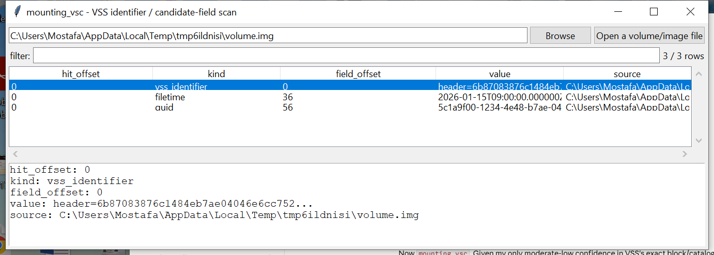

# mounting_vsc

**Prove Volume Shadow Copies exist, and surface candidate metadata for
each — without pretending to reconstruct their content.**

## ⚠️ Confidence & Validation — read before relying on this

The 16-byte VSS identifier GUID this scan looks for
(`3808876B-C176-4E48-B7AE-04046E6CC752`) is a well-established
constant, cited across public DFIR research on the format — finding it
is a real, high-confidence signal that shadow-copy structures are
present at that offset. What comes *after* that GUID in each VSS
block — the catalog/store header's exact field order, sizes, and
offsets — is known only through community reverse-engineering (the
libvshadow project), with no public vendor specification, and this
project has no verified reference to check its recollection of the
exact layout against.

**Given that, this deliberately does not implement VSS block
-remapping or snapshot mounting.** Reconstructing a shadow copy's
actual file content means correctly walking a differential-block
overlay structure; getting that wrong would silently serve corrupted
bytes as if they were legitimate historical file content — a
materially worse failure mode than a mislabeled metadata field, since
corrupted "recovered" evidence can look entirely convincing to a
reviewer who doesn't independently check it. Instead, this reports
every identifier hit (real signal) plus *candidate* fields found
nearby — FILETIME-shaped 8-byte values in a plausible date range, and
GUID-shaped 16-byte spans — for the examiner to judge, the same
candidates-not-claims pattern `mounting_fvde` uses for CoreStorage's
key-wrap plist. **Corroborate any candidate field** (e.g. against
`vssadmin list shadows` on a live system, or a reference tool like
`vshadowinfo`) before treating it as fact.

## Usage

```
mounting_vsc \\.\C: --csv hits.csv
mounting_vsc volume.img --json hits.json
mounting_vsc --gui
```



| flag | effect |
|------|--------|
| `--csv` / `--json` | UTF-8-with-BOM, formula-injection-safe output |

## What it reports

- **`vss_identifier`** — an offset where the VSS GUID was found, plus
  the raw hex of the following bytes for manual review.
- **`filetime`** — an 8-byte little-endian value near a hit that
  decodes to a plausible date (2001–2035) under the standard Windows
  FILETIME epoch — a real, exact conversion; only the *claim that this
  particular field is a shadow copy's creation time* is a guess.
- **`guid`** — a 16-byte span near a hit that parses as a
  structurally-valid RFC 4122 GUID — could be a shadow-copy-set ID, a
  store ID, or coincidental data that merely looks GUID-shaped.

## Why it matters

Even without full content reconstruction, confirming shadow copies
exist — and roughly when they were created — is real investigative
value: it tells you whether point-in-time recovery is even possible
before committing to a heavier, riskier extraction approach.

## Limitations (v0.1)

- **No mounting, no snapshot content reconstruction** — see above.
- Candidate fields are exactly that: plausible-shaped values near an
  identifier hit, not confidently-labeled structure fields. Expect
  some false positives (coincidental byte patterns) and don't assume
  completeness.
- No catalog/store-chain traversal — each identifier hit is reported
  independently; relationships between shadow copies (e.g. which
  store belongs to which set) aren't reconstructed.

## Tests

`tests/test_mounting_vsc.py` builds synthetic buffers containing the
real VSS identifier GUID bytes plus deliberately-placed FILETIME and
GUID values, and verifies the scan recovers them at the correct
offsets with correct decoded values (a genuine FILETIME-conversion
correctness check, not just detection). Also covers rejecting
implausible FILETIME values, multiple hits in one buffer, no-hits on
random data, row flattening, and the CLI (`--csv`/`--json`).

```
cd mounting/mounting_vsc && python -m pytest -q
```
