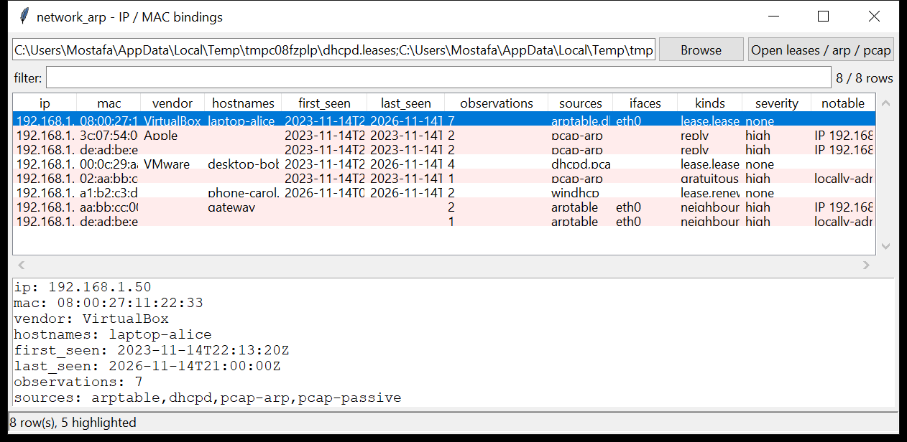

# network_arp

**Which host held this IP, with which MAC, when.** `network_arp` builds an
address-binding timeline from every layer-2 / DHCP source you have and merges
them into one row per `IP ↔ MAC` pair: first / last seen, the hostnames, the
sources it was seen in, the interface, and the observation count — with a
best-effort vendor from a small built-in OUI table.

Sources (auto-detected per file):

- **ISC `dhcpd.leases`** — lease start / end, `hardware ethernet`, `client-hostname`
- **Windows DHCP audit CSV** — `DhcpSrvLog-*.log` (event 10 assign, 11/3x renew, 12 release, 13 conflict)
- **`arp -a` / `ip neigh` / Windows `arp -a`** — neighbour-table dumps
- **`pcap` / `pcapng`** — ARP request / reply frames, plus a passive `src-MAC ↔ src-IP` binding from every Ethernet frame



## Usage

```
network_arp /var/lib/dhcp/dhcpd.leases
network_arp arp.txt dhcpd.leases capture.pcap --csv map.csv
network_arp *.pcap --notable-only
network_arp leases.txt --ip 192.168.1.50
network_arp leases.txt --mac aa:bb:cc:dd:ee:ff
network_arp leases.txt capture.pcap --conflicts-only
network_arp *.txt --gui
```

| flag | effect |
|------|--------|
| `--ip IP` / `--mac MAC` | only bindings for this address |
| `--host NAME` | bindings whose hostname contains this substring |
| `--conflicts-only` | only IPs claimed by more than one MAC |
| `--notable-only` | only bindings that raised a flag |
| `--csv PATH` / `--json PATH` | write the table instead of the text report |
| `--gui` | open the graphical viewer |

The text report prints **conflicts** (an IP claimed by multiple MACs with
overlapping bindings) above the binding list.

## Why it matters

Attribution starts with "who was `10.0.0.50` at 14:07". A lease file answers it
for DHCP clients; the ARP table answers it for anything on the local segment;
a capture catches the moment an attacker's machine answered for the gateway's
IP. Putting the three together — and spotting where they disagree — is how you
tie an action to a device.

## Flags

| flag | meaning |
|------|---------|
| `IP X claimed by N MACs (overlapping in time)` | ARP-spoofing / a static-IP clash — the same address answered by different MACs at once |
| `IP X claimed by N MACs (sequential - re-assignment)` | the same address used by different MACs at different times (normal DHCP churn, or a rebuild) |
| `MAC X bound to N IPs (router / NAT / MAC spoofing?)` | one MAC answering for 5+ addresses |
| `gratuitous ARP announced` | an ARP where sender IP == target IP (announcement, or the start of a poisoning attack) |
| `locally-administered MAC (randomised / spoofed?)` | the U/L bit is set — a privacy-randomised or hand-set address |

Severity: overlapping conflicts and MAC-spoofing patterns are `high`; a
multi-MAC IP, a multi-IP MAC and gratuitous ARP are `medium`.

## Limitations (v0.1)

- The OUI table is **small** (virtualisation platforms and a handful of large
  vendors) — a full lookup would need the IEEE registry as a bundled data file.
- syslog / lease files without a year are read as the current year.
- ARP has no authentication; a "conflict" is evidence to investigate, not
  proof of an attack (fail-over pairs, VRRP / HSRP and dual-homed hosts all
  produce multi-MAC IPs legitimately).
- pcap passive bindings trust the Ethernet source address; a spoofed frame
  produces a spoofed binding (which is often exactly what you want to see).

## Tests

```
cd network/network_arp && python -m pytest -q
```

Fixtures for every source (`dhcpd.leases`, a Windows DHCP audit log, Linux and
Windows ARP tables, ARP request / reply / gratuitous frames and passive IP
frames in a pcap) exercise the parsers, the merge, conflict detection and the
CLI.
