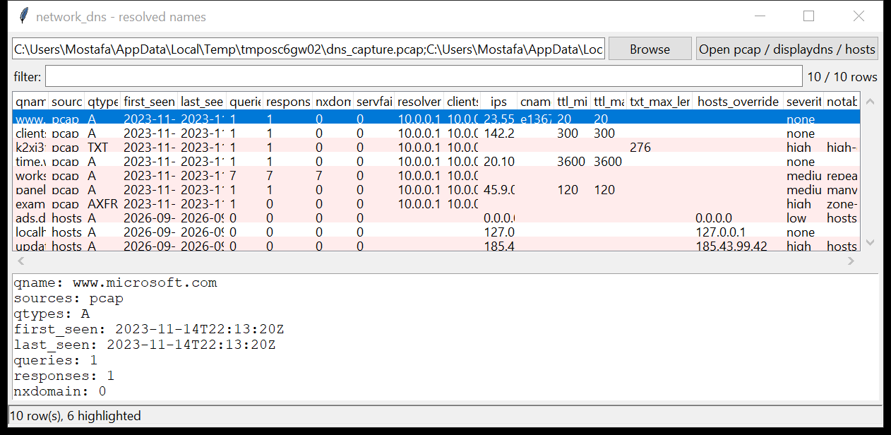

# network_dns

**One DNS timeline from every source you have.** `network_dns` pulls
name-resolution evidence out of three places and merges it into a single
per-name view:

- **captures** — queries and answers carved from a `pcap` / `pcapng` (UDP and
  TCP port 53, with a self-contained DNS message parser)
- **the OS resolver cache** — Windows `ipconfig /displaydns` text and
  `systemd-resolved` / `resolvectl` dumps
- **`hosts` files** — static name overrides

For each name it records first / last seen, the query types, every answer with
its TTL, the resolvers and the clients — then flags the names that look like
tunnelling, DGA, fast-flux, zone transfer, or a `hosts`-file redirect. Pure
Python standard library.



## Usage

```
network_dns capture.pcap
network_dns dns.pcapng displaydns.txt /etc/hosts --csv names.csv
network_dns *.pcap --notable-only --min-severity medium
network_dns capture.pcap --grep '\.top$|dyndns' --json hits.json
network_dns capture.pcap --client 10.0.0.50
network_dns capture.pcap --gui
```

Inputs are auto-detected by content — drop a mix of captures, cache dumps and
`hosts` files on the command line in any order.

| flag | effect |
|------|--------|
| `--notable-only` | only names that raised a flag |
| `--min-severity {low,medium,high}` | filter by the worst flag on the name |
| `--grep REGEX` | match the name (case-insensitive) |
| `--client IP` | only names queried by this client address |
| `--csv PATH` / `--json PATH` | write the table instead of the text report |
| `--gui` | open the graphical viewer |

## Why it matters

DNS is where command-and-control hides in plain sight: encoded subdomains for
tunnelling, algorithmically generated names for resilient C2, oversized `TXT`
and `NULL` answers used as a transport, and `hosts`-file edits that quietly
send a trusted name to an attacker's server. A capture or a cache dump has the
raw resolutions — this turns them into a reviewable list.

## Flags

| flag | meaning |
|------|---------|
| `encoded left-most label (tunnelling?)` | first label is a long hex / base32 string |
| `high-entropy left-most label (DGA / tunnelling?)` | long, random-looking first label |
| `deep subdomain chain` | 6+ labels |
| `very long name` | over 100 characters |
| `large TXT response` | a `TXT` answer of 200+ bytes |
| `NULL record` | rare record type, used as a covert channel |
| `ANY query` / `zone-transfer query` | reconnaissance / `AXFR` · `IXFR` |
| `repeated NXDOMAIN` / `repeated SERVFAIL` | 5+ failed resolutions for one name |
| `many low-TTL addresses … fast-flux?` | 8+ A records with a short TTL |
| `hosts-file override` | the name is pinned in a `hosts` file |
| `hosts entry differs from DNS answer` | the `hosts` IP and the DNS IP disagree |
| `public name redirected by hosts file` | a real domain pointed elsewhere locally |
| `public name resolves to a private / loopback IP` | e.g. `bank.example.com → 127.0.0.1` |
| `truncated response` | `TC` bit set (large payload / TCP retry) |

## Limitations (v0.1)

- **Cleartext DNS only.** DoH / DoT (DNS over HTTPS / TLS) is encrypted on the
  wire; those queries do not appear in a capture.
- `displaydns` parsing targets the English `ipconfig /displaydns` layout;
  other locales may need `--` heuristics to be extended.
- `systemd-resolved` has no on-disk cache dump — the resolved parser reads
  `resolvectl query` / `systemd-resolve` text output only.
- Timestamps come from the capture; cache-dump and `hosts` entries carry the
  file mtime (or none).

## Tests

```
cd network/network_dns && python -m pytest -q
```

In-memory captures (A / AAAA / CNAME / TXT / NULL / `AXFR` over TCP, NXDOMAIN
bursts, fast-flux answer sets), a `hosts` file and a `displaydns` dump exercise
the parser, the aggregation and every flag.
