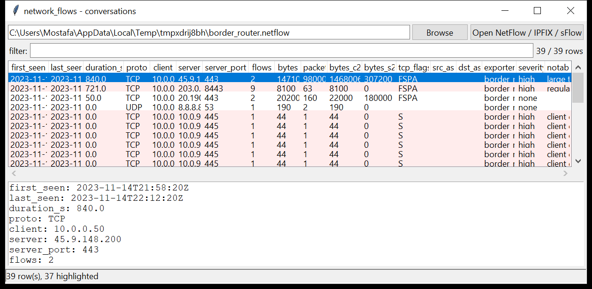

# network_flows

**Read exported flow records and turn them into conversations.**
`network_flows` parses **NetFlow v5**, **NetFlow v9**, **IPFIX** (with template
handling) and **sFlow** flow samples into one normalised unidirectional flow
schema, then rolls the flows up into conversations keyed on the canonical
`protocol · client · server · server-port` — with byte / packet counts each
way, duration, TCP flags and AS numbers.

On top of that it summarises the top talkers, the busiest server ports and the
protocol mix, and flags the conversations that look like bulk exfiltration,
command-and-control beaconing or a network sweep. Pure Python standard library.



## Usage

```
network_flows export.netflow
network_flows *.ipfix --csv conversations.csv
network_flows flows.bin --notable-only --min-severity high
network_flows flows.bin --host 10.0.0.50 --summary
network_flows flows.bin --port 443 --proto tcp
network_flows flows.bin --gui
```

The format is auto-detected from the record header — NetFlow v5 / v9, IPFIX and
sFlow messages can be concatenated in one file and mixed on the command line.
NetFlow v9 / IPFIX templates are cached per observation domain and reused across
later messages that carry only data records.

| flag | effect |
|------|--------|
| `--host IP/CIDR` | conversations touching this address or range |
| `--port N` | only this server port |
| `--proto NAME` | only this protocol (`tcp` / `udp` / `icmp` / …) |
| `--notable-only` / `--min-severity` | filter by the flags raised |
| `--summary` | append top-talker / server-port / protocol tables |
| `--csv PATH` / `--json PATH` | write the table instead of the text report |
| `--gui` | open the graphical viewer |

## Why it matters

Flow data is often all that survives — it is cheap to keep for months when full
packet capture is not. It has no payload, but the shape of a conversation still
tells you a lot: a host that sent 140 MB and received 300 KB, a connection that
repeats every 90 seconds with the same byte count, one source touching 400
hosts on port 445 in a minute.

## Flags

| flag | meaning |
|------|---------|
| `large transfer (N MB)` / `sizeable transfer` | ≥ 100 MB / ≥ 10 MB in a conversation |
| `outbound-heavy (… up / … down) - exfil?` | client sent ≥ 5 MB and ≥ 10× what it received, to a public host |
| `regular beacon (~Ns interval, K flows)` | repeated similar-sized flows at a steady cadence |
| `client contacted N hosts (scan / sweep?)` | one client, 25+ distinct servers |
| `SYN with no ACK (port probe / filtered)` | TCP flow, SYN only, ≤ 3 packets |
| `long-lived flow (N h)` | a single conversation open for an hour or more |
| `reserved / bogon address` | an endpoint in a reserved / link-local / multicast range |

## Limitations (v0.1)

- Flow records are **unidirectional**; the two halves of a conversation are
  paired heuristically (lower port = server). Asymmetric routing can split a
  conversation across exporters.
- **sFlow**: flow samples with a raw packet header are decoded (through the
  shared link-layer decoder); counter samples and extended flow records are
  skipped.
- NetFlow v9 / IPFIX: the common IE set (addresses, ports, protocol, byte /
  packet counts, timing, TCP flags, AS) is decoded; enterprise-specific and
  variable-length IEs are skipped.
- `nfcapd` / `nfdump` archive files are not supported — this reads the wire
  record formats (raw datagrams or a concatenation of them).
- Byte / packet counts from sFlow are multiplied by the sampling rate (an
  estimate, not an exact count).

## Chain of custody

Every run writes a `<output>.manifest.json` sidecar recording the tool version,
the exact command line, `--case-id` / `--examiner` / `--evidence-id`, start and
finish time (UTC), the host, and the **SHA-256 of every input and output file**.
CSV rows carry `evidence_source` / `parser_confidence` / `tz_provenance`
columns; JSON is wrapped as `{"manifest": {...}, "records": [...]}`.
`--no-provenance` disables this. `--max-input-bytes` / `--max-records` /
`--wall-seconds` bound a run against hostile or oversized evidence.

## Tests

```
cd network/network_flows && python -m pytest -q
```

In-memory exports (NetFlow v5, v9 with a reused template across messages, IPFIX
with millisecond timestamps, sFlow flow samples) exercise the parsers, the
conversation reassembly and every flag (large transfer, outbound-heavy, beacon,
scan fan-out, port probe).
