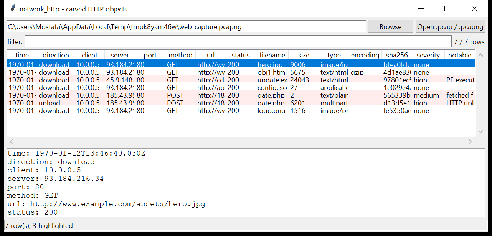

# network_http

**Carve every HTTP transfer out of a packet capture.** `network_http` reassembles
the TCP streams in a `pcap` / `pcapng`, parses the HTTP/1.x messages in both
directions (`Content-Length`, `chunked` and connection-close framing; `gzip` /
`deflate` transparently decoded), and pairs each request with its response.

For every transaction it records the method, URL, status, key headers, the
**size and SHA-256 / MD5 of the transferred body**, and — with `--extract` —
writes the body to disk. Uploaded request bodies (form posts, `PUT`, multipart
uploads) are carved the same way. Pure Python standard library, no dependencies.



## Usage

```
network_http capture.pcap
network_http traffic.pcapng --extract ./objects --csv manifest.csv
network_http *.pcap --notable-only --min-severity high
network_http case.pcap --grep '\.exe|\.ps1|\.dll' --downloads
network_http case.pcap --uploads                 # only what left the host
network_http case.pcap --gui
```

| flag | effect |
|------|--------|
| `--extract DIR` | write every carved body into `DIR` (names de-duplicated) |
| `--downloads` / `--uploads` | keep only response bodies / only request bodies |
| `--min-size BYTES` | ignore bodies smaller than this |
| `--notable-only` | only objects that raised at least one flag |
| `--min-severity {low,medium,high}` | filter by the worst flag on the object |
| `--grep REGEX` | match against URL / filename / content-type (case-insensitive) |
| `--csv PATH` / `--json PATH` | write the manifest instead of the text report |
| `--gui` | open the graphical viewer |

The file name of an extracted object comes from `Content-Disposition`, then the
URL path, then a generated `objN.<ext>` (extension from the detected magic bytes
or the `Content-Type`).

## Why it matters

Malware delivery, second-stage payloads, tool transfer and data exfiltration all
ride HTTP. A capture holds the actual bytes — this tool turns them back into
files you can hash, scan and diff, and tells you which ones do not look like what
the server said they were.

## Flags

| flag | meaning |
|------|---------|
| `PE executable body` / `ELF executable body` | body starts with `MZ` / `\x7fELF` |
| `executable served as text` | `MZ` body sent as `text/html` or `text/plain` |
| `content-type mismatch (says X, is Y)` | declared type and magic bytes disagree |
| `executable file name` / `script file name` | `.exe .dll .msi …` / `.ps1 .vbs .hta .js …` |
| `archive / disk-image body` | zip / rar / 7z / cab / gzip / tar / iso magic or extension |
| `high-entropy body (packed / encrypted?)` | non-media download, entropy ≥ 7.2, no known type |
| `HTTP upload / POST body` | a request carried a body |
| `credentials in upload` | `password` / `passwd` / `pwd=` in the first 4 KiB of an upload |
| `high-entropy upload (staged exfil?)` | large upload with entropy ≥ 7.4 |
| `fetched from an IP-literal host` | URL host is a bare IP address |
| `non-browser user-agent (X)` | download by curl / wget / PowerShell / BITS / requests / … |
| `body truncated (capture incomplete)` | the capture ended mid-body |

Severity is the worst flag on the object (`high` for PE bodies, type mismatch and
credentials in an upload).

## Limitations (v0.1)

- **HTTP/1.x only.** HTTPS (TLS) and HTTP/2 / HTTP/3 (QUIC) payloads are
  encrypted on the wire and are not parsed. TLS connections show up only in
  `network_pcap`.
- TCP reassembly orders segments by sequence number, fills gaps with zero bytes
  and drops retransmits — it is not a full TCP state machine. A capture with
  large missing runs can produce a partial body (flagged as truncated).
- Requests and responses on one connection are paired positionally; an
  out-of-spec pipelined server can misalign them.
- `chunked` + `Content-Encoding` are handled; other transfer codings are not.

## Tests

```
cd network/network_http && python -m pytest -q
```

The suite builds captures in memory (multi-segment and out-of-order TCP, chunked
and gzip bodies, IPv6, `pcapng`) and checks reassembly, decoding, magic-byte
detection, file-name derivation, extraction hashes, the flags and the CLI.
