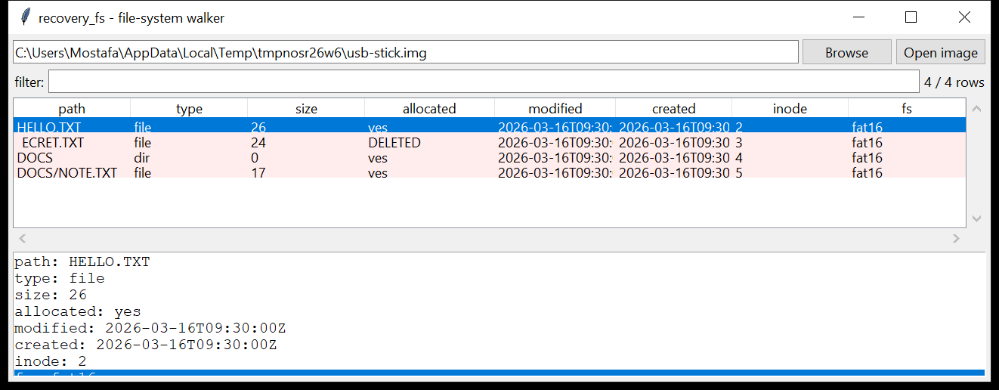

# recovery_fs

**One read-only walker for any supported file system.**

`recovery_fs` detects the file system at a byte offset (or auto-detects the
first partition), then exposes it through one interface regardless of type:

| command | does |
|---------|------|
| `list` | every file and directory — **allocated and deleted** — with size, all four timestamps and the inode / MFT-record / start-cluster |
| `extract` | pull files out by path glob or inode, preserving the tree |
| `cat` | write one file to stdout / a path |
| `bodyfile` | emit the 3.x pipe-format bodyfile for `analysis_timeline` / mactime |



## Supported file systems (v0.1)

| FS | status |
|----|--------|
| **NTFS** | full — the vendored `recovery_metadata` engine ($MFT walk, resident + non-resident data, deleted records, `$SI` / `$FN` times) |
| **FAT12 / FAT16 / FAT32** | full — directory tree, LFN, deleted (`0xE5`) entries, cluster-chain reads, DOS timestamps |
| **exFAT** | full — file/stream/name entry sets, `NoFatChain` runs, allocation via the bitmap entry, exFAT timestamps |
| **ext2 / ext3 / ext4** | detected only |
| **HFS+ / HFSX** | detected only |
| **APFS** | detected only |

The unsupported three are still **carvable** with `recovery_carve`.

## Usage

```
recovery_fs list disk.raw --deleted-only --csv files.csv
recovery_fs list usb.img --glob '*.jpg'
recovery_fs extract disk.raw --glob 'Users/*/Documents/*' -o ./out
recovery_fs cat part.img --path 'Windows/System32/drivers/etc/hosts'
recovery_fs bodyfile disk.raw -o fs.body
recovery_fs list image.E01 --offset 0x100000
```

| flag | effect |
|------|--------|
| `--offset OFF` | byte offset of the volume (default: auto — probe offset 0, then the first MBR / GPT partition) |
| `--deleted-only` / `--files-only` | filter the listing |
| `--glob PATTERN` | fnmatch on the full path |
| `--path PATH` / `--inode N` | exact selectors (for `cat` / `extract`) |
| `--csv` / `--json` (list) | `path,name,type,size,allocated,inode,created,modified,accessed,changed,fs` |
| `-o` (extract / bodyfile / cat) | output directory or file |

## Why it matters

`recovery_metadata` already does NTFS. Removable media — the USB sticks, SD
cards and camera media that show up in every case — are almost always FAT
or exFAT, and their deleted-file recovery (a `0xE5` entry whose start
cluster and size are intact, and whose data has not been reused) is often
the whole point of examining them. `recovery_fs` gives you one command and
one output schema across all of them, and one bodyfile that drops straight
into the super-timeline.

## Limitations (v0.1)

- **ext / HFS+ / APFS are not walked** — only recognised. Those backends
  are the next milestone.
- **FAT deleted recovery** relies on the directory entry surviving with an
  intact start cluster and size, and no FAT chain — a fragmented deleted
  file recovers only its first cluster's worth. FAT12/16 only clear the
  first name byte, so the recovered name has its first character replaced
  with `_`.
- **exFAT deleted recovery** is best-effort: cleared entry sets lose their
  checksum and often their name entries, so a deleted exFAT file may show
  with a partial or `(unnamed)` name.
- NTFS coverage is whatever the vendored `recovery_metadata` engine
  supports — no `$ATTRIBUTE_LIST` reassembly for very fragmented files, no
  ADS listed as separate entries here.
- Timestamps are emitted as stored: NTFS / exFAT in UTC, FAT DOS times as
  local wall-clock with no zone (the `tz` provenance column notes this).
- Reads the image through the OS; whole-disk `\\.\PhysicalDrive` / `/dev`
  access needs permission, and there is no built-in partition-table GUI
  (use `mounting_partitions` to find offsets).

## Tests

`tests/` hand-builds a **FAT16** image (a file, a deleted file, a subdir
with a nested file), an **exFAT** image (`NoFatChain` file + subdir), and
reuses `recovery_metadata`'s synthetic **NTFS** volume. The tests cover FS
detection, the walk + deleted-entry flagging + reads for all three
backends, MBR partition auto-detection, the `FsError` on an ext image, and
the `list` / `extract` / `cat` / `bodyfile` CLI.

```
cd recovery/recovery_fs && python -m pytest -q
```
