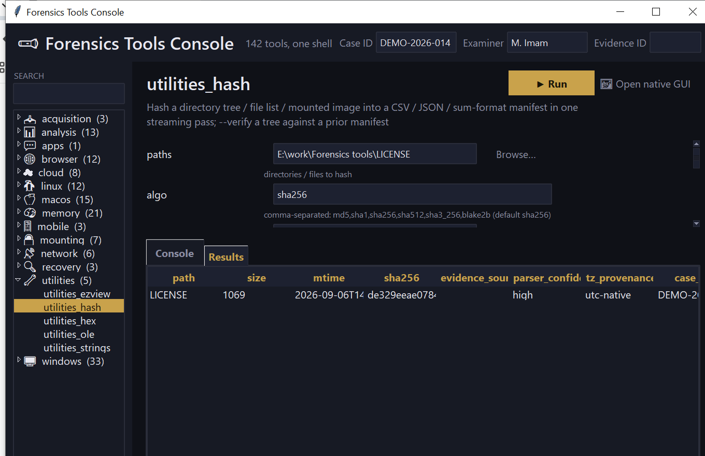

# suite_console

**One luxurious desktop shell for all 142 tools in this repository —
with zero per-tool integration code.**

Every tool here already shares the same shape: a `cli.py` exposing
`build_parser()` (a standard `argparse.ArgumentParser`, including the
common case-metadata flags every tool adds the same way via
`tracelib.add_arguments`) and `main()`. `suite_console` exploits that
directly instead of hand-wiring an integration per tool:

- **`discovery.py`** walks the repo for `<category>/<name>/
  pyproject.toml` + `<name>/cli.py` to build a live catalogue — a new
  tool #143 needs no registration here, it's found automatically the
  moment its directory matches the shape every other tool already uses.
- **`introspect.py`** imports a tool's own `build_parser()` and turns
  its argparse spec — including subcommands, where a tool has them
  (`mounting_fvde info`/`unlock`/`decrypt`) — into a form. The common
  provenance fields (`--case-id`, `--examiner`, ...) are filtered out
  of the per-tool form and rendered once, globally, instead of 142
  times.
- **`runner.py`** drives the tool as an **isolated subprocess**
  (`python -m <package>.cli ...`), not an in-process call — so one
  tool's crash or `sys.exit()` can never take the console itself down —
  and streams its stdout/stderr live.
- A tool that ships its own bespoke GUI (128 of the 142 do) can still
  be opened directly as its own window via **Open native GUI**,
  alongside the generic form.

## Usage

```
suite_console
suite_console --list
```

With no flags, opens the GUI. `--list` prints every discovered tool
(category, name, description) to stdout and exits — useful for
scripting or just checking discovery worked.



## Why it matters

Running 142 separate CLIs means remembering 142 separate argument
sets. This gives every one of them the same form, the same case
-metadata bar, the same results view — driven entirely by each tool's
own already-correct argparse spec, so it can never drift out of sync
with what a tool actually accepts.

## Limitations (v0.1)

- Reads a `--json`/`--csv` output file into the Results tab after a
  successful run; it does not attempt to parse a tool's raw stdout
  into structured rows.
- Append-type arguments (`--exclude PATTERN`, repeatable) render as a
  single text field — only one value can be supplied per run from the
  console.
- No persistence between sessions (recent tools, saved parameter sets)
  in v0.1.
- Windows-focused subprocess flags (`CREATE_NO_WINDOW`) are a no-op on
  other platforms, which is intentional, not untested — the app itself
  is plain `tkinter` and should run anywhere Python does.

## Tests

`discover_tools()` is tested against the real repository (a genuine
integration test, not a mock) — confirms it finds at least 142 tools,
excludes `shared`/`suite` themselves, and correctly reads a known
tool's description and native-GUI presence. `introspect.py` and
`runner.py` are tested against a minimal synthetic tool built on the
fly (a simple form, a subcommand-based one) to stay fast and isolated
from the full repo — including a genuine end-to-end subprocess run
that streams output and writes a real JSON file the console then reads
back.

```
cd suite/suite_console && python -m pytest -q
```
