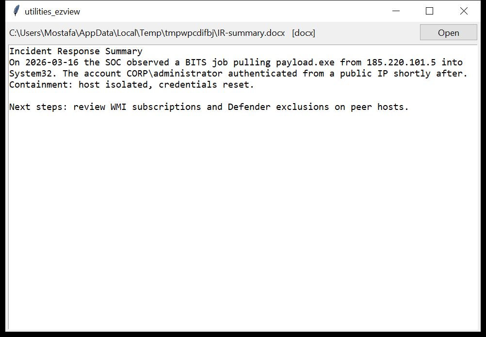

# utilities_ezview

**Look at a file's content without the app that made it.**

`utilities_ezview` sniffs a file **by content**, not extension, and renders
it as text or a table:

| format | how it's rendered |
|--------|-------------------|
| plain text / logs | as-is, with encoding detection (BOM, UTF-16 no-BOM heuristic, UTF-8, Latin-1) |
| CSV / TSV | parsed into rows (delimiter auto-detected) |
| HTML / XHTML | tags stripped, entities decoded, `<script>` / `<style>` dropped |
| MHTML (`.mht`) | MIME parsed, the `text/html` part extracted and stripped |
| RTF | control words removed, `\'hh` / `\uN` decoded |
| DOCX / PPTX | `<w:t>` / `<a:t>` text with paragraph / slide breaks |
| XLSX | shared-strings resolved into a table |
| DOC / XLS (legacy OLE) | best-effort printable-text extraction (noted as such) |
| PDF | text operators from the (Flate-decoded) content streams |
| anything else | handed to the `utilities_hex` hex + data-interpreter view |



## Usage

```
utilities_ezview report.docx
utilities_ezview export.xlsx
utilities_ezview note.rtf --text-out note.txt
utilities_ezview *.eml *.html --json formats.json
utilities_ezview mystery.bin           # -> hex fallback
utilities_ezview --gui evidence/
```

| flag | effect |
|------|--------|
| `--format` | print only the detected format + any note |
| `--text-out FILE` | write the extracted text (single input) |
| `--max-chars N` | truncate the rendering (default 2,000,000) |
| `--csv PATH` / `--json PATH` | one row per file: `path, format, encoding, chars, truncated, note` |
| `--gui` | tkinter viewer |

## Why it matters

During triage you constantly need to *read* a file — a suspicious `.docx`
attachment, an exported `.csv`, a config in an unknown text encoding, a
`.rtf` lure — on a machine that does not (and should not) have Office,
Acrobat or anything else installed. `utilities_ezview` gets you the text
with nothing but the Python standard library, and when it genuinely can't,
it drops straight into the hex view instead of failing.

## Limitations (v0.1)

- **DOC / XLS**: legacy binary Office formats are extracted as printable
  text runs only — the FIB / piece-table (Word) and BIFF record stream
  (Excel) are not parsed, so expect field codes, some ordering artefacts
  and no cell structure. Use `utilities_ole` for their metadata.
- **PDF**: text is pulled from `Tj` / `TJ` operators in Flate-decoded
  streams. Scanned (image-only) PDFs, encrypted PDFs, and documents using
  custom font encodings or `ObjStm`-packed content yield little or nothing
  (the note says so). No layout, no reading order guarantee.
- **XLSX**: the first worksheet only, values as stored (no number/date
  formatting applied); formulas show their cached result.
- HTML rendering is text extraction, not layout — tables become
  whitespace-separated text.
- No rendering of images, and no macro extraction (that's `utilities_ole`).

## Tests

`tests/test_utilities_ezview.py` covers text with a no-BOM UTF-16
encoding, CSV row parsing, HTML tag/script stripping with entity decode,
RTF control-word handling, DOCX paragraph extraction, XLSX shared-string
resolution, the binary → printable-runs fallback, and the CLI multi-file
JSON + `--text-out`.

```
cd utilities/utilities_ezview && python -m pytest -q
```
