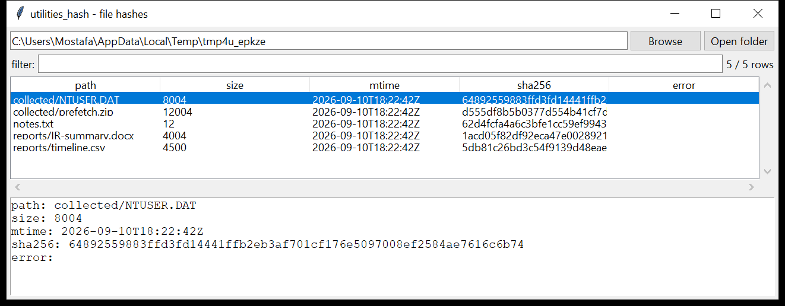

# utilities_hash

**One streaming pass, every digest, a manifest you can verify against later.**

`utilities_hash` walks a directory tree, a file list, or a mounted image and
hashes every file — computing all requested digests in a **single read** —
then writes a manifest as CSV, JSON, or the plain `<hash>  <path>` format the
`*sum` tools use. `--verify` diffs a fresh scan against a prior manifest and
reports what changed.



## Usage

```
utilities_hash /mnt/evidence --csv manifest.csv
utilities_hash /export --algo sha256 --sum-out hashes.txt
utilities_hash /cases/img --algo md5,sha1,sha256 --metadata --json m.json
utilities_hash /mnt/evidence --verify manifest.csv
utilities_hash --file-list collected.txt --json m.json
```

| flag | effect |
|------|--------|
| `--algo A,B,…` | any of `md5 sha1 sha256 sha512 sha3_256 blake2b` (default `sha256`) |
| `--file-list FILE` | hash the paths listed in `FILE`, one per line |
| `--no-recurse` / `--follow-symlinks` | directory-walk behaviour |
| `--exclude GLOB` | skip matching paths (repeatable) |
| `--verify MANIFEST` | diff against a prior manifest instead of writing one |
| `--csv PATH` / `--json PATH` | manifest with `path,size,mtime,<algos>,error` |
| `--sum-out FILE` | plain `<primary-hash>  <path>` (feeds `sha256sum -c`, `analysis_kff`) |

Manifest paths are stored **relative to each input root**, so a manifest
made on the acquisition host verifies on the analysis host.

## `--verify`

Loads the prior manifest (CSV / JSON / `*sum` format all auto-detected),
re-hashes the tree, and classifies every file:

| result | meaning |
|--------|---------|
| `CHANGED` | same path, different content (old → new hash shown) |
| `MOVED` | same content hash, different path (a rename) |
| `ADDED` | path present now, absent from the manifest |
| `REMOVED` | path in the manifest, absent now |
| *(unchanged)* | counted, not listed |

Exit code is non-zero if anything differs — usable as a tripwire in a
script.

## Why it matters

Every acquisition needs a hash manifest for chain of custody, and every
`analysis_kff` import needs one as input. Doing it in one pass with all the
digests you'll ever be asked for (MD5 for legacy tooling, SHA-256 for
everything modern) saves re-reading terabytes. The `--verify` diff is the
cheap integrity check between two points in an investigation — before and
after a tool ran, or acquisition host vs. lab.

## Limitations (v0.1)

- Hashes regular files only; symlinks are skipped unless
  `--follow-symlinks`, and special files (devices, sockets, FIFOs) are
  ignored.
- `--verify` matches `MOVED` purely by content hash, so two identical files
  that swap names are reported as two moves.
- Times are the filesystem `mtime` in UTC; no `atime` / `ctime` / birth
  time (those need a filesystem-level reader — see `recovery_metadata`).
- Reads through the OS, so on a live system a file changing mid-read yields
  a hash for neither the before nor after state (acquire from an image).

## Tests

`tests/test_utilities_hash.py` builds a small tree and checks the digest
values against `hashlib`, the exclude / no-recurse behaviour, the CSV
(BOM) / JSON / `sum-out` manifests, and a full `--verify` round trip
(changed + added + removed + moved) including the `*sum`-format manifest
loader.

```
cd utilities/utilities_hash && python -m pytest -q
```
