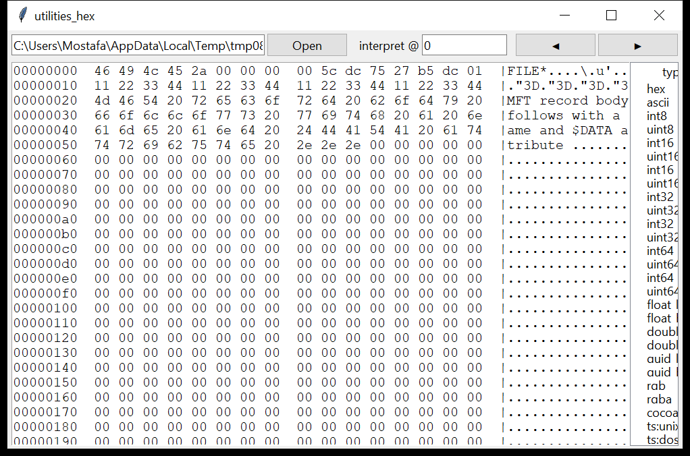

# utilities_hex

**A hex viewer that tells you what the bytes under the cursor mean.**

`utilities_hex` pages through any file, image, or device; renders the
classic `offset  16 bytes  ASCII` dump; searches for hex / text / UTF-16 /
regex; and interprets the bytes at any offset as every scalar and timestamp
encoding a forensic examiner reaches for.



## Data interpreter

For the bytes at an offset it shows:

- **integers** — signed and unsigned, 8 / 16 / 32 / 64-bit, **little- and
  big-endian**
- **floats** — 32-bit and 64-bit, both endiannesses
- **GUID** — mixed-endian (`bytes_le`) and big-endian
- **colour** — RGB (3 bytes) and RGBA (4 bytes)
- **timestamps** — Unix (s / ms / µs), Windows **FILETIME**, **WebKit /
  Chrome**, **DOS** date-time, **OLE** automation date, **Cocoa /
  Mac-absolute**, **HFS+** — each shown only when the value lands in a
  plausible date range

## Usage

```
utilities_hex firmware.bin --offset 0x1000 --length 256
utilities_hex record.bin --at 0x18
utilities_hex disk.raw --search 'MZ' --kind text --limit 20
utilities_hex $MFT --search '46 49 4c 45 30' --kind hex --csv hits.csv
utilities_hex \\.\PhysicalDrive0 --offset 0 --length 512
utilities_hex --gui evidence.raw
```

| flag | effect |
|------|--------|
| `-o` / `--offset`, `-l` / `--length`, `--width` | the dump window (offsets accept `0x…`) |
| `--at OFF` | interpret the bytes at `OFF` |
| `--search TERM` `--kind hex\|text\|utf16\|regex` | search; `--start` / `--end` / `--limit` bound it |
| `--csv PATH` / `--json PATH` | interpreter fields, or one row per search hit |
| `--gui` | tkinter viewer with the live interpreter panel |

## The embeddable widget

`utilities_hex.interp.interpret(buf, offset)` returns the full
representation dict, and `utilities_hex.gui` builds the same
hex-view + interpreter panel — so the suite's other `tkinter` GUIs
(`windows_mft`, `mounting_image`, `memory_image`) can drop it in rather
than re-implement byte interpretation.

## Limitations (v0.1)

- Search across an 8 MiB read boundary is handled with a 4 KiB overlap; a
  match longer than that at the exact seam could be missed (raise the
  overlap in `hexview.search` if you hit this).
- The interpreter reads up to 32 bytes from the offset; it does not do
  bit-fields, var-length integers, or structure overlays (that is
  `windows_mft` / a struct tool's job).
- Timestamp plausibility is a 1980–2100 window, so a deliberately
  out-of-range epoch value is shown as the raw integer only.
- Raw-device access needs OS permission; there is no locked-file bypass.

## Tests

`tests/test_utilities_hex.py` checks the hex-dump layout, every scalar
interpretation (including endianness and a real FILETIME → ISO
conversion and a GUID round-trip), text and hex search including a match
placed exactly on the 8 MiB read boundary, and the CLI dump / `--at` /
`--search` paths with CSV / JSON output.

```
cd utilities/utilities_hex && python -m pytest -q
```
