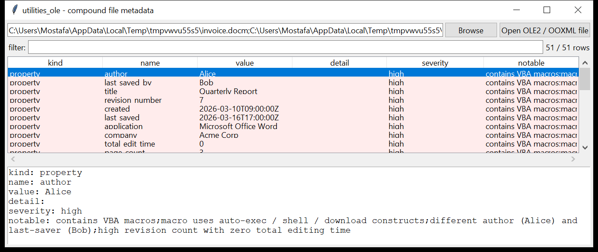

# utilities_ole

**Compound-file structure and Office document metadata, including macros.**

`utilities_ole` reads the OLE2 Compound File Binary format ([MS-CFB]) and
OOXML (`.docx` / `.xlsx` / `.pptx` and their macro-enabled `m` variants),
and reports:

| what | from |
|------|------|
| stream / storage tree | the CFB directory, or the OOXML package parts |
| document properties | `\x05SummaryInformation` + `\x05DocumentSummaryInformation` ([MS-OLEPS]), or OOXML `core.xml` / `app.xml` / `custom.xml` — author, dates, template, last saved by, revision, total editing time, application, company |
| **VBA macros** | detected in both formats; source **decompressed** ([MS-OVBA] 2.4.1) per module |
| embedded objects | `word/embeddings/*`, OLE package streams |
| external targets | relationship targets marked `TargetMode="External"` — remote templates, linked content, DDE |



## Usage

```
utilities_ole report.doc --props
utilities_ole invoice.xlsm --macros
utilities_ole deck.pptx --json meta.json
utilities_ole msg.msg --streams --extract ./out
utilities_ole *.docx --notable-only --csv suspicious.csv
```

| flag | effect |
|------|--------|
| `--streams` | list the stream / package tree with sizes |
| `--props` | print the document properties |
| `--macros` | print the decompressed VBA source |
| `--extract DIR` | write every stream of an OLE2 file into `DIR` |
| `--notable-only` / `--min-severity low\|medium\|high` | filter by the flags raised |
| `--csv PATH` / `--json PATH` | one row per property / macro module / embedded object / external target / stream |

## Flags

| flag | triggers on |
|------|-------------|
| `contains VBA macros` | a `Macros` / `_VBA_PROJECT_CUR` storage, or a `vbaProject.bin` part |
| `macro uses auto-exec / shell / download constructs` | source contains `AutoOpen`, `Document_Open`, `Workbook_Open`, `Shell`, `WScript.Shell`, `CreateObject`, `URLDownloadToFile`, `powershell`, `ADODB.Stream`, `ExecuteExcel4Macro`, … |
| `remote / UNC template` | `Template` property is an `http(s)://` or `\\host\` path |
| `external relationship target` | an OOXML relationship with `TargetMode="External"` to a URL / UNC / `mhtml:` |
| `different author (…) and last-saver (…)` | `Author` ≠ `Last Saved By` |
| `high revision count with zero total editing time` | `RevNumber` > 3 while `EditTime` is 0 — a hallmark of a document built from a template/kit |
| `N embedded object(s)` | any embedded OLE / package |

`severity` is the highest among a file's flags; a weaponised-macro construct
is `high`.

## The shared library

`utilities_ole.ole.OleFile` is the compound-file reader the other tools in
the suite import (`analysis_email` for `.msg`, `windows_jumplist` for
`automaticDestinations-ms`). It exposes `list_streams()`, `open_stream()`,
`walk()` / `tree()` (recursive path → `DirEntry`) and `read_path()`, handles
the FAT / mini-FAT / DIFAT chains, and reads both the 512- and 4096-byte
sector variants.

## Limitations (v0.1)

- VBA decompression implements the MS-OVBA RLE container; the *`dir`
  stream* record walk covers module name / stream name / offset / type,
  which is enough to locate and decompress each module's source. `PROJECT`
  / `PROJECTwm` references are not fully parsed.
- P-code (compiled VBA) is not disassembled — only the stored source text
  is recovered. A "VBA stomping" document whose source was removed will
  show the module with no source; that itself is suspicious.
- OOXML custom XML parts and the Excel 4.0 macro sheet (`xl/macrosheets/`)
  are listed but not decoded.
- Property-set parsing covers the common `VT_LPSTR` / `VT_LPWSTR` /
  `VT_FILETIME` / `VT_I2` / `VT_I4` / `VT_BOOL` / `VT_CLSID` types; vectors
  and other variants are skipped.
- Times are as stored (UTC for OLE `VT_FILETIME`; the OOXML `dcterms` value
  verbatim).

## Tests

`tests/_synth.py` builds an OLE2 `.doc` (SummaryInformation +
DocumentSummaryInformation property sets, a `Macros` storage with a `dir`
stream and an MS-OVBA-compressed `AutoOpen` + `WScript.Shell.Run` module),
a plain `.docx` (core/app props + an external `attachedTemplate`
relationship) and a macro-enabled `.docm` (embedded `vbaProject.bin`). The
tests cover the CFB walk, property-set field extraction, the OVBA
decompressor round-trip, OOXML property + external-target parsing, macro
detection in both container types, every flag family and the CLI
CSV(BOM) / JSON output.

```
cd utilities/utilities_ole && python -m pytest -q
```
