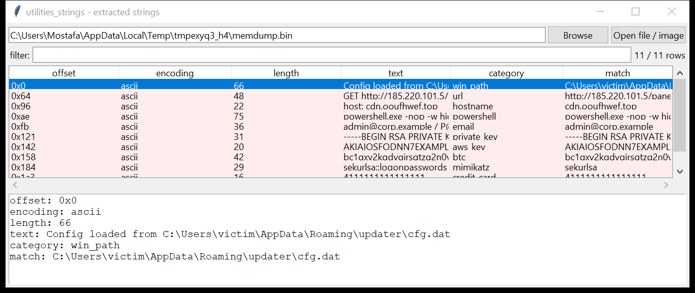

# utilities_strings

**`strings`, but it tells you what it found.**

`utilities_strings` extracts ASCII and UTF-16 (LE **and** BE) strings from
any file, image, or device — with byte offsets — and classifies each one
against a built-in library of ~35 forensic patterns.



## Pattern library

`url` · `email` · `ipv4` · `ipv6` · `hostname` · `unc_path` · `win_path` ·
`unix_path` · `registry` · `guid` · `powershell` · `cmdline` ·
`base64_blob` · `private_key` · `aws_key` · `jwt` · `btc` · `eth` ·
`credit_card` (Luhn-checked) · `user_agent` · `sql` · `onion` · `mac_addr` ·
`phone` · `iban` · `ssn_us` · `slack_token` · `github_pat` · `google_api` ·
`mimikatz` · `cobalt_strike`

`utilities_strings --list-patterns` prints the current set.

## Usage

```
utilities_strings suspicious.bin --min-len 6
utilities_strings disk.raw --category url,email,btc --csv iocs.csv
utilities_strings pagefile.sys --classified --json classified.json
utilities_strings \\.\C: --grep mimikatz --hex
utilities_strings mem.raw --start 0x1000000 --end 0x2000000 -e ascii,utf-16le,utf-16be
```

| flag | effect |
|------|--------|
| `-n` / `--min-len` | minimum run length (default 4) |
| `-e` / `--encoding` | comma list of `ascii,utf-16le,utf-16be` (default `ascii,utf-16le`) |
| `--hex` | print offsets in hexadecimal |
| `--start` / `--end` `OFF` | byte window (accepts `0x…`) |
| `--category A,B` / `--pattern NAME` | only strings matching those pattern classes |
| `--classified` | only strings that match at least one pattern |
| `--grep REGEX` | free-text filter |
| `--limit N` | stop after N results |
| `--csv PATH` / `--json PATH` | `offset,encoding,length,text,category,match` |

The target can be a path, a mounted image, or a raw device
(`\\.\C:` / `\\.\PhysicalDrive0` on Windows, `/dev/sdX` on Linux). If the
device is locked or needs elevation the tool says so — acquire an image or
a Volume Shadow Copy and point it there.

## Why it matters

Every triage of an unknown binary, a page / hibernation file, a memory
dump, or unallocated space starts with a strings pass. Doing the IOC
classification in the same pass — and Luhn-validating card numbers,
recognising `-enc` PowerShell, cloud tokens, wallet addresses and known
offensive-tool markers — turns a wall of text into a short list worth
following up, and feeds `analysis_kff` / `analysis_enrich` a clean IOC set.

## Limitations (v0.1)

- Strings crossing an 8 MiB read boundary are handled with an overlap
  window (default 1 MiB); a single string longer than that is truncated at
  the window edge.
- UTF-16 detection is the classic "printable byte + `\x00`" heuristic; it
  will occasionally stitch adjacent Latin-1 bytes into a spurious wide
  string, and it does not handle UTF-8 multibyte sequences (those show as
  their ASCII runs).
- Classification is regex-based and errs toward recall — expect some
  false positives in `hostname`, `base64_blob` and `phone`; `credit_card`
  is Luhn-filtered.
- Offsets are byte offsets into the *input as given*; on an image, add the
  partition offset yourself (or run against the extracted partition).
- Raw-device reads need OS permission; there is no built-in
  volume-shadow / locked-file bypass here (use `acquisition_collect` or
  `mounting_vsc`).

## Tests

`tests/test_utilities_strings.py` builds a blob mixing ASCII / UTF-16LE /
UTF-16BE strings plus planted IOCs (C2 URL, email, `-enc` PowerShell, a
valid and an invalid card number, a Windows path, a mimikatz command) and
checks the multi-encoding extraction, the pattern classification including
the Luhn filter, the `--category` filter, a string deliberately straddling
the 8 MiB read boundary, and the CLI CSV(BOM) / JSON / `--list-patterns`.

```
cd utilities/utilities_strings && python -m pytest -q
```
