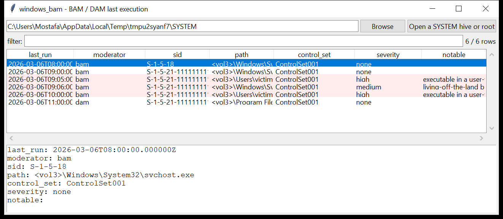

# windows_bam

**Per-user "last time this program ran", from the SYSTEM hive.**
Windows 10/11 keeps a last-execution timestamp for every program a user has
run, under the Background / Desktop Activity Moderator keys:

```
SYSTEM\CurrentControlSet\Services\bam\State\UserSettings\<SID>\<exe path>
SYSTEM\CurrentControlSet\Services\dam\State\UserSettings\<SID>\<exe path>
```

(plus the flatter `…\bam\UserSettings\<SID>` layout on Windows 10 1709).
Each value's **name** is the full NT path of an executable; the first 8
bytes of its **data** are the last-run time (FILETIME, UTC).

`windows_bam` reads a `SYSTEM` hive (or finds one under a mounted image
root) and emits one row per `(SID, executable)`: the drive path
(`\Device\HarddiskVolumeN\` → `<volN>\`), the last-run time, the moderator
(`bam` / `dam`) and the control set.



## Usage

```
windows_bam SYSTEM --csv bam.csv
windows_bam E:\                       (mounted image root)
windows_bam SYSTEM --sid S-1-5-21-… --json u.json
windows_bam SYSTEM --grep '\\temp\\|\\downloads\\'
windows_bam SYSTEM --notable-only --min-severity high
windows_bam SYSTEM --gui
```

| flag | effect |
|------|--------|
| `--sid SID` | only this user |
| `--moderator {bam,dam}` | one moderator |
| `--grep REGEX` | match the executable path |
| `--since` / `--until` `YYYY-MM-DD` | UTC date window |
| `--notable-only` / `--min-severity` | filter by the flags raised |
| `--csv PATH` / `--json PATH` | write the table instead of the text report |

## Why it matters

BAM is one of the cleanest execution artefacts on modern Windows: it names
the **user**, the **full path** and the **exact time** of the last run, and
it survives a lot of clean-up. It is the fastest way to answer "did this
account run this binary, and when" from a single hive — and a `.exe` under
`\Users\…\AppData\Local\Temp` sitting in the list is an immediate lead.

## Flags

| flag | meaning |
|------|---------|
| `executable in a user-writable path` | `\Users`, `\AppData`, `\Temp`, `\ProgramData`, `\Public`, `\Downloads`, `\Windows\Temp` |
| `living-off-the-land binary executed` | `powershell`, `mshta`, `rundll32`, `regsvr32`, `certutil`, `bitsadmin`, `wmic`, `psexec`, `schtasks`, … |
| `executed from a UNC / unusual volume path` | `\\host\share\…` or an unresolved volume |
| `system binary name outside a system directory` | e.g. `svchost.exe` under `\Users\…\Downloads` |
| `executable name contains a space` | possible `svchost .exe`-style masquerade |

## Limitations (v0.1)

- The `<volN>` prefix is *not* resolved to a drive letter — join it to the
  volume list from `windows_registry` (`MountedDevices`) if you need `C:`.
- SIDs are not resolved to account names (needs the `SAM` hive) — use
  `windows_registry`'s `sam-users` plugin.
- Only `bam` / `dam` are read; the related `AppCompatFlags` and `bam`
  `SettingsCollection` values are ignored.
- BAM stops updating an entry after the program's first run in a session,
  so the timestamp is the *last session start* that ran it, not necessarily
  the last invocation.

## Tests

```
cd windows/windows_bam && python -m pytest -q
```

`tests/_synth.py` hand-builds a `SYSTEM` hive with a `bam` and a `dam`
`UserSettings` subtree for two SIDs (a normal user and `S-1-5-18`),
including a `\Temp\agent.exe`, `powershell.exe` and a `svchost.exe` planted
in `\Users\victim\Downloads`, and the tests check the parse, the
`\Device\` rewrite, the FILETIME decode, every flag and the CLI (including
the mounted-root discovery).
