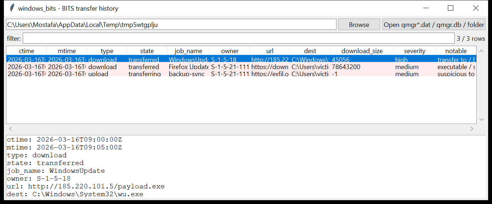

# windows_bits

**Every BITS transfer, carved out of the job queue.**
`windows_bits` reads the Background Intelligent Transfer Service database —
the legacy `qmgr0.dat` / `qmgr1.dat` queue files and the modern ESE
`qmgr.db` — and lists each download / upload job:

| field | meaning |
|-------|---------|
| `url` | the remote endpoint |
| `dest` | the local destination path |
| `tmp_file` | the `BITxxxx.tmp` scratch file the transfer streams into |
| `type` / `state` | download / upload / upload-reply; queued … transferred … cancelled |
| `owner` | the SID that created the job |
| `download_size` / `bytes_transferred` | byte counts (`-1` = unknown) |
| `ctime` / `mtime` | job create / last-modify FILETIMEs |



## Why it matters

BITS is a favourite of both commodity malware and hands-on-keyboard
intruders: the transfer is carried out by a **SYSTEM service**, it resumes
across reboots and logoffs, it is not tied to the calling process's
lifetime, and `bitsadmin` / `Start-BitsTransfer` make it a one-liner. A job
still sitting in the queue — or one that completed and has not yet been
flushed — is direct evidence of what was pulled in or pushed out, by whom,
and when.

## How it reads the database

Rather than depend on a container format or a file-header magic (which
differ across Windows builds), the parser scans the raw bytes for the job
and file record structures — three consecutive length-prefixed UTF-16LE
strings (local path, URL, scratch file) followed by two 64-bit byte counts,
with the job header (type, state, GUID, name, description), owner SID and
create/modify FILETIMEs sitting just before the first file of the job. For
`qmgr.db` the ESE cell contents are also concatenated and scanned, so a job
whose bytes straddle page boundaries is still recovered.

## Usage

```
windows_bits qmgr.db --csv bits.csv
windows_bits C:/ProgramData/Microsoft/Network/Downloader --notable-only
windows_bits E:\ --min-severity high --json bits.json
windows_bits qmgr0.dat --grep 'payload\.exe'
windows_bits E:\ProgramData\Microsoft\Network\Downloader --gui
```

A path can be a single `qmgr*.dat` / `qmgr.db` file, the `Downloader`
folder, or a mount root — files named `qmgr*` are picked up automatically.

| flag | effect |
|------|--------|
| `--type download\|upload\|upload-reply` | one job type |
| `--grep REGEX` | match url / dest / job name / owner |
| `--since` / `--until` `YYYY-MM-DD` | UTC date window on the job time |
| `--notable-only` / `--min-severity low\|medium\|high` | filter by the flags raised |
| `--csv PATH` / `--json PATH` | write the table instead of the text report |
| `--max-input-bytes` / `--max-records` / `--wall-seconds` | resource limits |

## Flags

| flag | triggers on |
|------|-------------|
| `transfer to / from a raw IP address` | URL host is a literal IPv4 / IPv6 |
| `suspicious top-level domain in URL` | `.top`, `.xyz`, `.tk`, `.zip`, `.mov`, `.click`, … |
| `cleartext HTTP transfer` | `http://` rather than `https://` |
| `executable / script payload` | `dest` / `url` / `tmp` ends `.exe .dll .ps1 .bat .hta .scr .msi .lnk .js …` |
| `destination in a Windows system directory` | `dest` under `\Windows\System32`, `\SysWOW64`, `\Tasks`, `\Windows\Temp` |
| `destination in a user-writable directory` | `dest` under `\AppData`, `\Temp`, `\ProgramData`, `\Users\Public`, `\Downloads` |
| `upload job (possible exfiltration)` | job type is upload / upload-reply |
| `job owned by a user account` | owner SID is not `S-1-5-18/19/20` and not `-500/-501` |
| `service-owned job fetching a payload` | `S-1-5-18` job pulling an executable or from a raw IP |
| `job name mimics a legitimate updater` | name contains `update` / `microsoft` / `windows` / `adobe` / `google` while the URL is a raw IP or bad TLD |

`severity` is the highest severity among a row's flags; an executable from a
raw IP is `high`.

## Limitations (v0.1)

- The record layout is recovered structurally, not from a spec. Jobs with
  no file entries, or files whose strings are corrupt, are not emitted.
  Field attribution (owner SID, job name, timestamps to a specific file)
  is "nearest preceding marker" and can be wrong when the queue is
  fragmented.
- FILETIMEs are picked as the first / last plausible 8-byte value within
  ~1 KiB of the file record; a job with unusual padding may pick a
  neighbouring value.
- `download_size` / `bytes_transferred` are read as the two 64-bit values
  after the scratch-file name; some job shapes carry extra fields there and
  the counts should be treated as approximate.
- The modern `qmgr.db` is read with the vendored `windows_esedb` reader,
  which does not inflate `XPRESS`/`LZXPRESS` long values — those cells are
  skipped, and the raw-byte scan is the fallback.
- Carving is heuristic: expect the occasional partial or duplicate row on a
  real, heavily-churned queue.

## Tests

```
cd windows/windows_bits && python -m pytest -q
```

`tests/_synth.py` builds a legacy `qmgr.dat` byte stream with three jobs: a
SYSTEM-owned download of `payload.exe` from a raw IP into `System32`, a
user-owned **upload** of an archive to a `.top` domain, and a benign HTTPS
`firefox.msi` download. The tests cover the string/GUID/SID/FILETIME
carving, job-type and owner attribution, every flag family and the CLI
filters with a CSV BOM + formula-injection check.
