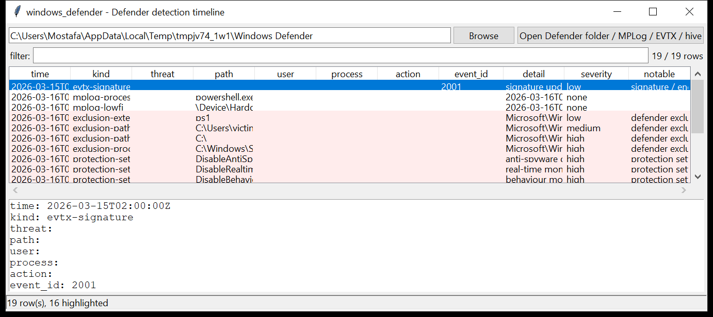

# windows_defender

**One Microsoft Defender detection timeline, from four artefacts.**
`windows_defender` reads every place Defender records evidence and merges it
into a single time-ordered table:

| artefact | on disk | what it gives |
|----------|---------|---------------|
| **MPLog** | `…\Windows Defender\Support\MPLog-*.log` | scan / real-time-protection activity: detections, scanned process images, `Lowfi` / `EMS` lines, exclusion use, scan spans |
| **Operational log** | `Microsoft-Windows-Windows Defender/Operational.evtx` | detections (1116 / 1117), actions (1006-1011), tamper (5001 / 5004 / 5007 / 5010 / 5012 / 5013), signature/engine updates (2000-2003), RTP failures (3002) |
| **Quarantine** | `…\Windows Defender\Quarantine\Entries\{GUID}` | threat name, **original file path**, detection time, threat id, resource hash — de-obfuscated from the RC4 store |
| **SOFTWARE hive** | `SOFTWARE` (or `Policies`) | path / extension / process / IP **exclusions** and the real-time-protection & tamper-protection switches |



## The quarantine store

Defender wraps every quarantine file — metadata and the malware itself — in
RC4 under a **single fixed key** that Microsoft has shipped unchanged for
years and that is published in open malware-analysis literature. Applying it
is de-obfuscation, not decryption: there is no secret, nothing is
brute-forced, and no password is involved. This tool reads the `Entries`
metadata by default; `--extract DIR` additionally unwraps the stored files
from `ResourceData` so they can be hashed or re-analysed (they remain inert
on disk — Defender will re-detect them if RTP is on).

## Usage

```
windows_defender 'C:/ProgramData/Microsoft/Windows Defender' --csv def.csv
windows_defender MPLog-20260316-090000.log --kind mplog-detection
windows_defender E:\ --notable-only --min-severity high
windows_defender SOFTWARE --kind exclusion-paths
windows_defender 'Windows Defender/Quarantine' --json q.json
windows_defender E:\Windows\System32\winevt\Logs --gui
```

A path can be the Defender data folder, a single MPLog / EVTX / `SOFTWARE`
file, a `Quarantine` directory, or a mount root — the tool walks it and
recognises each artefact by name and content.

| flag | effect |
|------|--------|
| `--kind KIND` | one record kind (`quarantine`, `evtx-detection`, `evtx-tamper`, `mplog-detection`, `mplog-process`, `exclusion-paths`, `protection-setting`, …) |
| `--grep REGEX` | match threat / path / user / detail |
| `--since` / `--until` `YYYY-MM-DD` | UTC date window |
| `--notable-only` / `--min-severity low\|medium\|high` | filter by the flags raised |
| `--no-quarantine` | skip the Quarantine store |
| `--csv PATH` / `--json PATH` | write the table instead of the text report |
| `--max-input-bytes` / `--max-records` / `--wall-seconds` | resource limits |

## Why it matters

The four sources overlap deliberately. A detection in the Operational log
tells you Defender *saw* something; the MPLog tells you what *process* was
touching it; the Quarantine entry preserves the **original path and the file
itself** even after the on-disk copy is gone; and the exclusion list tells
you whether an attacker told Defender to look away first. Seeing all four on
one timeline is what turns "AV fired once" into a sequence of events.

## Flags

| flag | triggers on |
|------|-------------|
| `threat detected / quarantined` | any MPLog / Operational-log / Quarantine detection |
| `remediation failed` | action events reporting failure |
| `real-time protection / configuration tampering` | 5001 / 5004 / 5007 / 5010 / 5012 / 5013 / 3002 |
| `protection setting changed` / `… disabled` | `DisableAntiSpyware`, `DisableRealtimeMonitoring`, `DisableBehaviorMonitoring`, `TamperProtection`, … set in the hive |
| `defender exclusion configured` | any exclusion present |
| `exclusion covers an entire drive / tree` | exclusion of `C:\`, `*`, a drive root or `…\Users` / `…\Windows` |
| `exclusion of a user-writable path` | exclusion under `\AppData`, `\Temp`, `\ProgramData`, `\Users\Public`, `\Downloads`, … |
| `exclusion of a living-off-the-land binary` | process exclusion for `powershell`, `mshta`, `rundll32`, `regsvr32`, `certutil`, `bitsadmin`, … |
| `signature / engine update failed` | 2001 / 2003 |

`severity` is the highest severity among a row's flags.

## Limitations (v0.1)

- MPLog has no published grammar; the parser targets the well-known line
  shapes (`DETECTIONEVENT`, `ProcessImageName:`, `Lowfi:`, `EXCLUSION`,
  `BEGIN`/`END`) and keeps the raw line for anything it classifies. Lines it
  does not recognise are dropped.
- The quarantine `Entries` layout (header + two RC4 sections, section-2
  TLV resource fields) is stable in practice but undocumented; fields that
  do not parse are surfaced as `t<type>=<hex>` rather than guessed.
- Times are taken verbatim from each artefact (event `TimeCreated`,
  quarantine `FILETIME`, MPLog line prefix), all UTC.
- Exclusion / switch values are read from the hive as-is; Group Policy
  tattooing vs. local configuration is not distinguished beyond the key path
  (`Policies\…` vs `Microsoft\…`).
- `--extract` is best-effort: the 0x28-byte `ResourceData` prefix is
  stripped, but multi-stream resources are written as a single blob.

## Tests

```
cd windows/windows_defender && python -m pytest -q
```

`tests/_qsynth.py` builds a Quarantine entry (RC4 round-trip: threat,
original path, FILETIME, SHA-1); `tests/_synth.py` builds a Defender
Operational log (1116 detection, 1117 quarantine action, 5007 RTP-disabled
config change, 5001, 2001 failed update) plus an MPLog sample;
`tests/_hive_synth.py` builds a `SOFTWARE` hive with path / extension /
process exclusions (including a whole-drive `C:\` exclusion) and
`DisableRealtimeMonitoring` / `DisableAntiSpyware` set. The tests cover the
quarantine decode, every artefact reader, the merge onto one timeline, the
flag families and the CLI filters with a CSV BOM + formula-injection check.
