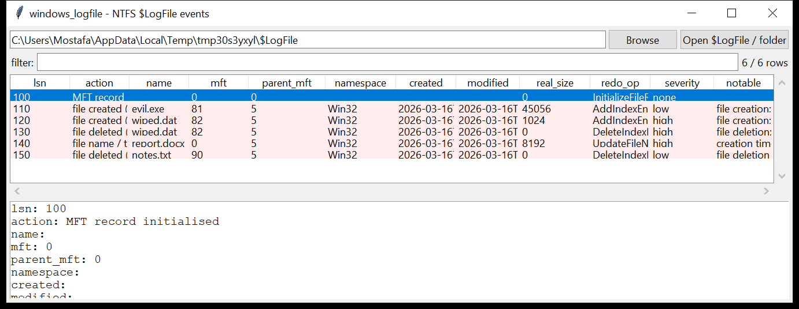

# windows_logfile

**The NTFS metadata journal, turned into a file-activity timeline.**
`windows_logfile` parses `$LogFile` — the transaction log NTFS uses to keep
its metadata consistent — and reconstructs the recent operations:

| event | from which log operations |
|-------|---------------------------|
| **file created** | `AddIndexEntryAllocation` / `AddIndexEntryRoot` carrying a `FILE_NAME` attribute |
| **file deleted** | `DeleteIndexEntryAllocation` / `DeleteIndexEntryRoot` |
| **name / timestamps updated** | `UpdateFileNameRoot` / `UpdateFileNameAllocation` |
| **MFT record initialised / freed** | `InitializeFileRecordSegment` / `DeallocateFileRecordSegment` |
| **resident value / non-resident data written** | `UpdateResidentValue` / `UpdateNonResidentValue` |

Each event that carries a `FILE_NAME` gives the name, the parent MFT
reference, the four `$FILE_NAME` timestamps and the file size.



## Why it matters

`$LogFile` only holds the last few tens of megabytes of metadata activity —
minutes to hours on a busy volume — but at a **finer grain than `$UsnJrnl`**
and often slightly ahead of it. It is where you see a file that was created
and deleted so fast it never reached the USN journal, or a `$FILE_NAME`
timestamp being rewritten. It is the closest thing NTFS has to a
transaction-level audit trail.

## Usage

```
windows_logfile $LogFile --csv logfile.csv
windows_logfile ./LogFile.bin --action 'file deleted'
windows_logfile E:\ --notable-only --min-severity high
windows_logfile $LogFile --grep '\.exe$' --named-only
```

Give it an extracted `$LogFile`, a folder, or a mount root.

| flag | effect |
|------|--------|
| `--action SUBSTR` | match the reconstructed action text |
| `--grep REGEX` | match the file name |
| `--named-only` | only events that recovered a file name |
| `--notable-only` / `--min-severity low\|medium\|high` | filter by the flags raised |
| `--csv PATH` / `--json PATH` | write the table instead of the text report |
| `--max-input-bytes` / `--max-records` / `--wall-seconds` | resource limits |

## Flags

| flag | triggers on |
|------|-------------|
| `file created and deleted within the log window (anti-forensics / staging)` | the same name appears in both a create and a delete event |
| `creation time later than modification time (timestomp)` | `$FILE_NAME` C-time > M-time on an update event |
| `deletion of an executable / script` | a delete event for `*.exe .dll .sys .ps1 .bat .vbs .hta .lnk …` |
| `creation of an executable / script` | the same for a create event |
| `alternate data stream in the name` | the recovered name contains `name:stream` |
| `path component under a temp / recycle directory` | name references `\Temp\`, `\$Recycle.Bin\`, `\AppData\Local\Temp\` |
| `DOS (8.3) short-name entry` | a create with a DOS-namespace `FILE_NAME` |

`severity` is the highest among a row's flags; a create+delete twin or a
timestomp is `high`.

## Limitations (v0.1)

- The log-record header and redo/undo operation structure are parsed at
  fixed offsets (first record at `0x40` in each RCRD page). This matches
  common Windows 10 / 11 layouts; a volume from an older or unusual build
  may need the offsets adjusted — records that do not decode are counted,
  not guessed.
- The update-sequence array is applied, but a torn or stale page is used
  as-is (and its records may be skipped).
- Events are **not** correlated by transaction — a rename shows as a
  name/timestamp update, not as a delete+create pair, and an aborted
  transaction is not distinguished from a committed one.
- No full-path reconstruction: the event carries the parent **MFT
  reference**, not a path. Resolve it against `$MFT` (`windows_mft`).
- `UpdateNonResidentValue` / `UpdateResidentValue` events are reported as
  activity markers; their data payloads are not interpreted.
- Only `$LogFile` itself is read — extract it with a tool that can copy
  locked files, or from an image.

## Tests

`tests/_synth.py` builds a `$LogFile` (two `RSTR` pages + one `RCRD` page
with a real update-sequence array) containing six log records: an MFT
init, a create of `evil.exe`, a create **and** delete of `wiped.dat`, a
`FILE_NAME` update on `report.docx` with C-time after M-time, and a delete
of `notes.txt`. The tests cover the USA fix-up, record-stream walk,
redo/undo op naming, `FILE_NAME` recovery from both index-entry and bare
layouts, the create/delete-twin and timestomp flags, and the CLI filters
with a CSV BOM + formula-injection check.

```
cd windows/windows_logfile && python -m pytest -q
```
