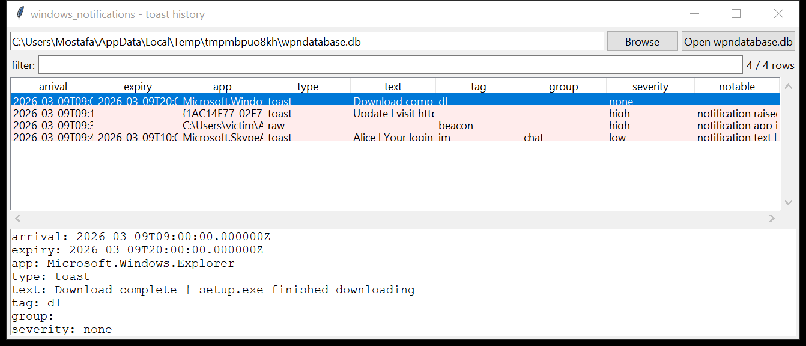

# windows_notifications

**The toast / tile notification history.** `windows_notifications` reads
`wpndatabase.db` — the SQLite store under
`…\AppData\Local\Microsoft\Windows\Notifications\` — and joins the
`Notification` table to `NotificationHandler` so every notification is
attributed to an **application** (its AUMID or executable id).

Per notification: the app, the **type** (`toast` / `tile` / `badge` /
`raw`), the **arrival** and **expiry** times (FILETIME → UTC), the tag /
group, and the **notification text** extracted from the toast / tile
payload XML (`<text>` / `<title>` / `<subtitle>` nodes).

The evidence file is copied with its `-wal` / `-shm` side files before it
is opened; the original is untouched.



## Usage

```
windows_notifications wpndatabase.db --csv notif.csv
windows_notifications E:\                          (mounted image root)
windows_notifications wpndatabase.db --type raw --json raw.json
windows_notifications wpndatabase.db --app powershell --grep 'http'
windows_notifications wpndatabase.db --notable-only --min-severity high
windows_notifications wpndatabase.db --gui
```

| flag | effect |
|------|--------|
| `--type NAME` | `toast` / `tile` / `badge` / `raw` |
| `--app REGEX` | match the app id |
| `--grep REGEX` | match the notification text |
| `--since` / `--until` `YYYY-MM-DD` | UTC date window (on arrival) |
| `--notable-only` / `--min-severity` | filter by the flags raised |
| `--csv PATH` / `--json PATH` | write the table instead of the text report |

## Why it matters

Notifications are a running commentary on what the machine was doing: a
download finished, a chat message arrived, a sign-in code was delivered, an
app wanted attention — each with a timestamp and the exact text shown to
the user. `raw` notifications carry an opaque binary payload straight to an
app, which is a delivery channel a handful of implants have used. And a
toast **raised by `powershell.exe` or a binary in `\Temp`** is not
something a normal program does.

## Flags

| flag | meaning |
|------|---------|
| `notification raised by a script / LOLBin app` | the handler's app id is `powershell.exe`, `mshta.exe`, a `.ps1` / `.hta` / `.js`, … |
| `notification app id is a user-writable path` | the handler id is a path under `\AppData`, `\Temp`, `\ProgramData`, `\Public`, `\Downloads` |
| `raw notification` | `Type = raw` — an opaque payload, not a visible toast |
| `notification text contains a URL` / `an IP address` | a link / literal address in the shown text |
| `notification text looks like an authentication code / credential prompt` | "verification code", "one-time", "OTP", "login code", "password" in the text |

## Limitations (v0.1)

- The `NotificationData` table (per-notification key/value data used by
  adaptive toasts) and `WNSPushChannel` (the push channel URIs / expiry)
  are not surfaced yet.
- `raw` payloads are noted but not decoded — they are app-specific.
- Tile / badge payloads are handled the same way as toasts; badge
  notifications usually carry only a glyph or number.
- The `Type` column has been an integer and, on some builds, a text string
  (`'toast'`) — both are handled.

## Tests

```
cd windows/windows_notifications && python -m pytest -q
```

`tests/_synth.py` builds a `wpndatabase.db` with a `NotificationHandler`
table (Explorer, `powershell.exe`, a `\Temp\agent.exe`, a Skype AUMID) and
four `Notification` rows — a download toast, a `powershell` toast with a
`http://185.10.20.30/…` link, a `raw` beacon notification, and a "login
code" toast — and the tests check the payload-text extraction, the handler
join, the FILETIME conversion, every flag and the CLI.
