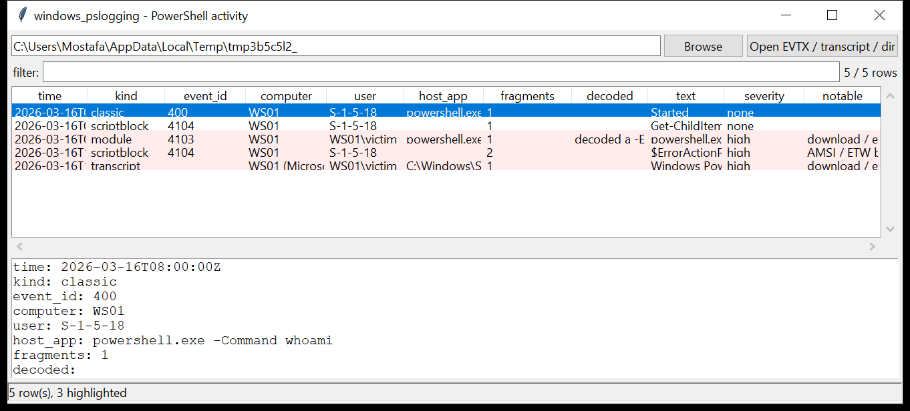

# windows_pslogging

**PowerShell activity, reassembled and decoded.**
`windows_pslogging` pulls every trace PowerShell leaves in the Windows event
log and on disk, and emits **one row per script** — with the full text put
back together and any encoded payloads expanded in place:

| source | events | what it carries |
|--------|--------|-----------------|
| `Microsoft-Windows-PowerShell/Operational` | **4104** Script Block Logging | the executed script, split across as many records as it takes — reassembled by `ScriptBlockId` in `MessageNumber` order |
| `Microsoft-Windows-PowerShell/Operational` | **4103** Module Logging | pipeline / command invocation with `ContextInfo` (host application, user) |
| `Windows PowerShell` (classic) | **400 / 403 / 500 / 501 / 600** | engine start / stop and provider lifecycle, with the host application line |
| `PowerShell_transcript.*.txt` | — | the `**********` transcript blocks: header (user, machine, host, start time) and every command typed |



## Decoding

Encoded payloads are expanded recursively (up to 3 layers) and the original
kept alongside:

- `-EncodedCommand` / `-enc` / `-e` → base64 → UTF-16LE
- `[Convert]::FromBase64String("…")` blobs
- base64 wrapped around gzip / raw-DEFLATE / zlib (`IO.Compression.GzipStream`,
  `DeflateStream`)

Each expansion is noted in the `decoded` column (`EncodedCommand → …`,
`FromBase64String (compressed) → …`).

## Usage

```
windows_pslogging 'Microsoft-Windows-PowerShell%4Operational.evtx' --csv ps.csv
windows_pslogging E:\ --notable-only --min-severity high
windows_pslogging PowerShell_transcript.WS01.20260316113000.txt --json t.json
windows_pslogging /mnt/evtx --grep 'DownloadString'
windows_pslogging E:\Windows\System32\winevt\Logs --gui
```

A path can be a single EVTX file, a single transcript, or a directory / mount
root — the tool walks it and picks up the PowerShell logs and
`PowerShell_transcript.*` files by name.

| flag | effect |
|------|--------|
| `--kind scriptblock\|module\|classic\|transcript` | one record type |
| `--grep REGEX` | match the decoded text, host application or user |
| `--since` / `--until` `YYYY-MM-DD` | UTC date window |
| `--notable-only` / `--min-severity low\|medium\|high` | filter by the flags raised |
| `--full-text` | print the whole decoded script in the text report |
| `--csv PATH` / `--json PATH` | write the table instead of the text report |
| `--max-input-bytes` / `--max-records` / `--wall-seconds` | resource limits |

## Why it matters

Script Block Logging is the single richest PowerShell artefact — but a real
script is chopped into dozens of 4104 records, and offensive tooling almost
always arrives base64-encoded. This tool does the two tedious steps
(reassemble, decode) so the analyst reads the actual script, then flags the
constructs that matter.

## Flags

| flag | triggers on |
|------|-------------|
| `download / execute cradle` | `Net.WebClient`, `Invoke-WebRequest` / `iwr`, `DownloadString/File/Data`, `Start-BitsTransfer`, `certutil -urlcache`, `curl` / `wget` |
| `AMSI / ETW bypass string` | `amsiInitFailed`, `AmsiUtils`, `AmsiScanBuffer`, `[Ref].Assembly.GetType`, `EtwEventWrite`, `PSEtwLogProvider` |
| `reflective / in-memory assembly load` | `[Reflection.Assembly]::Load`, `Add-Type -TypeDefinition`, `VirtualAlloc`, `WriteProcessMemory`, `CreateRemoteThread` |
| `reverse shell / raw socket` | `Net.Sockets.TCPClient` / `UDPClient`, `GetStream()` |
| `credential / LSASS access` | `Invoke-Mimikatz`, `sekurlsa`, `MiniDumpWriteDump`, `comsvcs.dll MiniDump`, `Invoke-Kerberoast`, `Rubeus`, `SharpHound` |
| `persistence via scheduled task / WMI / registry Run` | `schtasks /create`, `Register-ScheduledTask`, `__EventFilter`, `CommandLineEventConsumer`, `Run` key writes, `New-Service` |
| `clears event logs / history` | `Clear-EventLog`, `wevtutil cl`, `Clear-History`, `ConsoleHost_history` deletion, `-HistorySaveStyle SaveNothing` |
| `hidden window / no profile / EP bypass` | `-w hidden`, `-nop`, `-ExecutionPolicy Bypass`, `-NonInteractive`, inline `-enc` |
| `obfuscation markers` | `-join (`, `[char[]]`, format-string `-f`, `${x}` splatting, `[Convert]::ToChar`, short `-replace` |
| `IEX / dynamic execution` | `Invoke-Expression` / `IEX`, `& ($…)`, `.Invoke()`, `[ScriptBlock]::Create` |
| `high concatenation / escape-character density` | backtick + `+` density over 3% of the script |

`severity` is the highest severity among the flags on that row (`high` for
the cradle / bypass / shell / credential / persistence / log-clear families).

## Limitations (v0.1)

- Times are taken verbatim from the event record (`TimeCreated`, UTC). No
  transaction-log replay for a dirty EVTX — records past a corrupt chunk are
  skipped and counted in the run summary.
- 4104 reassembly needs every part present. A script missing part *n* is
  still emitted, joined from what is there, and its `fragments` count will be
  below `MessageTotal`.
- Flags are substring / regex heuristics on the decoded text — they locate
  suspicious constructs, they do not prove intent. Read the script.
- Deep or non-standard obfuscation (custom XOR, char-code arithmetic,
  SecureString round-trips) is not unwound; only base64 / gzip / deflate is.

## Tests

```
cd windows/windows_pslogging && python -m pytest -q
```

`tests/_evtx_synth.py` is the from-scratch EVTX writer (shared with
`windows_evtx`); `tests/_synth.py` builds a PowerShell Operational log with a
benign one-part 4104, a malicious two-part 4104 stored **out of order**
(reverse shell + AMSI bypass + `Invoke-Mimikatz`), a 4103 carrying an
`-EncodedCommand`, and a classic 400 event — plus a `PowerShell_transcript`
with a `certutil` download, a BITS transfer and `wevtutil cl Security`. The
tests cover fragment reassembly and ordering, base64 and gzip+base64
decoding, every flag family, transcript parsing, and the `--kind` /
`--min-severity` / `--grep` CLI filters with a CSV BOM + formula-injection
check.
