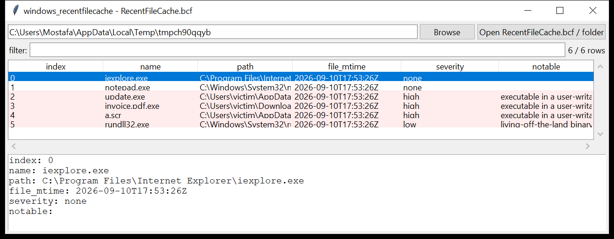

# windows_recentfilecache

**The Windows 7 program-execution list, before Amcache existed.**
`windows_recentfilecache` parses
`C:\Windows\AppCompat\Programs\RecentFileCache.bcf` — a 20-byte header
followed by a flat list of length-prefixed UTF-16 paths. Each path is an
executable the Program Compatibility Assistant recorded running (or newly
appearing) in roughly the 24 hours before the last program-inventory
sweep.



## What you get

One row per entry: `index`, `name`, full `path`, and `file_mtime` (the
`.bcf` file's own modification time — the artefact has **no internal
timestamps**, so this is the only temporal bound available).

## Why it matters

On a Windows 7 host `RecentFileCache.bcf` is often the single best
"what ran recently" artefact — it predates and was replaced by
`Amcache.hve`. An executable that appears here ran on this machine; the
file's MFT timestamps put a ceiling on when. Pair it with `windows_amcache`
and `windows_shimcache` on the same host for corroboration.

## Usage

```
windows_recentfilecache RecentFileCache.bcf --csv rfc.csv
windows_recentfilecache C:/Windows/AppCompat/Programs --notable-only
windows_recentfilecache E:\ --min-severity high --json rfc.json
windows_recentfilecache RecentFileCache.bcf --grep '\\Temp\\'
```

| flag | effect |
|------|--------|
| `--grep REGEX` | match the path / name |
| `--notable-only` / `--min-severity low\|medium\|high` | filter by the flags raised |
| `--csv PATH` / `--json PATH` | write the table instead of the text report |
| `--max-input-bytes` / `--max-records` / `--wall-seconds` | resource limits |

## Flags

| flag | triggers on |
|------|-------------|
| `executable in a user-writable directory` | path under `\AppData`, `\Temp`, `\ProgramData`, `\Users\Public`, `\Downloads`, `\Windows\Temp`, `$Recycle.Bin` |
| `double extension (masquerading)` | `invoice.pdf.exe`, `photo.jpg.scr`, … |
| `script / non-PE executable type` | `.scr`, `.pif`, `.hta`, `.js`, `.vbs`, `.ps1`, `.bat`, … |
| `living-off-the-land binary` | `powershell`, `rundll32`, `regsvr32`, `mshta`, `certutil`, `bitsadmin`, `wmic`, … |
| `path is a UNC share or the recycle bin` | path starts `\\` or `X:\$Recycle.Bin` |
| `randomised / very short executable name` | 8+ hex characters, or a 1–3 letter name |

`severity` is the highest among a row's flags.

## Limitations (v0.1)

- The `.bcf` format has no timestamps and no metadata beyond the paths;
  the tool cannot tell you *when* within the ~24 h window an entry was
  added.
- The header signature is checked against the known values; an unexpected
  signature is reported but parsing still proceeds.
- Parsing stops at the first entry whose length prefix is implausible and
  reports the trailing byte count (a truncated or carved file).
- This artefact only exists on Windows 7 / Server 2008 R2; on newer
  systems use `windows_amcache`.

## Tests

`tests/_synth.py` builds a `RecentFileCache.bcf` with six entries — two
benign system binaries and four suspicious ones (`\Temp\update.exe`, an
`invoice.pdf.exe` double extension, an `.scr` in `\AppData\Roaming`, and
`rundll32.exe`). The tests cover header detection, the length-prefixed
string parse, index numbering, trailing-byte accounting, every flag family
and the CLI filters with a CSV BOM + formula-injection check.

```
cd windows/windows_recentfilecache && python -m pytest -q
```
