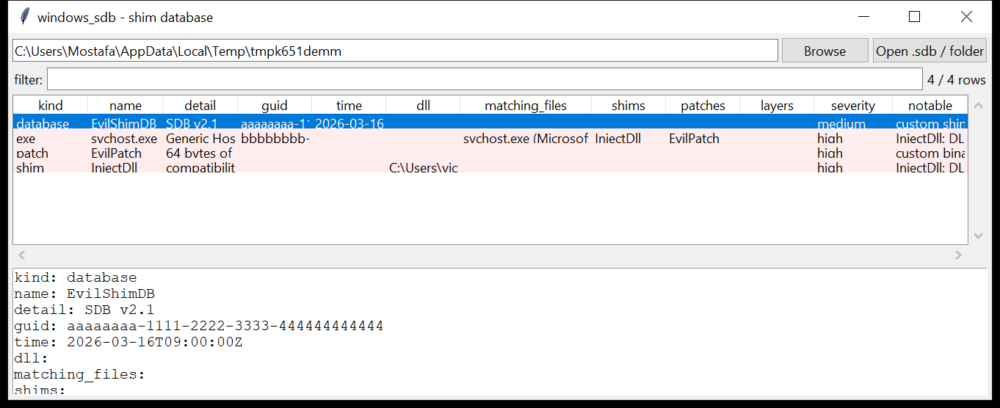

# windows_sdb

**Application Compatibility shim databases, unpacked.**
`windows_sdb` parses `.sdb` files — the system `sysmain.sdb` and, more to
the point, **custom / installed** databases — and lists what they contain:

| record | fields |
|--------|--------|
| `database` | name, database GUID, build time, SDB version |
| `shim` | shim name, backing DLL (`DLLFILE`), module, description |
| `patch` | patch name, size of the in-place patch data |
| `exe` | executable name, app / vendor, `EXE_ID` GUID, matching files, the shims / patches / layers applied to it, command line |
| `layer` | layer name and the shims it bundles |



## Why it matters

A custom shim database is a documented, signed-by-Windows way to run code:
`sdbinst evil.sdb` registers an `InjectDll` shim (or a binary `PATCH`)
against a target executable, and from then on Windows loads the attacker's
DLL — or applies the attacker's byte patch — every time that executable
starts. It survives reboots, and the only artefacts are the `.sdb` file and
an `InstalledSDB` registry key. `windows_sdb` reads the `.sdb` and tells
you exactly which executable it hooks and how.

## Usage

```
windows_sdb C:/Windows/AppPatch/sysmain.sdb --csv sdb.csv
windows_sdb custom.sdb --notable-only
windows_sdb E:\Windows\apppatch\Custom --min-severity high
windows_sdb E:\ --kind exe --grep svchost
windows_sdb custom.sdb --gui
```

A path can be a single `.sdb`, a folder of them
(`%WINDIR%\AppPatch\Custom`), or a mount root.

| flag | effect |
|------|--------|
| `--kind database\|exe\|shim\|patch\|layer\|file` | one record kind |
| `--grep REGEX` | match name / detail / matching files / shims / DLL / command line |
| `--notable-only` / `--min-severity low\|medium\|high` | filter by the flags raised |
| `--csv PATH` / `--json PATH` | write the table instead of the text report |
| `--max-input-bytes` / `--max-records` / `--wall-seconds` | resource limits |

## Flags

| flag | triggers on |
|------|-------------|
| `<shim>: DLL injection into the target process` | `InjectDll` |
| `redirects LoadLibrary calls` | `LoadLibraryRedirect` |
| `replaces the executable that is launched` | `RedirectEXE` |
| `redirects a shortcut target` | `RedirectShortcut` |
| `redirects file-system paths` | `CorrectFilePaths` |
| `redirects / virtualises registry access` | `VirtualRegistry` |
| `disables DEP for the target` | `DisableNXShowUI` |
| `forces the target to run elevated` / `fakes administrator access checks` | `RunAsAdmin`, `ForceAdminAccess`, `ElevateCreateProcess` |
| `custom binary patch (in-place code modification)` | any `PATCH` record or a `PATCH_REF` on an EXE |
| `shim DLL is not a standard AppCompat module` | `DLLFILE` is not `apphelp` / `acgenral` / `aclayers` / … |
| `shim DLL path is user-writable` | `DLLFILE` under `\AppData`, `\Temp`, `\ProgramData`, … |
| `shim targets a Windows system binary` | a matching file of `svchost.exe`, `explorer.exe`, `lsass.exe`, `services.exe`, `winlogon.exe`, `powershell.exe`, … with a shim or patch attached |
| `custom shim database (not the system sysmain.sdb)` | the `.sdb` is not `sysmain` / `msimain` / `drvmain` and not under `\AppPatch\` |

`severity` is the highest among a record's flags; `InjectDll`, `RedirectEXE`
and any custom patch are `high`.

## Limitations (v0.1)

- The tag parser covers the common storent tags (NULL / BYTE / WORD /
  DWORD / QWORD / STRINGREF / LIST / STRING / BINARY) and the documented
  compatibility tag names; unrecognised tags are kept as `TAG_XXXX` with
  their raw value.
- `STRINGREF` is resolved as a byte offset from the start of the string
  table's child data; databases that lay the table out differently will
  show empty names.
- Shim *semantics* are not evaluated — the flags key off the shim's
  **name**. A renamed or in-house shim that does something dangerous under
  an innocuous name will not be flagged; conversely a differently-named
  shim that merely contains "inject" as a substring will.
- The `InstalledSDB` registry key (install time, install path, per-machine
  vs per-user) is not read here — pair with `windows_registry`.
- Patch *contents* (`PATCH_BITS`) are reported only by size, not
  disassembled.

## Tests

`tests/_synth.py` hand-builds an `.sdb` (12-byte header + tag tree + string
table) containing an `InjectDll` shim whose `DLLFILE` is under
`\AppData\Local`, an `EvilPatch` binary patch, and an `EXE` entry for
`svchost.exe` that references both — plus a benign system-style database.
The tests cover the tag-tree parse, `STRINGREF` resolution, FILETIME
conversion, GUID decoding, every flag family and the CLI filters with a CSV
BOM + formula-injection check.

```
cd windows/windows_sdb && python -m pytest -q
```
