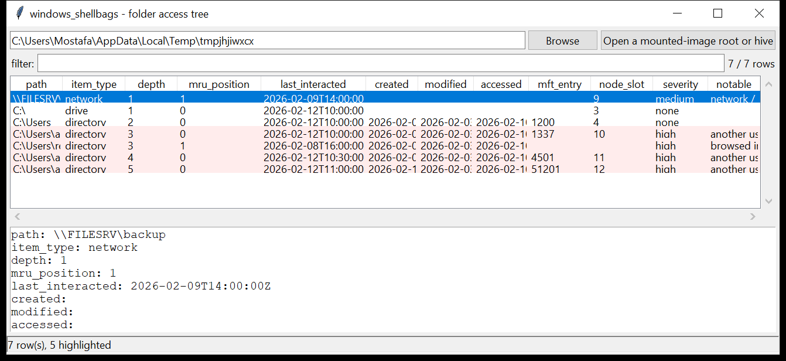

# windows_shellbags

**Every folder the user opened in Explorer, rebuilt into a tree.**
`windows_shellbags` walks `BagMRU` / `Bags` from `UsrClass.dat` (and the older
`NTUSER.DAT` / `ShellNoRoam` locations) and reconstructs the folder-access
tree — one row per folder.

Per folder:

- the **full reconstructed path**, assembled from the shell items along the
  `BagMRU` branch (drive letters, directories with their long names, GUID
  known-folders, UNC / network shares, archives-as-folders);
- the shell-item type;
- the `BagMRU` key path, its `NodeSlot`, and its **last-written time** — the
  best available "this folder was last interacted with" timestamp;
- the folder's own **created / modified / accessed** DOS timestamps and the
  **`$MFT` entry + sequence** from the `BEEF0004` extension block, when
  present;
- the **`MRUListEx` position** — 0 means that child was the most recently
  touched of its siblings.



## Usage

```
windows_shellbags E:\                         (mounted image root)
windows_shellbags UsrClass.dat --csv bags.csv
windows_shellbags E:\ --notable-only --min-severity high
windows_shellbags E:\ --type network
windows_shellbags E:\ --grep '\.zip|\\\\'
windows_shellbags E:\ --gui
```

Point it at a mounted-image root (it finds every user's `UsrClass.dat` /
`NTUSER.DAT`), a single user profile, or a hive file directly.

| flag | effect |
|------|--------|
| `--type NAME` | `drive` / `directory` / `known-folder` / `network` / `delegate` |
| `--grep REGEX` | match the path / name |
| `--max-depth N` | only folders at or above depth N in the tree |
| `--notable-only` / `--min-severity` | filter by the flags raised |
| `--csv PATH` / `--json PATH` | write the table instead of the tree report |

## Why it matters

Shellbags record that a folder was *browsed* — even a folder that has since
been deleted, was on a USB stick that is long gone, or lives on a network
share the examiner cannot reach. They survive the folder they describe. The
`MRUListEx` order and the key's last-written time turn that into a rough
timeline of where the user (or an attacker on the user's session) was
looking.

## Flags

| flag | meaning |
|------|---------|
| `network / UNC path browsed` | a `\\host\share` folder in the tree |
| `non-system drive browsed` | a drive letter other than `C:` (removable / mapped) |
| `browsed inside an archive / image file` | a shellbag for a directory ending `.zip` / `.7z` / `.iso` (Explorer navigated into it) |
| `disk-image / VHD path in the shellbag tree` | `.vhd` / `.vhdx` / `.e01` in a folder path |
| `folder under a user-writable / staging path` | `AppData`, `Temp`, `ProgramData`, `$Recycle.Bin`, `Public\` |
| `another user's profile browsed` | a `\Users\<other>\…` path where `<other>` is not this account |
| `GUID-only known-folder entry` | a shell folder that does not resolve to a name |
| `folder name suggests offensive tooling` | a `Downloads` / `Desktop` / `Temp` path with `tools`, `mimikatz`, `psexec`, `winpeas`, … in it |

## Timestamp provenance

The **last-interacted** column is the `BagMRU` key's last-written time — a
real `FILETIME` in **UTC**. The **created / modified / accessed** columns
come from the shell item's DOS date/time fields (and the `BEEF0004` block),
which are **local time with no timezone** — they are emitted without a `Z`.
Parser confidence is **medium**: shell-item layouts vary and only the
file-entry / drive / known-folder / network types are decoded in detail.

## Limitations (v0.1)

- The `Bags\<NodeSlot>\Shell` view settings (icon size, sort column, window
  position) are not read — only the `NodeSlot` number is carried.
- Property-store / delegate shell items and some control-panel item types
  are recognised by class but their names are not fully decoded.
- Transaction-log replay is not performed; point a dirty `UsrClass.dat`
  through `windows_reglog` first for the most current tree.
- Deleted `BagMRU` keys in free hive cells are not recovered in this version.

## Tests

```
cd windows/windows_shellbags && python -m pytest -q
```

`tests/_hive_synth.py` hand-builds a `regf` `UsrClass.dat` with a `BagMRU`
tree: `C:\` → `Users` → `attacker` → `Downloads` → `tools`, a `report.zip`
directory, and a `\\FILESRV\backup` network share, with real shell items
(drive, `0x31` directory entries carrying `BEEF0004` blocks with `$MFT`
refs, a `0x1F` "This PC" GUID, a network item) and `MRUListEx` /
`NodeSlot` values. The tests check the shell-item parser, the tree walk,
the timestamps and MFT refs, the MRU order, every flag and the CLI.
