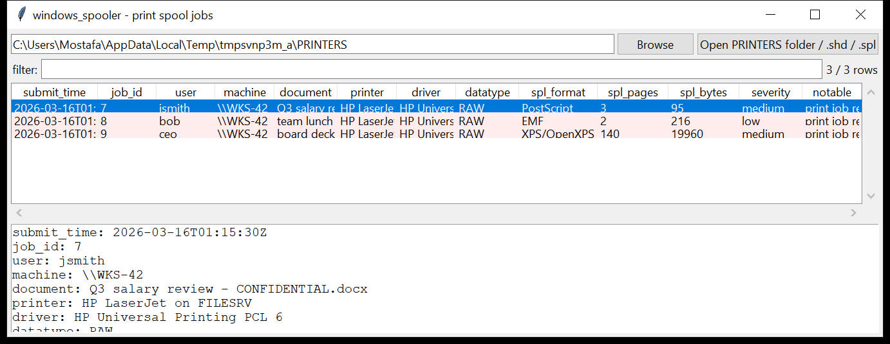

# windows_spooler

**Recover who printed what, from where, and when.**
`windows_spooler` reads the print-spool files left in
`C:\Windows\System32\spool\PRINTERS` — the `.shd` job header and its `.spl`
data — and reports one row per job:

| field | from |
|-------|------|
| `submit_time` | the `SYSTEMTIME` in the `.shd` |
| `job_id`, `priority` | `.shd` header |
| `user` / `machine` | job owner and the client that submitted it |
| `document` | the printed document's name |
| `printer` / `driver` / `datatype` / `processor` | destination and rendering path |
| `spl_format` / `spl_pages` / `spl_bytes` | the payload: **EMF**, **XPS / OpenXPS**, **PostScript**, **PCL**, **PDF** or raw, with a page count |

`--extract DIR` copies each `.spl` payload out for rendering or carving.



## Why it matters

A `.shd` / `.spl` pair still on disk is a print job that **did not complete
cleanly** — the spooler deletes both on success. So every job you find is
either in progress, stuck, or was interrupted, and the `.spl` still holds
the document that was being printed. That is the whole picture of a
print-based data exfiltration, or simply proof that a named user sent a
named document to a printer at a specific time from a specific machine.

## Usage

```
windows_spooler C:/Windows/System32/spool/PRINTERS --csv spool.csv
windows_spooler FP00004.shd FP00004.spl --json job.json
windows_spooler E:\ --notable-only
windows_spooler PRINTERS --extract ./out
windows_spooler PRINTERS --format xps --grep 'confidential'
```

`.shd` and `.spl` files are paired by their shared base name; a lone `.shd`
or `.spl` is still reported.

| flag | effect |
|------|--------|
| `--grep REGEX` | match document / user / machine / printer |
| `--format FMT` | only jobs whose `.spl` format matches (`EMF`, `XPS`, `PostScript`, …) |
| `--extract DIR` | copy each `.spl` payload into `DIR` |
| `--notable-only` / `--min-severity low\|medium\|high` | filter by the flags raised |
| `--csv PATH` / `--json PATH` | write the table instead of the text report |
| `--max-input-bytes` / `--max-records` / `--wall-seconds` | resource limits |

## Flags

| flag | triggers on |
|------|-------------|
| `print job recovered from the spool directory` | every job — the baseline fact |
| `document name suggests sensitive content` | name contains `confidential`, `salary`, `payroll`, `ssn`, `contract`, `nda`, `offer letter`, … |
| `job owner and source machine name do not correspond` | the user name and the `\\MACHINE` name share no common prefix |
| `PostScript spool data (can carry executable operators)` | `.spl` is PostScript |
| `large print job (N pages)` | ≥ 100 pages |
| `spool data did not parse cleanly` / `SHD parse issue` | a malformed or truncated file |

`severity` is the highest among a row's flags.

## Limitations (v0.1)

- The SHD struct has changed across Windows versions. The parser reads the
  **offset table** (`0x18`–`0x38`: printer, machine, user, notify,
  document, datatype, processor, parameters, driver) when it resolves to
  strings, and otherwise falls back to classifying every UTF-16 string in
  the header by content. Field assignment can be wrong on an unusual
  build; the raw string list is kept.
- The submit `SYSTEMTIME` is located by scanning the header for a run of
  eight `u16`s with sane calendar values — it takes the first match, which
  on some layouts is the "submitted" time and on others the "started"
  time. It is treated as UTC.
- `.spl` page counts are best-effort: EMF counts `EMR_HEADER` records, XPS
  counts `.fpage` parts, PostScript counts `%%Page:` / `showpage`, PDF
  counts `/Type /Page`. A spool wrapper the tool does not recognise is
  reported as `SPL-wrapped` or `raw`.
- The `.spl` content is not rendered to an image here — use `--extract`
  and an EMF / XPS viewer.

## Tests

`tests/_synth.py` builds a `.shd` with the classic offset table (printer,
`\\WKS-42`, `jsmith`, a "CONFIDENTIAL" document, `RAW`, `winprint`, a PCL
driver) and a `SYSTEMTIME`, plus `.spl` payloads in XPS (zip with
`.fpage` parts), spooled EMF (`EMR_HEADER` + `EMR_EOF`) and PostScript.
The tests cover the SHD field recovery, `SYSTEMTIME` decoding, each `.spl`
format and page count, `.shd`/`.spl` pairing, `--extract`, every flag
family and the CLI filters with a CSV BOM + formula-injection check.

```
cd windows/windows_spooler && python -m pytest -q
```
