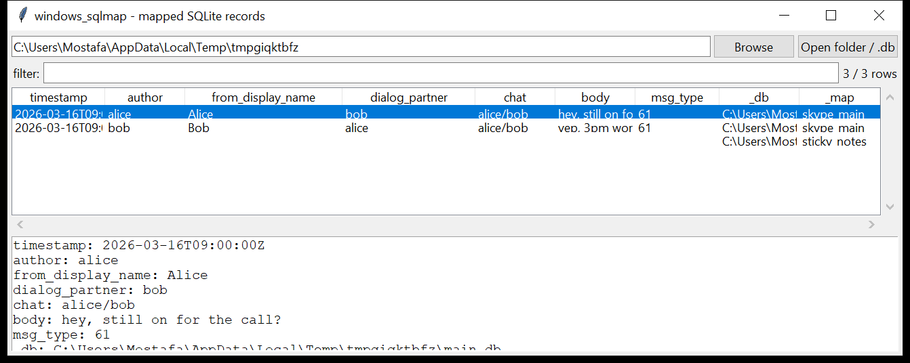

# windows_sqlmap

**Every SQLite database on the target, mapped or at least indexed.**

`windows_sqlmap` walks a folder tree (or takes specific files) looking for
SQLite databases **by header magic**, not extension — a lot of app data
sits in a `.db` / `.sqlite` / `.dat` / extension-less file. Every database
found is matched against a set of **named maps**: small declarative JSON
profiles that say which tables a schema must have, the SQL to run, the
output columns and the timestamp format. A match is normalised straight
into rows; a database that matches nothing is still listed with its full
table / row-count schema so you can write a map for it in five minutes.



## Built-in maps

| map | targets |
|-----|---------|
| `skype_main` | Skype (classic desktop) `main.db` — `Messages` joined with the conversation/author fields |
| `sticky_notes` | Windows 10+ Sticky Notes `plum.sqlite` — `Note` (id, text, created, last modified) |

`--list-maps` prints the available set (built-in + anything loaded from
`--map-dir`).

## Map format

```json
{
  "name": "widget_settings",
  "description": "Example app config store",
  "match_tables": ["WidgetSettings"],
  "query": "SELECT key, value FROM WidgetSettings",
  "columns": ["setting", "value"],
  "time_col": "",
  "time_format": "raw"
}
```

A database matches a map when it has **every** table in `match_tables`
(case-insensitive). `columns` names the output fields positionally against
the query's result columns; `time_col` + `time_format`
(`unix` / `unix_ms` / `unix_us` / `webkit` / `filetime` / `iso` / `raw`)
converts one of them to UTC ISO-8601 in place. Drop `.json` files matching
this shape into a directory and pass `--map-dir` — no code changes needed.

## Usage

```
windows_sqlmap C:/Users --csv hits.csv
windows_sqlmap main.db --map skype_main --json chat.json
windows_sqlmap E:\ --map-dir ./my_maps --list-maps
windows_sqlmap unknown.db --dump-table Messages
```

| flag | effect |
|------|--------|
| `--map NAME` | only run this one map |
| `--map-dir DIR` | load additional `*.json` maps; repeatable |
| `--list-maps` | print the available maps and exit |
| `--dump-table TABLE` | also raw-dump this table from every database that has it — the fastest way to eyeball an unmapped schema |
| `--unmatched-only` | only the schema recon for databases nothing matched |
| `--csv PATH` / `--json PATH` | mapped rows plus `_db` / `_map` provenance columns |

## Why it matters

Most desktop applications that are not covered by a dedicated parser in
this suite still keep their data in SQLite — chat clients, note apps,
game launchers, license managers, browser-adjacent extensions. Rather than
write and maintain a bespoke tool for each one, `windows_sqlmap` gives you
the discovery pass and the normalisation mechanics for free; you only ever
need to write the map, and the schema recon on a miss tells you exactly
what to put in it.

## Limitations (v0.1)

- Built-in maps are the schema as commonly documented for that app; a
  different app version can rename or drop columns, in which case the
  query fails and the row is skipped with the error recorded — check
  `--dump-table` against the actual schema first if a built-in map returns
  nothing.
- Discovery reads the first 16 bytes of every file under the target to
  check the SQLite magic — fine for a case folder, slow across a whole
  volume; scope `paths` to where app data actually lives.
- Opened WAL-safe (copy + `-wal`/`-shm` side files, falling back to
  `immutable`/`nolock`) via the same `dbopen` helper as `browser_history`.
- No SQL injection surface from evidence data — maps are examiner-authored
  JSON, not derived from file content — but a map's `query` is run
  verbatim, so only load maps you trust.

## Tests

`tests/_synth.py` builds a Skype-shaped `main.db`, a Sticky-Notes-shaped
`plum.sqlite`, and an arbitrary `widget.db`. The tests cover SQLite
discovery by magic (ignoring a non-DB file), both built-in maps
(including the `unix` and `filetime` conversions), the unmatched-schema
recon, loading a custom `--map-dir` profile, `--dump-table`, `--list-maps`,
and the CLI CSV(BOM) / JSON output.

```
cd windows/windows_sqlmap && python -m pytest -q
```
