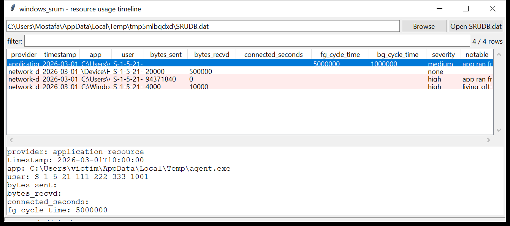

# windows_srum

**The System Resource Usage Monitor, as a per-app hourly timeline.**
`windows_srum` reads `C:\Windows\System32\sru\SRUDB.dat` (an ESE database)
and emits one normalised row per application per hourly bucket, across every
known provider:

| provider | what it records |
|----------|-----------------|
| `network-data` | bytes **sent / received** per app per interface |
| `network-connectivity` | connected seconds + connection start time per interface |
| `application-resource` | foreground / background CPU cycle time and disk bytes read / written per app |
| `energy-usage` (+ `-lt`) | per-app energy / charge data |
| `push-notification` | notification payload / network bytes per app |
| `app-timeline` | app foreground durations |

`SruDbIdMapTable` resolves the numeric `AppId` / `UserId` foreign keys — so
each row carries the **full application path** and the **user SID**, not an
opaque integer.



## Usage

```
windows_srum SRUDB.dat --csv srum.csv
windows_srum SRUDB.dat --provider network-data --min-bytes-sent 10000000
windows_srum SRUDB.dat --app 'powershell|\\temp\\' --json ps.json
windows_srum SRUDB.dat --since 2026-03-01 --until 2026-03-07
windows_srum SRUDB.dat --notable-only --min-severity high
windows_srum SRUDB.dat --gui
```

| flag | effect |
|------|--------|
| `--provider NAME` | one provider (repeatable) |
| `--app REGEX` | match the resolved application path |
| `--user SUBSTR` | match the resolved user SID |
| `--since` / `--until` `YYYY-MM-DD` | UTC date window |
| `--min-bytes-sent N` | `network-data` rows with at least N bytes sent |
| `--notable-only` / `--min-severity` | filter by the flags raised |
| `--csv PATH` / `--json PATH` | write the table instead of the text report |

## Why it matters

SRUM is the closest thing Windows has to per-process network accounting on a
dead box. It answers "which executable sent how much data, and when" — down
to the hour, going back ~30–60 days — which is exactly the question in an
exfiltration case. Because the `AppId` is usually the **full path**, a
process that ran from `\AppData\Local\Temp` and pushed 90 MiB out in an hour
stands right out.

## Flags

| flag | meaning |
|------|---------|
| `app ran from a user-writable path` | `AppId` path under `\AppData`, `\Temp`, `\ProgramData`, `\Public`, `\Windows\Temp`, … |
| `living-off-the-land binary recorded` | `powershell`, `mshta`, `rundll32`, `certutil`, `bitsadmin`, `wmic`, `curl`, … |
| `large outbound transfer in one hour` | ≥ 50 MiB `BytesSent` in a single bucket |
| `upload-only traffic` | bytes sent, nothing received |
| `network usage by a writable-path / LOLBin process` | the two combined |

## Limitations (v0.1)

- Interface LUIDs are reported as their raw 64-bit value; joining them to
  friendly names via the SOFTWARE hive (`NetworkList\Profiles`) is on the
  roadmap.
- The ESE reader (vendored `windows_esedb`) does not yet inflate
  `XPRESS`/`LZXPRESS` long values or replay a transaction log for a dirty
  database — a dirty `SRUDB.dat` is read best-effort and flagged.
- Column names vary slightly across Windows builds; unknown provider tables
  are skipped (listed in the run summary).
- Tested against the format with a synthetic `SRUDB.dat`; not yet validated
  against a real Microsoft database on this dev box.

## Tests

```
cd windows/windows_srum && python -m pytest -q
```

`tests/_ese_build.py` is a small general ESE writer; `tests/_synth.py` uses
it to build a `SRUDB.dat` with `SruDbIdMapTable` (app-path and SID blobs), a
`network-data` table (a normal app, a `\Temp\agent.exe` doing a 90 MiB
upload-only hour, and `powershell.exe`) and an `application-resource` table.
The tests check the id-map resolution, the normalisation, every flag and the
CLI filters.
