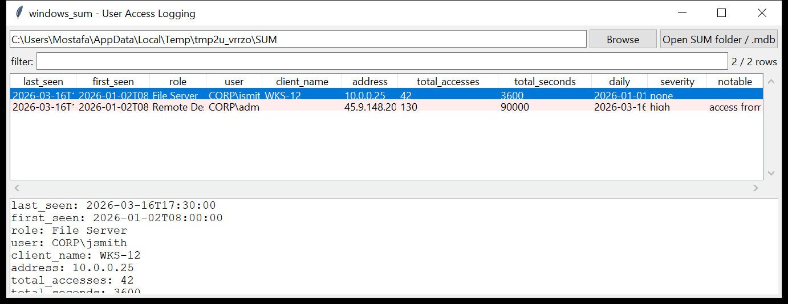

# windows_sum

**Who connected to this server, from where, and how often.**
`windows_sum` reads the Microsoft **User Access Logging (SUM)** databases
under `C:\Windows\System32\LogFiles\SUM` and produces one row per
`(user, client, role)` access aggregate:

| field | meaning |
|-------|---------|
| `user` | the authenticated account (`AuthenticatedUserName`) |
| `client_name` / `address` | the connecting machine name and IP (decoded from the binary `Address`) |
| `role` | the server role accessed — resolved from `SystemIdentity.mdb`'s `ROLE_IDS` (e.g. *File Server*, *Remote Desktop Services*, *Active Directory*) |
| `first_seen` / `last_seen` | activity window |
| `total_accesses` / `total_seconds` | totals for this tuple |
| `daily` | the per-day histogram (`Day1..DayN` columns expanded to `YYYY-MM-DD:count`) |



## Why it matters

UAL is enabled by default on Windows Server 2012+ and keeps roughly three
years of history (`Current.mdb` plus one `{GUID}.mdb` per year). It records
**every client that used a server role** — SMB, RDP, AD, IIS, DNS, DHCP —
with the account, the source IP and a per-day count. On a domain member or
DC it is one of the best answers to "who accessed this box, and when" that
survives on a dead disk, and it is largely unknown to attackers so it is
rarely cleaned.

## Usage

```
windows_sum C:/Windows/System32/LogFiles/SUM --csv sum.csv
windows_sum Current.mdb SystemIdentity.mdb --json sum.json
windows_sum E:\ --notable-only --min-severity medium
windows_sum SUM --user administrator
windows_sum SUM --role "remote desktop" --since 2026-03-01
```

Point it at the `SUM` folder (so `SystemIdentity.mdb` is picked up for role
names), individual `.mdb` files, or a mount root.

| flag | effect |
|------|--------|
| `--user` / `--role` / `--address` `SUBSTR` | substring match on that field |
| `--grep REGEX` | match user / client / address / role |
| `--since` / `--until` `YYYY-MM-DD` | window on `last_seen` |
| `--notable-only` / `--min-severity low\|medium\|high` | filter by the flags raised |
| `--csv PATH` / `--json PATH` | write the table instead of the text report |
| `--max-input-bytes` / `--max-records` / `--wall-seconds` | resource limits |

## Flags

| flag | triggers on |
|------|-------------|
| `access from a public IP address` | client `Address` is a globally-routable IP |
| `RDP-role access from a public IP` | the above **and** the role is Remote Desktop / Terminal Services |
| `high single-day access count (N)` | ≥ 100 accesses on one calendar day |
| `machine / computer account` | user name ends with `$` |
| `privileged / built-in account` | `administrator`, `krbtgt`, `guest`, or an RID `-500` / `-501` |
| `access with no authenticated user name` | accesses recorded with a blank user |
| `Remote Desktop / Terminal Services access` / `Active Directory access` | context label for those roles |

`severity` is the highest among a row's flags.

## Limitations (v0.1)

- Read with the vendored `windows_esedb` reader — it does not inflate
  `XPRESS`/`LZXPRESS` long values or replay a transaction log, so a dirty
  `.mdb` is read best-effort and anything unreadable is listed in the run
  summary.
- The calendar year for the `DayN` columns is derived from `LastSeen` /
  `FirstSeen` on the row. A row that spans a year boundary, or a
  `{GUID}.mdb` whose year is only recorded in `SystemIdentity.mdb`'s
  `CHAINED_DATABASES` table, may date some `DayN` counts to the wrong
  year; those appear as `dayN:count` instead of a date.
- Timestamps are emitted as stored (UAL writes local time on most builds);
  the `tz` provenance column records this.
- `Address` is decoded as IPv4 (4 bytes) or IPv6 (16 bytes); other
  `sockaddr` encodings fall back to hex.
- Column names vary slightly across Server builds; unrecognised columns are
  ignored and GUID-named tables that are not role tables are skipped.

## Tests

`tests/_synth.py` builds a `SystemIdentity.mdb` (`ROLE_IDS`,
`SYSTEM_IDENTITY`) and a `Current.mdb` with two role tables — a File Server
access by `CORP\jsmith` from `10.0.0.25`, and a Remote Desktop Services
access by `CORP\administrator` from a public IP with a 130-access day. The
tests cover role-name resolution, the IP decode, `DayN`→date expansion,
every flag family and the CLI filters with a CSV BOM + formula-injection
check.

```
cd windows/windows_sum && python -m pytest -q
```
