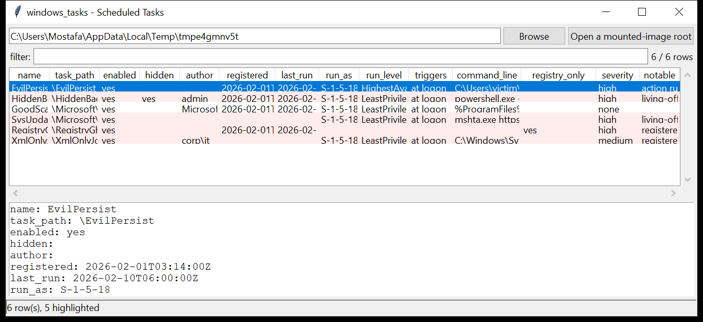

# windows_tasks

**Scheduled Tasks, XML and registry joined.** `windows_tasks` reads the
on-disk task definitions in `C:\Windows\System32\Tasks\**` and, when a
`SOFTWARE` hive is present, joins the
`…\CurrentVersion\Schedule\TaskCache\{Tree,Tasks}` registry keys into one
row per task.

From the **XML**: author, registration date, description, the triggers
(rendered in plain language), the principal (run-as SID, run level, logon
type), the hidden / enabled flags, and every action — an `Exec` command with
its arguments and working directory, or a `ComHandler` CLSID.

From the **registry**: the `DynamicInfo` timestamps (task registered, last
run), the security descriptor, and — crucially — whether the task's GUID is
present in the `Tree` (a GUID under `Tasks` with **no** `Tree` entry is a
long-standing way to hide a task from `schtasks` and the Task Scheduler UI).



## Usage

```
windows_tasks E:\                       (mounted image root)
windows_tasks C:\Windows\System32\Tasks --csv tasks.csv
windows_tasks E:\ --notable-only --min-severity high
windows_tasks E:\ --hidden-only
windows_tasks E:\ --grep 'powershell|mshta|rundll32'
windows_tasks E:\ --gui
```

Point it at a mounted-image root (it finds `Windows\System32\Tasks` and
`Windows\System32\config\SOFTWARE` itself), at a `Tasks` directory, or at a
folder containing a `SOFTWARE` hive.

| flag | effect |
|------|--------|
| `--enabled-only` / `--hidden-only` | filter by state |
| `--grep REGEX` | match task path / command / author / triggers |
| `--notable-only` / `--min-severity` | filter by the flags raised |
| `--csv PATH` / `--json PATH` | write the table instead of the text report |

## Why it matters

A scheduled task is one of the most durable persistence mechanisms on
Windows: it survives reboots and logoffs, can run as `SYSTEM`, and fires on
a trigger the operator chooses. The XML tells you exactly what runs; the
`TaskCache` registry tells you *when it last ran* and whether someone tried
to keep it out of sight. Reading both off a mounted image needs no live
`schtasks` and no matching OS.

## Flags

| flag | meaning |
|------|---------|
| `living-off-the-land binary in the action` | `mshta`, `rundll32`, `regsvr32`, `powershell`, `certutil`, `bitsadmin`, `msbuild`, `wmic`, … |
| `action runs from a user-writable path` | `\Users\`, `\AppData\`, `\Temp\`, `\ProgramData\`, `\Public\`, … |
| `action runs from a UNC path` | `\\host\share\…` |
| `encoded / obfuscated command line` | `-enc <base64>`, `-w hidden`, `FromBase64String`, `IEX`, `DownloadString`, … |
| `ComHandler action` | runs an in-process COM object, not an executable |
| `task is hidden` | `<Hidden>true</Hidden>` |
| `registered outside \Microsoft\Windows` | a top-level task not under the OS namespace |
| `runs as SYSTEM / elevated from a user-writable path` | privilege + a writable binary |
| `registry-only task` | a `TaskCache` entry with no XML on disk (deleted definition, or a stealth task) |
| `XML-only task` | an XML file with no `TaskCache` entry (unregistered / staged) |
| `in TaskCache\Tasks but absent from the Tree` | hidden from `schtasks` and the UI |
| `Microsoft-looking name registered outside \Microsoft\Windows` | masquerade |
| `no author recorded` | blank `<Author>` on a non-OS task |

## Timestamp provenance

The `registered` and `last run` times come from the `TaskCache\Tasks\{GUID}`
**`DynamicInfo`** blob (`FILETIME`, UTC). The layout of that blob has varied
across Windows builds; this tool reads the two most consistently reported
fields (offsets `0x04` and `0x0C`) and reports parser confidence **medium**
for them. The XML `<Date>` (registration) is taken verbatim and is
wall-clock as written by the registering host.

## Limitations (v0.1)

- The `DynamicInfo` blob is only partially decoded (see above); the "next
  run" time and the run result / last-exit-code fields are not surfaced.
- The security descriptor under `SD` is detected but not parsed into an
  owner / DACL summary.
- `.job` files (the pre-Vista Task Scheduler 1.0 binary format) are not read.
- Task files are expected to be UTF-16 (with BOM) or UTF-8; a task whose XML
  is malformed is reported as a parse error and skipped.

## Tests

```
cd windows/windows_tasks && python -m pytest -q
```

`tests/_hive_synth.py` hand-builds a `regf` `SOFTWARE` hive with a
`TaskCache\Tree` subtree and four `TaskCache\Tasks\{GUID}` entries (two in
the Tree, one hidden-from-Tree, one registry-only). `tests/_synth.py`
writes the matching UTF-16 task XML (a benign Defender scan, an
`AppData\svc.exe` SYSTEM task with a blank author, a hidden encoded-
PowerShell task, an `mshta` task, and an XML-only task), and the tests
check the XML parser, the hive reader, the join, every flag and the CLI.
