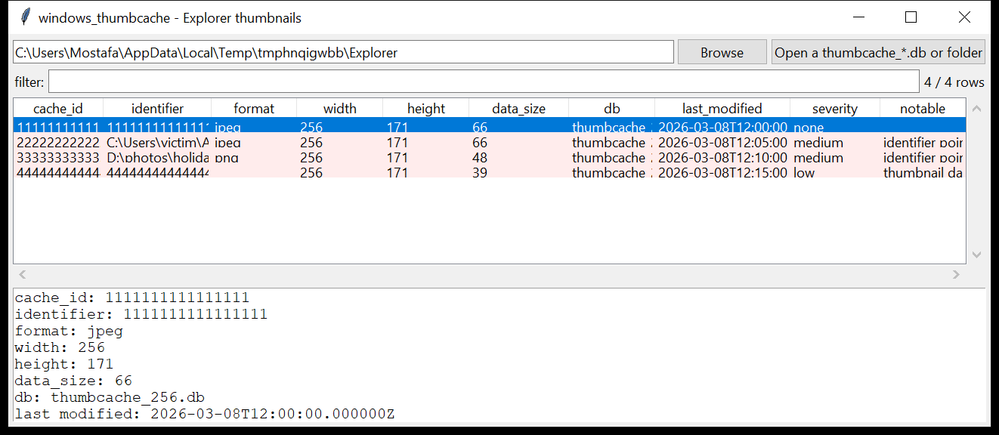

# windows_thumbcache

**Explorer's thumbnail cache — list and extract.** `windows_thumbcache`
parses the `thumbcache_*.db` set from
`…\AppData\Local\Microsoft\Windows\Explorer\`:

- each **`thumbcache_<size>.db`** holds `CMMM` cache entries — a 64-bit
  cache id, an identifier string (a path, or the id in hex, depending on
  the Windows version), the thumbnail dimensions (Win8.1+), and the
  thumbnail image itself (JPEG / PNG / BMP / GIF);
- **`thumbcache_idx.db`** is the index — it maps each cache id to an
  entry-flags value and the **source file's last-modified time**
  (FILETIME, UTC).

One row per cached thumbnail. `--extract DIR` writes every thumbnail out as
an image file named by its cache id — **evidence of pictures that may no
longer be on disk** (the cache outlives the originals).



## Usage

```
windows_thumbcache thumbcache_256.db --csv thumbs.csv
windows_thumbcache E:\ --extract ./recovered_thumbs
windows_thumbcache 'C:\…\Explorer' --notable-only
windows_thumbcache thumbcache_1024.db --format jpeg --min-size 20000
```

| flag | effect |
|------|--------|
| `--extract DIR` | write every (filtered) thumbnail image into this directory |
| `--format NAME` | only `jpeg` / `png` / `bmp` / `gif` |
| `--grep REGEX` | match the identifier |
| `--min-size N` | thumbnails with at least N bytes of data |
| `--notable-only` / `--min-severity` | filter by the flags raised |
| `--csv PATH` / `--json PATH` | write the table instead of the text report |

## Why it matters

A thumbnail is generated the first time Explorer displays a folder in a
thumbnail view, and it stays in the cache long after the picture (or the
whole USB stick / network share it lived on) is gone. Extracting the cache
recovers a visual record of what the user saw. On Windows 8.1 and later the
identifier is often the **full path**, so the cache alone can place a file
on `D:\` or a UNC share at a point in time.

## Flags

| flag | meaning |
|------|---------|
| `identifier points at a user-writable path` | the identifier path is under `\AppData`, `\Temp`, `\ProgramData`, `\Public`, `\Downloads`, `\$Recycle.Bin` |
| `identifier points at a removable / network path` | a drive letter other than `C:`, or `\\host\share` |
| `thumbnail data is not a recognised image format` | the entry's data does not start with a JPEG / PNG / BMP / GIF / WebP magic |
| `unusually large thumbnail` | over 4 MiB of data |

## Limitations (v0.1)

- On Windows 7 and Vista the identifier is the **hex cache id**, not a
  path — resolve it via `windows_esedb` on `Windows.edb`
  (`System.ThumbnailCacheId`) or `windows_search` when that tool lands.
- The `thumbcache_idx.db` entry layout has drifted across builds; this
  reader uses the common `{id, last-modified, flags, offsets}` shape and
  a real database whose layout differs will still parse the cache files,
  just without the index join.
- `_custom_stream` / `_exif` / `_wide` / `_sr` cache variants are parsed
  the same way as the sized caches.
- Data checksums (CRC-64) are not verified.

## Tests

```
cd windows/windows_thumbcache && python -m pytest -q
```

`tests/_synth.py` builds a Windows-8.1-format `thumbcache_256.db` with four
entries (a hex-id JPEG, a `\Temp\stolen.jpg`, a `D:\photos\…\IMG.png`, and a
bogus non-image entry) plus a matching `thumbcache_idx.db`, and the tests
check the cache parser, the index join, every flag, the CLI and `--extract`
(which must write a valid `.jpeg` / `.png` back out).
