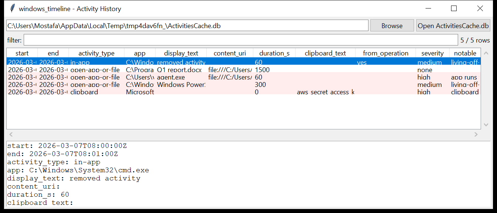

# windows_timeline

**Windows "Activity History", as a timeline.** `windows_timeline` reads
`ActivitiesCache.db` — the SQLite store under
`…\AppData\Local\ConnectedDevicesPlatform\<profile>\` that backs the
Windows 10/11 Timeline / Task View — and turns it into one row per
activity.

Per activity: the **type** (`open-app-or-file`, `in-app`, `clipboard`,
`copy-paste`, `notification`), the **resolved application** (the Win32
executable path or the packaged-app id, pulled from the `AppId` JSON), the
**display text** and **content URI** from the `Payload` JSON, the
**start / end / last-modified** times (Unix seconds → UTC) and the
on-disk **duration**, plus the local-only / in-cloud flags. Base64
`ClipboardPayload` blobs are **decoded to text**. `ActivityOperation` rows
— pending sync operations, which often still hold activities the user
*removed* from the visible timeline — are included and marked.

The evidence file is copied with its `-wal` / `-shm` side files before it
is opened, so the journal is checkpointed into *our* copy and the original
is untouched.



## Usage

```
windows_timeline ActivitiesCache.db --csv timeline.csv
windows_timeline E:\                          (mounted image root)
windows_timeline ActivitiesCache.db --type clipboard --json clip.json
windows_timeline ActivitiesCache.db --app 'powershell|\\temp\\'
windows_timeline ActivitiesCache.db --notable-only --min-severity high
windows_timeline ActivitiesCache.db --gui
```

| flag | effect |
|------|--------|
| `--type NAME` | one activity type |
| `--app REGEX` | match the resolved application |
| `--grep REGEX` | match app / display text / content URI / clipboard |
| `--since` / `--until` `YYYY-MM-DD` | UTC date window |
| `--notable-only` / `--min-severity` | filter by the flags raised |
| `--csv PATH` / `--json PATH` | write the table instead of the text report |

## Why it matters

The Timeline records *what the user did* — which document they opened, in
which app, for how long, and (for `copy-paste` activities) **what they put
on the clipboard**. It is one of the few artefacts that captures clipboard
content at all, and the `ActivityOperation` table is a small recycle bin
for activities that were deleted from the UI.

## Flags

| flag | meaning |
|------|---------|
| `app runs from a user-writable path` | the resolved app is under `\Users`, `\AppData`, `\Temp`, `\ProgramData`, … |
| `living-off-the-land binary activity` | `powershell`, `mshta`, `rundll32`, `certutil`, `wmic`, … |
| `opened a file in a writable / script path` | the `contentUri` points at `\Temp`, `\AppData`, or a `.ps1` / `.hta` / `.js` / … |
| `content URI with an IP-literal host` | `http://<ip>/…` opened |
| `clipboard capture contains a secret-looking string` | `password=`, `api_key=`, `aws_secret_access_key`, `-----BEGIN … PRIVATE KEY` in the decoded clipboard text |
| `large clipboard capture recorded` | over 400 characters |
| `from ActivityOperation` | pending sync — possibly removed from the visible timeline |

## Limitations (v0.1)

- Column names have drifted across CDP builds; a table missing an expected
  column is read for whatever it does have.
- `PackageIdHash` / `Activity_PackageId` cross-references are not joined.
- Non-text clipboard formats (bitmap, HTML fragment) are listed by format
  name only.
- The `Metadata` table (device names, sync cursors) is not surfaced.

## Tests

```
cd windows/windows_timeline && python -m pytest -q
```

`tests/_synth.py` builds an `ActivitiesCache.db` with an `Activity` table
(a Word document open, a `\Temp\agent.exe` launch, a `powershell.exe`
session, and a `clipboard` activity carrying an `aws_secret_access_key`)
plus an `ActivityOperation` row, and the tests check the parse, the
`AppId` resolution (Win32 and packaged), the clipboard decode, every flag
and the CLI (including mounted-root discovery).
