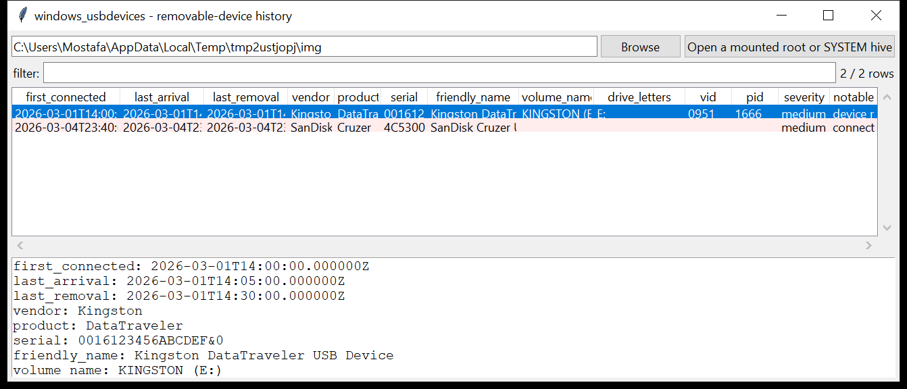

# windows_usbdevices

**Removable-device history, correlated across the hives.**
`windows_usbdevices` pulls USB mass-storage history from the `SYSTEM` and
`SOFTWARE` hives (and `setupapi.dev.log` when present) and joins it into one
row per device:

| source | what it contributes |
|--------|---------------------|
| `SYSTEM\…\Enum\USBSTOR` | vendor / product / revision, the **serial** (`&0` synthetic-serial suffix noted), the friendly name, and the per-device **install / first-install / last-arrival / last-removal** FILETIMEs from `Properties\{83da6326-…}\0064-0067` |
| `SYSTEM\…\Enum\USB` | the **VID / PID** and the container id |
| `SYSTEM\MountedDevices` | the **drive letter(s) / volume GUID** the device was mounted as (matched on the `USBSTOR#` string) |
| `SOFTWARE\…\Windows Portable Devices\Devices` | the friendly **volume name** (e.g. `KINGSTON (E:)`) |
| `Windows\INF\setupapi.dev.log` | the **first-seen** timestamp from the `Device Install` blocks |



## Usage

```
windows_usbdevices E:\                          (mounted image root)
windows_usbdevices SYSTEM --csv usb.csv
windows_usbdevices E:\ --known-good 'Kingston,SanDisk,Corp-Issue'
windows_usbdevices E:\ --since 2026-03-01 --notable-only
windows_usbdevices E:\ --grep 'DataTraveler' --json k.json
```

| flag | effect |
|------|--------|
| `--known-good LIST` | comma-separated vendor / serial / name substrings; any device not matching is flagged **high** |
| `--grep REGEX` | match vendor / product / serial / friendly name |
| `--since` / `--until` `YYYY-MM-DD` | window on the first-connected time |
| `--notable-only` / `--min-severity` | filter by the flags raised |
| `--csv PATH` / `--json PATH` | write the table instead of the text report |

## Why it matters

"Was a USB drive plugged in, which one, and when" is a standard question and
the answer is spread across four registry locations and a log file. Pulling
them together gives you the serial (which ties a device to other machines),
the drive letter it took (to line up against `$MFT` / `LNK` / jump-list
paths), and the first-plugged / last-removed times — enough to place a
specific stick on the host during the window of interest.

## Flags

| flag | meaning |
|------|---------|
| `device reports no unique serial` | the instance id ends `&0` — Windows synthesised a serial, so the device cannot be uniquely tracked and it may be a cheap / counterfeit controller |
| `connected only once` | first-install and last-arrival are the same minute |
| `connected outside business hours` | a connect time before 07:00, after 20:00, or on a weekend |
| `device installed but never mounted` | present in `Enum\USBSTOR` but no entry in `MountedDevices` |
| `device is not on the --known-good list` | (only with `--known-good`) an unexpected device |

## Limitations (v0.1)

- `EMDMgmt` (ReadyBoost — carries volume serial + last write time) and the
  `WpdBusEnumRoot` `USBPRINT` / `MTP` device classes are not read yet.
- SIDs are not tied to devices — `NTUSER.DAT\…\MountPoints2` (per-user
  mount history) is a separate lookup; this tool works from the machine
  hives.
- The `<volN>` disk-signature → drive-letter mapping in `MountedDevices`
  for *fixed* disks is not resolved (only the USB matches).
- FILETIME properties `0064`-`0067` exist from Windows 8 onward; on Windows 7
  only the `USBSTOR` key's own last-written time is available (not read
  here).

## Tests

```
cd windows/windows_usbdevices && python -m pytest -q
```

`tests/_synth.py` hand-builds a `SYSTEM` hive (a Kingston stick with a
synthetic `&0` serial mounted as `E:`, and a SanDisk stick connected once
at 23:40 with a real serial), a `SOFTWARE` hive with the Windows Portable
Devices friendly name, and a `setupapi.dev.log`. The tests check the
registry parse, the `setupapi` first-seen extraction, the full
correlation, every flag, `--known-good` and the CLI.
