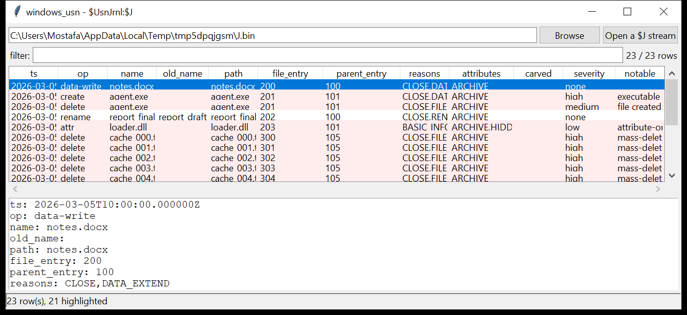

# windows_usn

**The NTFS change journal, standalone — sequential *and* carved.**
`windows_usn` reads a `$Extend\$UsnJrnl:$J` data stream that has been
extracted to a file, and also **carves** `USN_RECORD` (v2 / v3) structures
straight out of a raw volume image, a `$UsnJrnl` file with slack, or
unallocated space — recovering change records that have already scrolled
out of the live journal.

Per record: USN, timestamp (FILETIME, UTC), the file and parent `$MFT`
reference (entry + sequence), the decoded **reason** flags, the source-info
flags, the file attributes and the name. Consecutive records for one file
fold into a single **operation** — `create` / `rename A→B` / `delete` /
`data-write` / `attr`. Point `--mft` at an `$MFT` and every operation gets a
full path.



## Usage

```
windows_usn J_stream.bin --csv usn.csv
windows_usn '$UsnJrnl_$J' --mft '$MFT' --json usn.json
windows_usn unalloc.bin --carve --notable-only
windows_usn image.dd --also-carve --op delete --grep '\.docx$'
windows_usn J.bin --since 2026-03-01 --min-severity high
```

| flag | effect |
|------|--------|
| `--carve` | scan every 8-byte boundary for records (unallocated space / slack) |
| `--also-carve` | sequential walk **plus** a carve pass, de-duplicated |
| `--mft PATH` | resolve the parent reference to a path from this `$MFT` |
| `--op NAME` | one operation type |
| `--grep REGEX` | match name / old-name / path |
| `--since` / `--until` `YYYY-MM-DD` | UTC date window |
| `--notable-only` / `--min-severity` | filter by the flags raised |
| `--csv PATH` / `--json PATH` | write the table instead of the text report |

## Why it matters

`$UsnJrnl` is often the only place a short-lived file leaves a mark: a
payload dropped in `\Temp`, run, and deleted a minute later is gone from the
`$MFT` and the file system, but its `FILE_CREATE` → `DATA_EXTEND` →
`FILE_DELETE` sequence is right here with timestamps. Carving the journal
out of unallocated space extends that window back further than the live
stream — the journal is a fixed-size ring and overwrites itself.

## Flags

| flag | meaning |
|------|---------|
| `executable / script created (<name>)` | a `.exe` / `.dll` / `.ps1` / `.hta` / … created under `\Users`, `\AppData`, `\Temp`, `\ProgramData`, `\Windows\Temp` |
| `file created and deleted within this journal window` | the same `$MFT` entry has both a `create` and a `delete` op |
| `mass-delete burst` | ≥ 15 `FILE_DELETE` operations within ~60 s |
| `attribute-only change (no data write)` | a `BASIC_INFO_CHANGE` with no data reason — worth checking against `$SI` vs `$FN` for timestamp manipulation |
| `carved record (not in the live journal)` | recovered by the carve pass |

## Limitations (v0.1)

- The bundled `--mft` reader is deliberately tiny (`$FILE_NAME` only); for
  full timeline / ADS / timestomp analysis use `windows_mft`, which shares
  the same USN parser.
- The `$Max` metadata stream (`$UsnJrnl:$Max`) is not read, so the journal's
  configured size / allocation are not reported.
- USN_RECORD_V4 (range-tracking, used only mid-transaction) is skipped.
- Carving keys on `(USN, entry, reason, name)` to de-duplicate — two genuine
  records that share all four (extremely rare) would collapse to one.

## Tests

```
cd windows/windows_usn && python -m pytest -q
```

`tests/_synth.py` builds a `$J` stream (a doc edit, a `\Temp\agent.exe`
create→write→delete, a `report_draft → report_final` rename, an
attribute-only change, and an 18-file delete burst) with a leading sparse
region, plus a tiny `$MFT`. The tests check the sequential parser, the
operation folding, every flag, the carve pass on a noisy blob and the CLI
(including `--mft` path resolution).
