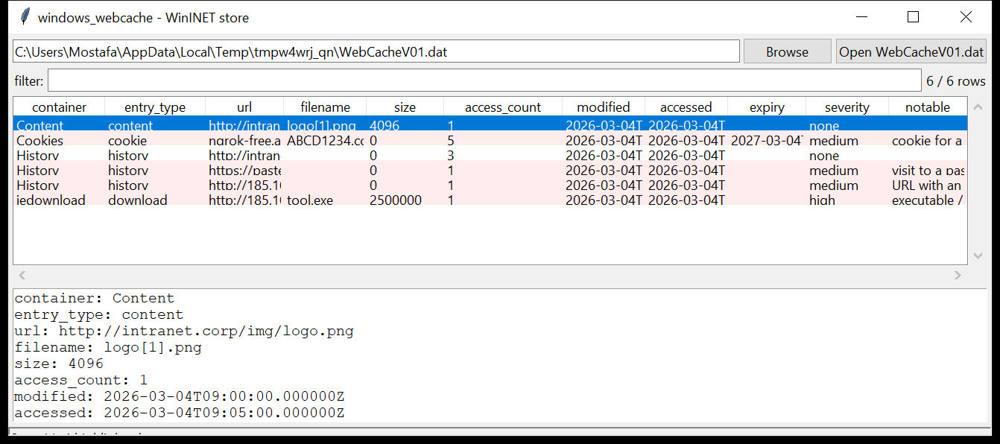

# windows_webcache

**The WinINET store, decoded.** `windows_webcache` reads `WebCacheV01.dat`
— the ESE database that Internet Explorer, legacy Edge and every
WinINET-based application share for history, cookies, cached content and
HTML5 DOM storage (`…\AppData\Local\Microsoft\Windows\WebCache\`).

- the **`Containers`** table names each container (History, Cookies,
  Content, DOMStore, `iedownload`, …) and gives its on-disk directory;
- each **`Container_<n>`** table holds the entries — URL, local filename,
  entry size, access count, and the **modified / accessed / expiry / sync**
  FILETIMEs;
- history and cookie URLs are **un-prefixed** (`Visited: user@…` → `…`,
  `Cookie:user@domain/path` → host + path) and each entry is classified
  (`history` / `cookie` / `content` / `download` / `dom` / `other`).



## Usage

```
windows_webcache WebCacheV01.dat --csv webcache.csv
windows_webcache WebCacheV01.dat --type download --json dl.json
windows_webcache WebCacheV01.dat --grep 'pastebin|\.exe$'
windows_webcache WebCacheV01.dat --container Cookies
windows_webcache WebCacheV01.dat --notable-only --min-severity high
windows_webcache WebCacheV01.dat --gui
```

| flag | effect |
|------|--------|
| `--type NAME` | `history` / `cookie` / `content` / `download` / `dom` / `other` |
| `--container SUBSTR` | match the container name |
| `--grep REGEX` | match the URL / filename |
| `--since` / `--until` `YYYY-MM-DD` | UTC date window (on accessed / modified) |
| `--notable-only` / `--min-severity` | filter by the flags raised |
| `--csv PATH` / `--json PATH` | write the table instead of the text report |

## Why it matters

`WebCacheV01.dat` is still the record of choice for anything that uses the
Windows HTTP stack — not just IE. Update checkers, installers, `.hta` and
`.NET` apps, and a lot of malware go through WinINET, and their requests
land here with a timestamp and often the downloaded file's local name. The
`iedownload` container is a straightforward download history; the `Content`
container is a cache you can line up against files still on disk.

## Flags

| flag | meaning |
|------|---------|
| `executable / script fetched` | a download / cached entry for `.exe`, `.dll`, `.ps1`, `.hta`, `.js`, `.iso`, an archive, … |
| `URL with an IP-literal host` | `http://185.10.20.30/…` |
| `punycode host` | `xn--…` in the host |
| `file:// URL recorded` | a local-file URL in the store |
| `visit to / cookie for a paste / file-sharing / tunnel site` | pastebin, mega, transfer.sh, ngrok, trycloudflare, `*.onion`, dynamic-DNS, … |
| `very large cached response` | a `Content` entry over 100 MiB |

## Limitations (v0.1)

- Request / response headers (`RequestHeaders` / `ResponseHeaders`) and the
  redirect chain are present in the DB but not yet surfaced.
- The DOM-storage container's key/value payloads are listed by URL only.
- The vendored ESE reader does not inflate `XPRESS`/`LZXPRESS` long values
  or replay a transaction log — a dirty `WebCacheV01.dat` is read
  best-effort and flagged.
- Tested against the format with a synthetic database; not yet validated
  against a real Microsoft `WebCacheV01.dat` on this dev box.

## Tests

```
cd windows/windows_webcache && python -m pytest -q
```

`tests/_synth.py` builds a `WebCacheV01.dat` with a `Containers` table and
four `Container_<n>` tables — a `History` container (an intranet page, a
`pastebin.com/raw` link, an IP-literal panel URL), a `Cookies` container
(an `ngrok-free.app` cookie), a `Content` cache entry and an `iedownload`
of `tool.exe` from an IP host — and the tests check the container join, the
URL un-prefixing, the FILETIME conversion, every flag and the CLI.
