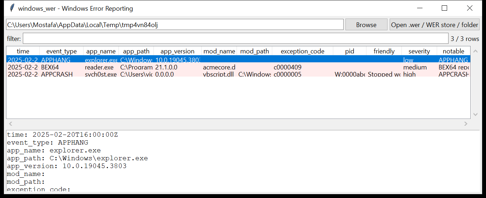

# windows_wer

**Windows Error Reporting as execution evidence.**
`windows_wer` parses `.wer` report files — from the `ReportArchive` and
`ReportQueue` stores or handed to it directly — into one row per crash or
hang:

| field | from |
|-------|------|
| `time` | `EventTime` (FILETIME) |
| `event_type` | `APPCRASH`, `BEX` / `BEX64`, `APPHANG`, `MoAppHang`, … |
| `app_name` / `app_path` / `app_version` | the faulting executable and where it ran from |
| `mod_name` / `mod_path` | the faulting module |
| `exception_code` / `exception_offset` | e.g. `c0000005` (access violation), `c0000409` (/GS stack overrun), `c0000374` (heap corruption) |
| `friendly` / `report_id` / `report_status` / `consent` | report metadata |
| `os_version`, `loaded_modules` | environment; count of `LoadedModule[n]` entries |



## Why it matters

A `.wer` report is written the moment a program crashes or hangs, and it
records the **full path** and version of the faulting binary and every
module it had loaded. That makes it durable proof that a specific
executable ran on a specific date — evidence that routinely outlives the
executable itself, which an intruder deletes but the report in
`ReportArchive` they forget. It is also a cheap exploit tripwire: a `BEX`
report, or an access violation inside a script engine, is what a failed
memory-corruption attempt looks like.

## Usage

```
windows_wer C:/ProgramData/Microsoft/Windows/WER --csv wer.csv
windows_wer Report.wer --json r.json
windows_wer E:\ --notable-only --min-severity high
windows_wer WER --grep 'powershell|\\Temp\\'
windows_wer C:\Users\v\AppData\Local\Microsoft\Windows\WER --gui
```

A path can be a single `.wer` file, a WER store folder, or a mount root
(the tool walks it for `*.wer`).

| flag | effect |
|------|--------|
| `--event-type TYPE` | exact `EventType` (`APPCRASH`, `BEX`, `APPHANG`, …) |
| `--grep REGEX` | match app / module path / name / friendly name |
| `--since` / `--until` `YYYY-MM-DD` | UTC date window |
| `--notable-only` / `--min-severity low\|medium\|high` | filter by the flags raised |
| `--csv PATH` / `--json PATH` | write the table instead of the text report |
| `--max-input-bytes` / `--max-records` / `--wall-seconds` | resource limits |

## Flags

| flag | triggers on |
|------|-------------|
| `<EventType> report (evidence of execution)` | every report — the baseline fact |
| `faulting application ran from a user-writable directory` | `app_path` under `\AppData`, `\Temp`, `\ProgramData`, `\Users\Public`, `\Downloads`, `\Windows\Temp`, `$Recycle.Bin` |
| `faulting module loaded from a user-writable directory` | same for `mod_path` |
| `faulting application is a living-off-the-land binary` | `powershell`, `rundll32`, `regsvr32`, `mshta`, `installutil`, `msbuild`, `certutil`, … |
| `buffer-overflow / DEP violation report (possible exploit)` | `EventType` is `BEX` / `BEX64` |
| `access violation in a script / runtime module` | `c0000005` with a fault module of `vbscript`, `jscript`, `chakra`, `mshtml`, `flash*`, `vcruntime*`, … |
| `stack buffer overrun (/GS)` | exception code `c0000409` |
| `heap corruption` | exception code `c0000374` |
| `LOLBin crashed loading a module from a writable path` | `regsvr32` / `rundll32` / `mshta` faulting with `mod_path` under a writable directory |

`severity` is the highest among a row's flags.

## Limitations (v0.1)

- `.wer` files are read as UTF-16LE (BOM) or UTF-8; the key grammar is
  `Key=Value` with `[Section]` headers ignored. `Sig[n].Name` values are
  mapped from their human labels ("Application Name", "Fault Module Name",
  …); when only `Sig[n].Value` is present the tool falls back to the
  positional order for the known `EventType`s.
- `AppPath` / `ModPath` are taken from the explicit keys when present,
  otherwise inferred from a matching `LoadedModule[n]` — which can be wrong
  if two loaded modules share a base name.
- Only the `Report.wer` metadata is parsed; the accompanying minidump /
  heap files in the same folder are not read.
- No signature / hash verification of the faulting binary (it is usually
  gone by the time of analysis).

## Tests

`tests/_synth.py` builds three UTF-16 reports: an `APPCRASH` of
`svch0st.exe` running from `\AppData\Local\Temp` faulting in `vbscript.dll`
(`c0000005`), a `BEX64` report with a `/GS` stack-overrun code, and a
benign `explorer.exe` `APPHANG`. The tests cover the key/`Sig[n]` parsing,
FILETIME conversion, `AppPath` / `ModPath` resolution, `LoadedModule`
counting, every flag family and the CLI filters with a CSV BOM +
formula-injection check.

```
cd windows/windows_wer && python -m pytest -q
```
