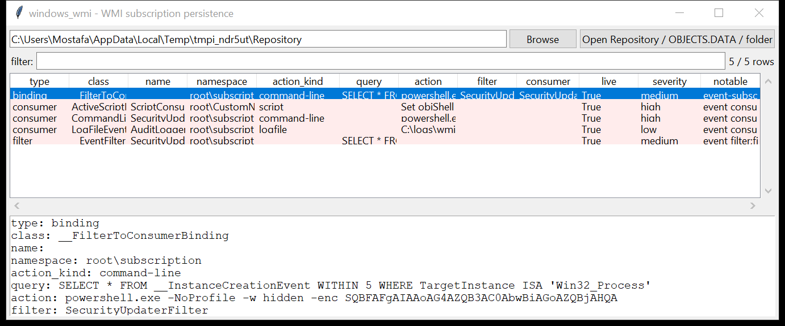

# windows_wmi

**WMI event-subscription persistence, out of the CIM repository.**
`windows_wmi` scans `OBJECTS.DATA` for the three object types that make up a
permanent WMI event subscription and reports them as one table:

| object | what it is |
|--------|-----------|
| `__EventFilter` | the **WQL trigger** — e.g. "a process named `x` started", "the local time is 09:00", "a USB volume arrived" |
| `*EventConsumer` | the **action** — `CommandLineEventConsumer` (a command line), `ActiveScriptEventConsumer` (inline VBScript / JScript), `LogFileEventConsumer`, `NTEventLogEventConsumer`, `SMTPEventConsumer` |
| `__FilterToConsumerBinding` | the **link** that arms a filter/consumer pair |



## Why it matters

A permanent WMI subscription is fileless persistence: an `__EventFilter` on
`Win32_Process` creation bound to a PowerShell `CommandLineEventConsumer`
runs SYSTEM code on every process start, survives reboots, and leaves
nothing on disk except three records inside `OBJECTS.DATA`. It is used by
everyone from commodity coin-miners to state actors, and Autoruns-style
tools only see it if WMI is healthy enough to enumerate.

## How it reads the repository

Fully parsing the CIM repository (`MAPPING*.MAP` page tables, the
`INDEX.BTR` B-tree, per-class record layouts) is a large job. For
persistence hunting the reliable, tool-independent approach — the same one
used by well-known WMI-persistence scanners — is to work over the **string
content** of `OBJECTS.DATA`: locate each class marker, collect the ASCII /
UTF-16 strings in the record that follows it (bounded by the next marker),
and pick out the name, namespace, WQL query and consumer action. When
`MAPPING*.MAP` is present the live physical pages are noted so stale
records can be told apart (`--live-only`).

## Usage

```
windows_wmi C:/Windows/System32/wbem/Repository --csv wmi.csv
windows_wmi OBJECTS.DATA --type consumer --notable-only
windows_wmi E:\ --min-severity high --json wmi.json
windows_wmi Repository --grep 'Win32_Process'
windows_wmi E:\Windows\System32\wbem\Repository --gui
```

A path can be the `Repository` folder, a single `OBJECTS.DATA`, or a mount
root.

| flag | effect |
|------|--------|
| `--type filter\|consumer\|binding` | one object type |
| `--grep REGEX` | match name / query / action / namespace |
| `--notable-only` / `--min-severity low\|medium\|high` | filter by the flags raised |
| `--live-only` | only records on mapped (live) pages |
| `--csv PATH` / `--json PATH` | write the table instead of the text report |
| `--max-input-bytes` / `--max-records` / `--wall-seconds` | resource limits |

## Flags

| flag | triggers on |
|------|-------------|
| `event-subscription binding present` | any `__FilterToConsumerBinding` |
| `event consumer (…)` | any consumer, labelled by kind |
| `consumer runs a living-off-the-land binary` | action contains `powershell`, `cmd`, `mshta`, `rundll32`, `regsvr32`, `wscript`, `cscript`, `certutil`, `bitsadmin` |
| `consumer payload is encoded / obfuscated / hidden` | `-enc <base64>`, `FromBase64String`, `DownloadString`, `IEX`, `-w hidden`, `-nop`, `bypass` |
| `consumer executes from a user-writable path` | action references `\AppData`, `\Temp`, `\ProgramData`, `\Users\Public`, `\Downloads` |
| `in-memory script consumer (VBScript / JScript)` | class is `ActiveScriptEventConsumer` |
| `filter triggers on process / system activity` | query references `__InstanceCreationEvent`, `Win32_Process`, `Win32_ProcessStartTrace`, `__TimerEvent`, `RegistryTreeChangeEvent`, … |
| `non-default namespace (…)` | namespace is not `root\subscription` / `root\default` / `cimv2` |
| `record is on a stale (unmapped) repository page` | the record's page is not referenced by `MAPPING*.MAP` |

`severity` is the highest severity among a row's flags; a LOLBin or script
consumer is `high`.

## Limitations (v0.1)

- This is a **string-level** recovery, not a full CIM parse. Names,
  queries and actions are picked heuristically from the strings around each
  class marker; a heavily fragmented repository can mis-attribute a
  property to a neighbouring object or miss one entirely.
- No timestamps: the repository stores object write times in a form this
  tool does not decode yet, so rows carry no `time` column.
- `MAPPING*.MAP` parsing is best-effort (the entry layout varies by OS
  build); if it cannot be read, every record is treated as live.
- Class-definition records (as opposed to instances) and consumers in
  classes not in the known list are not reported.
- Deleted subscriptions that have been overwritten are gone; ones merely
  unlinked may still be recovered and are flagged as stale.

## Tests

`tests/_synth.py` builds an `OBJECTS.DATA` with a full triad — an
`__EventFilter` on `Win32_Process` creation, a PowerShell
`CommandLineEventConsumer` with an `-enc` payload, and the binding between
them — plus an `ActiveScriptEventConsumer` (VBScript) in a non-default
namespace and a benign `LogFileEventConsumer`. The tests cover marker
location and record bounding, name / query / action / namespace recovery,
the filter↔binding join, every flag family and the CLI filters with a CSV
BOM + formula-injection check.

```
cd windows/windows_wmi && python -m pytest -q
```
